======================================================================
Recursive Bayesian Regularization Applied to Ultrasound Strain Imaging
======================================================================

.. |comparison_images_phantom| replace:: Fig. 1

.. |comparison_images_simulation| replace:: Fig. 2

.. |metric_plot_uniform| replace:: Fig. 3

.. |metric_plot_inclusion| replace:: Fig. 4

.. |e_sigma_plot| replace:: Fig. 5

.. |optimization_plot| replace:: Fig. 6

.. |reverb_b_mode| replace:: Fig. 7

.. |prob_image| replace:: Fig. 8

.. |iteration_0| replace:: Fig. 9

.. |iteration_1| replace:: Fig. 10

.. |iteration_2| replace:: Fig. 11

.. |iteration_3| replace:: Fig. 12

.. |comparison_images_liver| replace:: Fig. 13

.. |comparison_images_carotid| replace:: Fig. 14

.. |comparison_images_breast| replace:: Fig. 15

This chapter describes how a recursive Bayesian regularization algorithm can be
applied during ultrasound displacement estimation to improve the quality of
carotid strain images.  First, we describe regularization's role in the 
block-matching approach to deformable image registration.  Then we review
regularization algorithms that have been implemented in the literature.  Next,
we describe the iterative probabilistic approach taken in this work.  Finally,
we present results on simulations, phantoms, and carotid strain image case
studies.

~~~~~~~~~~~~~~~~~~~~~~~~~~~~~~~~~~~~~~~~~~~~~~~~~~~~~~~
Improvement of Strain Image Quality with Regularization
~~~~~~~~~~~~~~~~~~~~~~~~~~~~~~~~~~~~~~~~~~~~~~~~~~~~~~~

The deformable image registration problem is common in medical imaging
[Zitova2003, Crum2004]_.  It is used to monitor tumor growth, compensate for
patient motion, register to a common atlas, etc.  In the context of ultrasound
strain imaging, estimating local displacements is the first step in a two stage
process; in the second step strains are calculated from the estimated
displacements.  In some cases strain is estimated iteratively along with the
displacements in order to improve the quality of strain estimation
[Brusseau2001,Maurice2004a,Brusseau2008]_, but all algorithms take this form.

In simple block-matching image registration methods, the registration of a block
is isolated to the given block.  Motion of the block is local, and motion of
surrounding regions is not considered in determination of the block's
displacement.  Regularization methods allow displacements and success in
tracking of surrounding regions to influence the local displacement estimate.

Most regularization routines fit into a cost function paradigm.  Without
regularization, the estimated displacement, :math:`\mathbf{\hat{u}_x}`, can
be formulated as

.. math:: \mathbf{\hat{u}_x} = \arg\min_{\mathbf{u_x}}  E_s( \mathbf{u_x} )

Where :math:`E_s` is a similarity metric term, e.g., sum of squared differences,
negative of the correlation coefficient, etc.  When regularization is performed
in a cost function paradigm, an additional term must be minimized.

.. math:: \mathbf{\hat{u}_x} = \arg\min_{\mathbf{u_x}} [ E_s( \mathbf{u_x} ) + \alpha \: E_c( \mathbf{u}_{\mathcal{N}_x}, E_s( \mathbf{u}_{\mathcal{N}_x} )  ) ]

Here :math:`E_c` is a continuity term that depends on the neighboring
displacements and the similarity metric at neighboring displacements.  The
parameter :math:`\alpha` determines the amount of regularization.  A higher
:math:`\alpha` will given greater weight to the displacement of surrounding
displacements and increase the amount of regularization.  Different algorithms
will implement their choice of :math:`E_s`, :math:`E_c`, and optimization
method to minimize the cost function.

The result of regularization is an improved displacement estimate since we can
incorporate our *a priori* knowledge that the displacement is continuous.
However, if the regularization parameter :math:`\alpha` is too large, excessive
smoothing may be introduced causing a loss of features and dynamic range in the
strain images.  Regularization of this type is especially important for
block-matching deformable image registration techniques where the motion model
does not assume any continuity.  Motion is considered as a completely local
phenomena.  This contrasts with B-spline, Elastic Body Spline, or Finite
Element Method (FEM) deformable image registration methods
[Zikic2006,Davis1997,Krucker2002,Craene2009,Zhong2007]_.  In these methods, the motion
model is such that a local point moves in concert with surrounding tissues.

While the B-spline deformable transform does not have the same difficulty that the
block-matching methods have in enforcing local continuity, they both share a
related problem since the B-Spline deformation basis functions are compactly
supported.  Both block-matching and B-spline deformable transforms do not
enforce a diffeomorphic transform [Rueckert2006,Craene2009]_.  A displacement map that is
diffeomorphic must be continuous, differentiable, and invertible [Craene2009]_.
A diffeomorphic transformation is a one-to-one mapping between the pre and post
deformation image.  Consider the following B-spline grid from Schnabel et. al.
that illustrates non-diffeomorphic behavior [Schnabel2001]_

.. figure:: figures/folding.png
  :width: 7cm
  :height: 4.2cm
  :align: center

  B-spline grid demonstrating non-diffeomorphic folding.  Taken from
  [Schnabel2001]_.

.. |folding| replace:: Figure 1

In general, folding or tearing is not likely or possible in physical tissues, so
diffeomorphic behavior should be enforced.

Peak-hopping errors in block-matching methods will result in non-diffeomorphic
displacement maps.  Since regularization helps to enforce diffeomorphic behavior
with block-matching methods, it helps to remove peak-hopping errors in addition
to generally improving the motion estimates.  The motion estimates are improved
by addressing quantization and decorrelation noise as well as addressing the
"aperture" problem [Horn1981]_.  The aperture problem recognizes that a block
may not have derivatives in the image intensity in all directions, and it is
difficult to determine displacement in directions where gradients are small.

~~~~~~~~~~~~~~~~~~~~~~~~~~~~~~~
Prior Efforts in Regularization
~~~~~~~~~~~~~~~~~~~~~~~~~~~~~~~

Peak hopping errors and degradation in the quality of the strain image results
primarily from signal decorrelation [Varghese2001, Varghese1998]_.  The source
of signal decorrelation can be large axial deformations that distort the signal,
reverberations, motion of tissue in the elevational direction relative to the
probe, or undesirable physiological motion [Kallel1997,Kallel1997a]_.

Most approaches to address signal decorrelation can be placed in two categories.
One strategy tries to reduce peak hopping by restricting the search region of a
matching kernel.  Tighter search regions are feasible when the center of the
search region is initialized appropriately.  Sometimes, *a priori* knowledge of
the type of motion expected is used to initialize search regions.  Hall et al.
described an implementation where the displacement is always assumed to be null
at the transducer surface [Hall2003]_.  This is a reasonable assumption since
the transducer must always remain in contact with the tissue to generate an
image and the stiffness of transducer is much higher than the soft tissue, so it
effectively a rigid body.  Motion tracking starts from the
transducer surface, and the displacement estimates are used initialize search
regions deeper into tissue.  Basarab et al. describe a similar strategy
[Basarab2008]_.  Search regions are propagated by displacement estimates
starting from the center of the transducer.  The points initialized are set in a
"V" shaped front in order to better initialize lateral displacements since
lateral displacements are often near zero at the transducer's center during
freehand compression and increases towards the edges of the transducer.

Search region initialization strategies that do not depend on the presence of
locations of zero displacement somewhere in the image use points or lines of
high displacement estimation confidence.  Instead of propagating search region
centers axially from the transducer, estimates can be propagated laterally from
an A-line of high confidence [Jiang2007,Rivaz2010]_ or diagonally
[Zahiri-Azar2006]_.  Chen, Treece, Lindop, Gee, and Prager have described a
quality-guided algorithm that uses multiple seed points [Chen2009]_.  The
initial seed points require a large search region.  After initialization,
search regions are kept small.  Displacements are estimated from neighbors
adjacent to the seed with the search region centered at the seed's displacement.
Among these neighbors and the other seed's neighbors, the location with the best
quality metric is used to initialize the next set of search regions.  The
process proceeds iteratively until the entire image has been tracked, and search
region initialization propagates from locations of highest tracking quality.  The
quality metric used in [Chen2009]_ was normalized cross correlation.

A weakness of the other search region initialization algorithms that the seeds
algorithm overcomes is the presence of discontinuous locations.  This can occur
with a slip boundary along a tumor or the vessel wall of the carotid artery, for
example.  This weakness is also overcome by a coarse-to-fine scheme where
displacements from a large kernel or low-pass filtered and sub-sampled kernel
initializes the center of the search region at progressively smaller kernel
sizes to achieve a high resolution strain image [Pellot-Barakat2004, Shi2007,
Yeung1998, Chen2007, Bai1999, Basarab2008, Lopata2009]_.  This multi-resolution
pyramid approach is commonly employed in many different types of registration
problems.  Since tracking in the coarse image can be performed on subsampled
data, initialization is performed quickly.  Also, robustness is improved because
initialization occurs near the final solution and local minima in the high
frequency speckle are avoided.

The second strategy to address decorrelation noise in ultrasound displacement
estimation incorporates displacements from neighboring blocks into the
displacement estimation equation.  Filtering approaches remove noise but come
at the cost of reduced strain dynamic range and spatial resolution.  For
example, a median filter can be used to remove outliers, [Thitaikumar2008a]_.
During estimation of strains from estimated displacement, a least squares fit to
the displacement can be used estimate the local slope in displacement
[Kallel1997a]_.  A statistical model of the displacements can be taken
and the Kalman filter used during estimation of the strain [Rivaz2010]_.
Alternatively, as mentioned previously, a cost function optimization approach
can be taken involving a similarity metric term and a displacement continuity
term.  Both Jiang and Rivaz describe implementations of this approach that use
dynamic programming, sometimes called the Viterbi algorithm, to solve the
optimization problem [Jiang2009,Rivaz2008]_.  Dynamic programming is a global, non-iterative
optimization strategy that finds the shortest path through transitioning states
given a cost to go from one state to the next set of states.  In the context of
block-matching motion tracking, each state represents the displacement of a
kernel.  The next set of states is the displacement of the next kernel along an
A-line.  The transition cost is the chosen cost function that has a similarity
and a continuity term.  In Jiang's paper, normalized cross correlation was used
as a similarity metric and a number of continuity terms were examined
[Jiang2009]_,

.. math:: S = \sqrt{ \left( \frac{\delta \overrightarrow{u}}{\delta x} \right)^2 + \left( \frac{\delta \overrightarrow{u}}{\delta y} \right)^2 }

.. math:: E_{c,a} = \frac{S}{ \sqrt{|S|^2 + \beta}}

.. math:: E_{c,b} = \left\lbrace{ \begin{tabular}{ll} $e^S - 1,$ & $S < 2$ \\ $\frac{S}{ \sqrt{|S|^2 + \beta}} + e^2 - 1,$ & $S \geq 2 $ \end{tabular} } \right.

.. math:: E_{c,c} = 2 \, (e^S - 1)

In Rivaz's article, he examined sum of absolute differences as a similarity
metric and the following continuity term [Rivaz2008]_,

.. math:: E_c = ( d_i - d_{i-1} )^2

where d\ :sub:`i` is the displacement at sample *i*.

Brusseau used a sequential quadratic programming strategy to solve the
optimization problem.  This is a Newton like optimization technique that allows
for constrained parameters.  She applied normalized cross correlation as the
similarity metric and used the following as a continuity term [Brusseau2008]_,

.. math:: E_c = \left( \frac{ \alpha - \alpha_{average} }{ \alpha_{max} - \alpha_{min}} \right)^2 + \left( \frac{u - u_{average}}{ u_{max} - u_{min} } \right) ^2

Where *α* is a scaling factor related to the local strain and *u* is the local
displacement.

~~~~~~~~~~~~~~~~~~~~~~~~~~~~~~~~~
Recursive Bayesian Regularization
~~~~~~~~~~~~~~~~~~~~~~~~~~~~~~~~~

We will examine a regularization approach that attempts to optimize the
displacement using both the block similarity metric and the motion of
neighboring blocks.   However, unlike the aforementioned algorithms, we do not
explicitly formulate the problem as the minimization of a cost function.
Instead, we follow the approach proposed by Hayton et al. [Hayton1999]_ where
the similarity metric is viewed in a probabilistic framework.  Iterative
Bayesian regularization is applied based on the similarity metric observed in
neighboring blocks.  Hayton et al.[Hayton1999]_ originally applied this method
for deformable image registration of magnetic resonance images obtained during
breast imaging.  The purpose of the algorithm was to register MR breast images
taken before and after injection of a contrast agent, Gd-DTPA.  Without
registration, patient motion due to breathing and other motion would interfere
with effective analysis of the images.  A mutual information similarity metric
was used in a multi-scale implementation.  After the
block-matching displacement estimates were obtained, they were used as initial
values for a deformable cubic B-spline motion model that was regularized by a
smoothing term

.. math:: \rho \int \int u_{xx}^2 + 2 u_{xy}^2 + u_{yy}^2

and optimization performed with the conjugate gradient descent method.

The paper by Hayton has been referenced many times in the literature, but the
author has not found a paper the reimplemented and applied the algorithm.
However, another paper that describes application of the algorithm to an
ultrasound registration case was published from the same Michael Brady Oxford
University group.  Xiao et al. applied this method to the registration of 3D
B-mode ultrasound subvolumes[Xiao2002]_.  B-mode breast ultrasound volumes were
collected by free-hand sweeping of a 2D ultrasound transducer.  Multiple sweeps
are collected to obtain a larger area and reduce speckle noise through spatial
compounding.  Differing sweep speeds, angles, and tissue deformation require
deformable registration of the sub-volumes.  In contrast to the Hayton MR paper,
normalized cross correlation was used as a similarity metric and single-level
searching was performed.  Like the Hayton experiment, the resulting
displacements were input into a cubic B-spline parameter optimization with a
smoothing term consisting of squares of the second derivatives of displacement
and solved with the conjugate gradient descent method.

Algorithm
=========

In block-matching methods, a small kernel from the pre-deformation image is
compared to the post-deformation image using a similarity metric
[Ophir1991,Ophir2001]_.  We assume the comparison is made on a regular grid of
points by translating the kernel within a specified search region.  The grid of
similarity metric values located at the kernel's center define a similarity
metric image associated with the kernel utilized for displacement estimation.
Examples of similarity metrics include sum of absolute difference, sum of
squared differences, normalized cross correlation, phase correlation, or mutual
information [Zitova2003,Crum2004]_.

We can treat the similarity metric image as a probability image for the
displacement of the kernel by applying a few basic transformations.  First, the
similarity must be inverted, if necessary, such that the maximum value
corresponds the region with the greatest similarity.  For normalized cross
correlation or mutual information this is not required, but it is required for
most other similarity metrics.  Next, the metric must be shifted by the negative
of the metric's theoretical minimum so the smallest resulting value is zero.  In
the case of normalized cross correlation, 1.0 is added to the similarity metric
since its bounds are :math:`[-1, 1]`.  In the case of an inverted sum of squared
differences, the theoretical minimum is negative infinity, but real world
limited bit depth integer data and with finite signal length allow the use of a
reasonable finite lower bound.  Finally, the similarity metric values are
normalized by their sum such that integral of all values is unity.  The
similarity metric image can now be treated as a probability image for
displacement estimation using the kernel.  A value of zero in the probability
image occurs at the metric's theoretical minimum with the sum of probabilities
being unity.

The probability images obtained are prior probability estimates, :math:`Pr( \mathbf{u_x} )`, in
a Bayesian framework.

.. math:: Pr( \mathbf{u_x} | \mathbf{u}_{\mathcal{N}_x} ) = \frac {Pr( \mathbf{u}_{\mathcal{N}_x} | \mathbf{u_x} ) Pr( \mathbf{u_x} )} { Pr ( \mathbf{u}_{\mathcal{N}_x} ) }

where :math:`\mathbf{u_x}` is the displacement of the kernel at location :math:`\mathbf{x}` and
:math:`\mathbf{u}_{\mathcal{N}_x}` is the displacement at the neighboring kernels.  The
denominator, :math:`Pr ( \mathbf{u}_{\mathcal{N}_x} )` serves at as a normalizing
constant.  This factor is accounted for by re-normalization at the end of every
iteration of the algorithm.

We assume that :math:`Pr ( \mathbf{u}_{\mathcal{N}_x} | \mathbf{u_x} )` can be
modeled by the probabilities of the displacements estimated at immediate
neighbors, i.e. four neighbors in 2D.  In addition, we assume that these
probabilities are independent.

.. math:: Pr ( \mathbf{u}_{\mathcal{N}_x} | \mathbf{u_x} ) = \prod_{\mathbf{x'} \in \mathcal{N}_x} Pr( \mathbf{u_{x'}} | \mathbf{u_x} )

Here :math:`Pr( \mathbf{u_{x'}} | \mathbf{u_x} )` is the probability that a neighboring block at
:math:`\mathbf{x}'` has a displacement :math:`\mathbf{u_{x'}}` given a displacement :math:`\mathbf{u_x}` at
:math:`\mathbf{x}`.  The assumption of independence is usually invalid, but iterative
application of the algorithm is intended to account for some of the expected
correlation between neighboring displacement estimates.

We model :math:`P( \mathbf{u_{x'}} | \mathbf{u_x} )` as the maximum of the neighboring probability image modulated
by a Gaussian term.

.. math:: Pr( \mathbf{u_{x'}} | \mathbf{u_x} ) = \max_{\mathbf{v}} \left[ Pr( \mathbf{v_{x'}} ) \exp( \frac{- || \mathbf{v_{x'}} - \mathbf{u_x} || ^2 } { 2 \mathbf{\sigma_u}^2 } ) \right]

Here :math:`\mathbf{v_{x'}}` is the displacement at :math:`\mathbf{x'}`.  We
restrict the above to :math:`|| \mathbf{v_{x'}} - \mathbf{u} || < \epsilon`,
where :math:`\epsilon` is a threshold.  The :math:`\mathbf{\sigma_u}`: is a vector that determines the width of Gaussian-like term for each direction.  If :math:`\delta_x` is the spacing
between kernels in one direction, then :math:`\sigma_\varepsilon = \sigma_u / \delta_x`, the strain regulation sigma (SRS),
represents the algorithm's parameter in terms of a factor related to the
expected strain.  Spacing between kernels can be decreased by increasing kernel
overlap or decreasing their dimension.

A likelihood term for the Bayesian model can then be written as,

.. math:: Pr( \mathbf{u}_{\mathcal{N}_x} | \mathbf{u_x} ) = \prod_{\mathbf{x'} \in  \mathcal{N}_x} Pr( \mathbf{u_{x'}} | \mathbf{u_x} ) = \prod_{\mathbf{x'} \in  \mathcal{N}_x} \max_{\mathbf{v}} \left[ Pr( \mathbf{v_{x'}} ) \exp( \frac{- || \mathbf{v_{x'}} - \mathbf{u} || ^2 } { 2 \mathbf{\sigma_u}^2 } ) \right]

The influence of neighbors beyond adjacent blocks can be achieved by
recursively applying the regularization.

The displacement of the kernel is taken according to the *maximum a posteriori*
principle.

.. math:: \mathbf{u_x} = \arg\max_{ \mathbf{u_x} } Pr( \mathbf{u_x} | \mathbf{u}_{\mathcal{N}_x} )

Subsample precision of the displacement is achieved using interpolation of the
posterior probability.

Implementation
==============

A multi-threaded version of the described algorithm was implemented with the
Insight Toolkit [Yoo2002]_ using normalized cross-correlation as the similarity
metric for the results presented in this chapter.

The search region was 17 A-lines in the lateral direction along with sufficient
data points along the axial direction to capture the maximum displacement for
the following analysis.  A simple unguided search was used, which is sufficient
for the following analysis but not computationally efficient.  The means to
provide a computationally efficient implementation is achieved with the
multi-resolution methods described in the other chapters.  For a 2D image, the
computational complexity scales with order :math:`\mathcal{O}(n^2)` for a search
region of side length *n*.  That is, the computational quadruples as the size of
the search region doubles.  The size of the search region can be significantly
reduced by using a coarse-to-fine or multi-scale approach.  Motion estimates
from sub-sampled images are used to initialize the center of the search region
in finer resolution images.

The quantity :math:`\epsilon`, where :math:`|| \mathbf{v_{x'}} -
\mathbf{u} || < \epsilon` was taken to be :math:`3 \sigma_u`.

We followed the recommendations described in [Hayton1999]_ and [Xiao2002]_ and applied the
natural logarithm operator before the exponential operator after computing
posterior probabilities.  The idea is that additions, which are not as
computationally expensive as multiplications, can be used in the
convolution-like operation used for computing posterior probabilities.  That is, the
log posterior probability is computed using

.. math:: Pr_{log} ( \mathbf{u_x} | \mathbf{u}_{\mathcal{N}_x} ) \propto \sum_{\mathbf{x'} \in  \mathcal{N}_x} \max_{\mathbf{v}} \left[ Pr_{log} ( \mathbf{v_{x'}} ) - \frac{ || \mathbf{v_{x'}} - \mathbf{u} || ^2 } { 2 \mathbf{\sigma_u}^2 } \right] + Pr_{log} ( \mathbf{u_x} )

The statement is only proportional because it does not contain the denominator
in Bayes' Theorem, which is accounted for by re-normalization after taking the
exponential of the posterior probability.

~~~~~~~~~~~~~~~~~~~~~~~~~~~~~~~~
Experimental Methods and Results
~~~~~~~~~~~~~~~~~~~~~~~~~~~~~~~~

Uniform Strain Simulations and Phantoms
=======================================

A uniform elastic modulus tissue-mimicking ultrasound phantom was tested.
Frames of data were continuously collected as the unconstrained phantom was
deformed with an acrylic plate.  The plate was  fitted with a transducer at the
center and translated using a linear motion table.  The phantom was scanned
using a Siemen's S2000 (Siemens Ultrasound, Mountain View, CA, USA) clinical
ultrasound system equipped with a VFX9-4 transducer and the plane through the
center of the sphere imaged.  The transducer was excited at 8.9 MHz and
RF data was sampled at 40 MHz to a depth of 5.5 cm.

Twenty independent deformation experiments were performed by varying the
pre-deformation frame index within the continuous loop to obtain statistically
significant results.  The frame average strain was controlled by the frame skip
between pre-deformation and post-deformation frames.

Displacement estimation error was quantified using the elastographic
signal-to-noise (SNRe) ratio in the axial direction [Ophir2001]_

.. math:: SNR_e [dB] = 20 \log10 \; ( \frac {m_\varepsilon} {s_\varepsilon} )

where :math:`m_\epsilon` and :math:`s_\epsilon` are the mean and standard
deviation of the axial strain, respectively.  Calculation of the SNRe
was restricted to the area around the transducer's focus.

Numerical ultrasound simulations were designed to mimic the ultrasound physics
and solid body mechanics present in the phantom.  The RF data was generated
using an ultrasound frequency domain simulation program developed in our
laboratory [Li1999]_.  Uniformly distributed collections of randomly positioned
acoustic scatterers were generated and their response to a linear array
transducer over a range of frequencies calculated.  A particular ultrasound
transducer was simulated by multiplying the phantom response in the frequency
domain with the spectrum for the ultrasound transducer of interest.  A single
row of 128 elements was the aperture, with a spacing of 0.2 mm between elements.
An individual element had a size of 0.15 mm laterally and 10 mm in the
elevational direction.
The beamspacing was 0.2 mm, and the transmit focus was located at a depth of 20
mm.  This yielded the Fourier Transform of the RF data of interest.  For these
experiments, the simulated transducer's spectrum was modeled as Gaussian with a
center frequency of 8.0 MHz and a 40% fractional bandwidth. The simulated
transducer array had a channel count of 128 elements.  Displacements were
applied to the individual scatterers that made up each numerical phantom, to
produce a set of post-deformation numerical phantoms and the accompanying RF
data.  A 40mm×40mm×10mm volume of scatterers was simulated.

The axial displacement field for a uniform elastic modulus phantom undergoing
unconstrained compression along the axial direction is simply a linear increase
in displacement starting from zero at the transducer surface.  The slope of the
displacement is the amount of strain applied.  In the lateral direction the
displacement often starts from zero at the center of the phantom and increases
linearly towards the edge of the phantom.  The slope of the displacement is the
applied axial strain multiplied by Poisson's ratio.  If we assume an
incompressible material as is common for soft tissues and the gelatin phantoms,
the Poisson's ratio is near 0.5.

Deformation estimation statistics on n=30 randomly generated
collections of scatterers were collected.

The simulations of a uniformly elastic TM block were examined in a manner
similar to the uniform TM phantom and evaluated for variations in the SNRe with
applied deformation.  In order to visualize the effectiveness of recursive
Bayesian regularization, we quantified errors at 0.5%, 1.0%, 3.0%, 5.0%, 7.0%,
and 9.0% strain in the TM phantom and numerical simulation images.  Tracking
kernel size used was 41 points (0.8 mm) in the axial direction and 9 points (1.1
mm) in the lateral direction.  Error bars denote two standard errors of the
error measures corrected for repeated measure means [Cousineau2005]_.

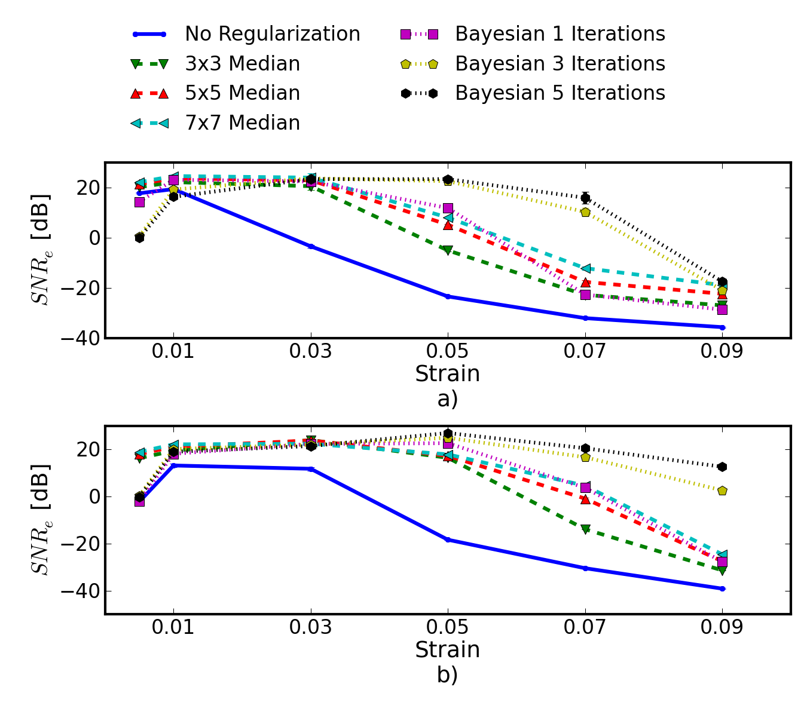

  |metric_plot_uniform|.  Motion tracking quality (SNRe) versus applied strain for a) uniform phantom and b)
  uniform simulation.

In |metric_plot_uniform| we see that, especially for high strains, Bayesian
regularization outperforms median filtering or no regularization.  The same
bandpass type pattern [Varghese1997]_ is seen for both the phantom and
simulation.  With regularization, the simulation performs better at the highest
strain, 9.0%.  This may be explained by the deformation model used in the
simulation: the simulation does not account for out of plane motion, which may
occur at high strains and causes large signal decorrelation.  Note that for very
low strains, 0.5%, the Bayesian regularization causes a regression in
performance.

Circular Inclusion Simulations and Phantoms
===========================================

A TM ultrasound elastography phantom subject to uniform deformation was imaged
using a clinical ultrasound scanner.  The 10×10×10 cm gelatin phantom had a 1.0
cm spherical inclusion near its center.  This type of phantom is common in the
elastography literature because of its simple, well known behavior and
resemblance to a tumor within background tissue.

Displacement estimation error for comparison with the median filter and
optimization of SRS was computed as follows.  The estimated displacements were
interpolated with cubic B-spline interpolation such that the sampling of the
displacement image matched that of the RF data.  The inverse displacement was
applied to each pixel in the pre-deformation image, and windowed-sinc
interpolation applied to find the corresponding RF value in the post-deformation
image.  A mean absolute RF difference (MARD) is reported excluding the edges of
the image where edge effects or out-of-bounds conditions may occur.

.. math:: MARD = \frac{ \sum_{i=1}^n | I_m(\mathbf{x}_i - \mathbf{u}_{x,i}) - I_f(\mathbf{x}_i) | } { n }

Where :math:`I_m` is the interpolated RF value in the post-deformation (moving)
image and :math:`I_f` is the RF value in pre-deformation (fixed) image.

In order to simulate the circular inclusion, displacement fields were generated
by specifying the mechanical properties of interest, and applying uniform
displacements as boundary conditions using commercially available finite element
software, ANSYS (ANSYS Inc, Pittsburgh, PA, USA).  Displacement fields were
simulated for a simulation having a uniform background modulus of 2kPa and a
circular inclusion with a modulus of 8 kPa.  The inclusion's diameter was 8 mm.
Boundary conditions were as follows.  Uniform displacements were applied across
the tops of each simulation in the axial direction such that the nominal strain
produced in the simulation was equal to 0.5%,
1.0%, 3.0%, 5.0%, 7.0%, and 9.0%.  The bottom of the simulation was constrained to
have no axial displacement, and a single node was fixed in the lateral
direction at the bottom, central node to ensure uniqueness of the solution.
Displacement fields from a nearly incompressible (Poisson's ratio of 0.495)
material model in a plane stress state were simulated and applied to the
numerical phantoms.  The mechanical model represents a cylindrical inclusion
in an unconstrained background, which is similar in its deformation to the
spherical inclusion phantom [Skovorada1994]_.

Again, deformation estimation statistics on n=30 randomly generated collections
of scatterers were collected.  Displacement estimation error for comparison with
the median filter and optimization of SRS were computed as follows.  Output
displacements from the finite element simulation were interpolated with cubic
B-spline interpolation at locations where displacement estimation occurred.  A
mean absolute axial displacement difference (MADD) is reported excluding the
edges of the image, where edge effects may occur.

.. math:: MADD = \frac{ \sum_{i=1}^n | \hat{u}_a - u_a | } { n }

Where :math:`\hat{u}_a` is the estimated axial displacement and :math:`u_a` is
the known axial displacement.

We present estimated axial strain images with and without regularization at 5.0%
strain.  We also generated strain images after filtering the displacements with a 3×3,
5×5, and 7×7 pixel median filter for comparison.

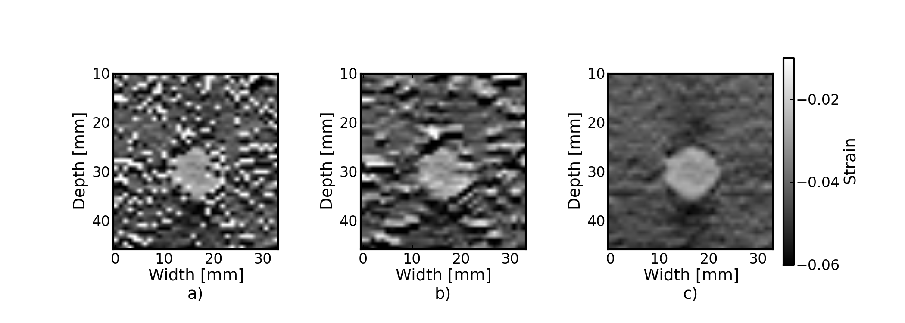

  |comparison_images_phantom|.  Phantom axial strain images with different types of regularization applied.
  a) No regularization.  b) 3×3 median filter applied to the displacements.  c)
  Three iterations of the proposed regularization algorithm.

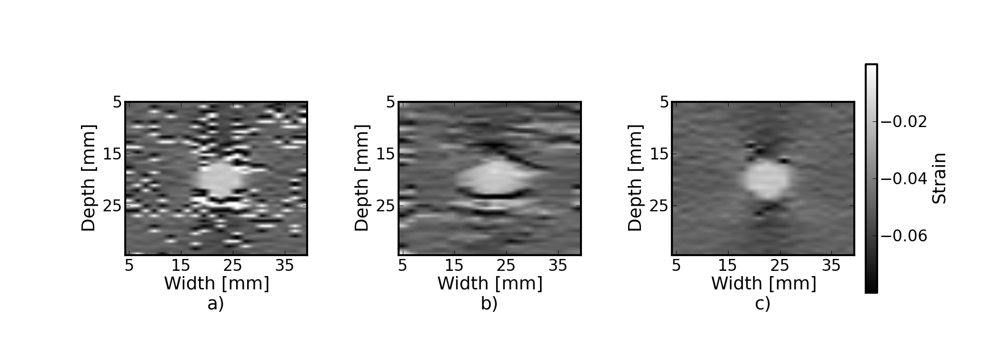

  |comparison_images_simulation|.  Simulation axial strain images with different
  types of regularization applied.  a) No regularization.  b) 3×3 median
  filter applied to the displacements.  c)  Three iterations of the proposed
  regularization algorithm.

Examples of the algorithm's effectiveness are shown in
|comparison_images_phantom| and |comparison_images_simulation|.
|comparison_images_phantom| shows axial strain images of the phantom data with
no regularization (a), median filtering of the displacements (b), and recursive
Bayesian regularization (c).  With no regularization, there are considerable
peak hopping errors limiting the ability of median filtering to remove these
errors.  Instead, these errors are 'smeared', which arguably makes the
regularized image worse than the original because the peak hopping errors are
more likely to be interpreted as artifactual tissue structures.  The proposed
Bayesian regularization on the other hand, does an excellent job of removing
these noise artifacts from the image.  Results are similar for the numerical
simulation results, shown in the |comparison_images_simulation|.  Again,
considerable decorrelation noise is present in the uncorrected image.  Median
filtering removes a good portion of the noise, but it also results in a
noticeable loss of resolution at the boundary of the inclusion.  The Bayesian
regularization does a better job of removing noise while increasing the
observable strain pattern surrounding the inclusion.  However, a few peak hopping errors
are not removed as illustrated in |comparison_images_simulation|\ (c).

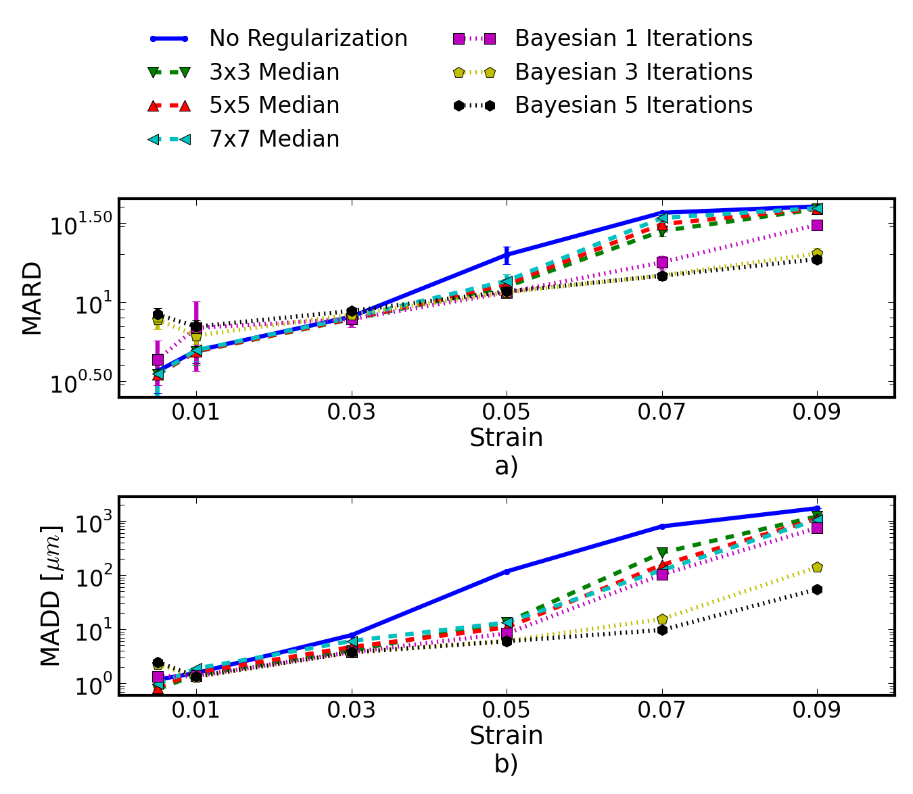

  |metric_plot_inclusion|.  Motion tracking quality versus applied strain for a) spherical inclusion
  phantom and b) cylindrical inclusion phantom simulation.  Different quality
  metrics are applied to the appropriate experiment-- a) uses mean absolute RF
  phantom image RF difference (MARD) versus regularization method (lower is
  better) and b) uses mean absolute displacement difference between the simulated and
  estimated displacements (lower is better).

Quantification of the results observed visually in |comparison_images_phantom|,
are shown in |metric_plot_inclusion|\ (a) and the corresponding simulation
results indicated visually in |comparison_images_simulation| are plotted in
|metric_plot_inclusion|\ (b).  Mean error metrics for the inclusion experiments
are plotted against strain for each regularization method.  Error bars again
denote two standard errors of the error measures corrected for repeated measure
means [Cousineau2005]_.  Results are consistent across strain content,
simulation and phantom data, and method for measuring the tracking quality of
the estimated displacement.  Bayesian regularization greatly improves motion
tracking performance over no regularization and median filtering at large
strains, 5.0% and higher.  Improvement is on par with median filtering at
moderate strains, 3.0%.  For small strains, <1.0%, Bayesian regularization may
decrease performance relative to no regularization.  In general,
increased iterations of the proposed algorithm results in greater improvement,
but the relative improvement from three iterations to five iterations is much
smaller than one iteration to three iterations.  In contrast, the ideal median
filter size varies depending on the strain content and the amount of applied
deformation.  This is consistent with our visual observations of the algorithm's
behavior; images improve up to approximately three iterations after which the
improvement is not as noticeable.

Optimal SRS
===========

An optimal SRS under different conditions was extracted
by minimizing the described error measure for both TM phantom and numerical simulation
images.  Brent's Method for scalar minimization [Brent1973]_ was performed to
a tolerance of 0.001.  The optimal SRS was examined over a range
of strains, kernel overlaps, and algorithm iterations.  Unless otherwise noted,
strain examined was 5%, kernel separation was 0%, and the number of iterations was
set to three.  Although SRS can be specified independently in
all directions, SRS reported is the parameter's value along
the axial direction.  The value in the lateral direction was taken to be half
the value in the axial direction since unconstrained compression of nearly
incompressible elastic materials lead to strains in orthogonal planes that are
half that along the loading axis, i.e. the incompressibility assumption.  Note,
however, the parameters for each direction can be specified independently, and
strain in one direction does not directly influence strain in the other
directions.

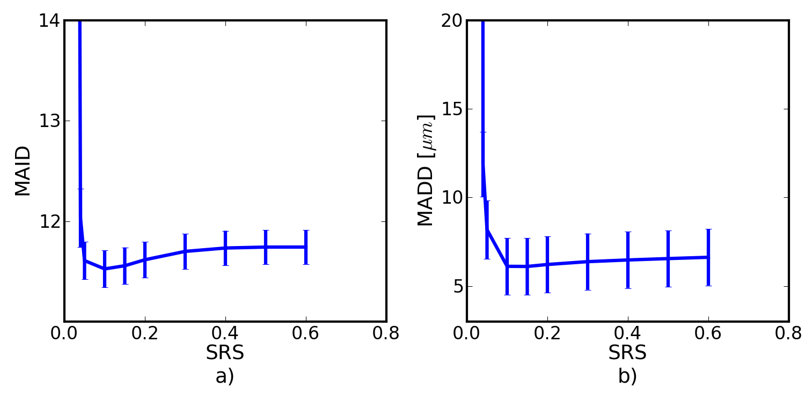

  |e_sigma_plot|.  Error measures on a) phantom and b) simulation versus
  the regularization parameter.  The nominal strain in both cases was 5 \%.

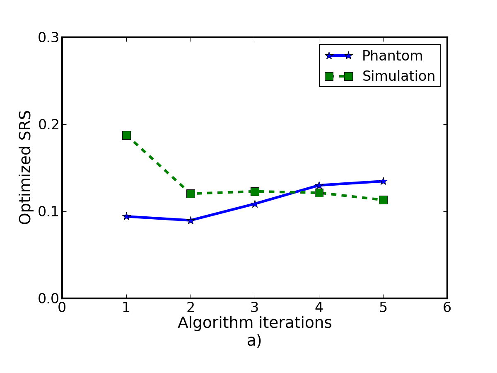

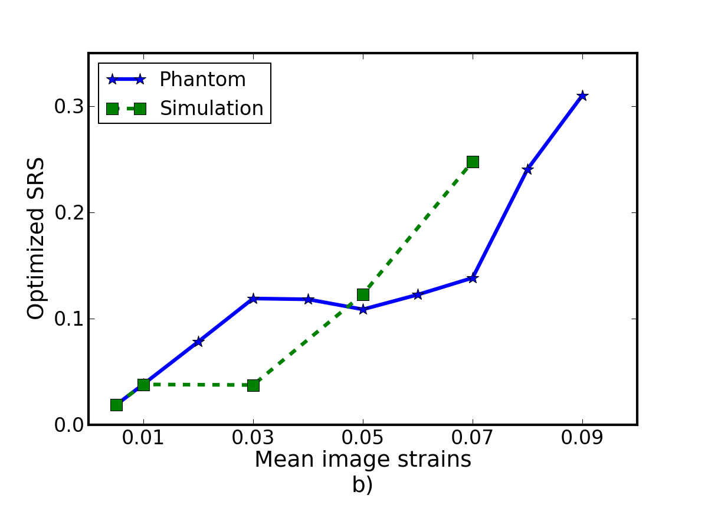

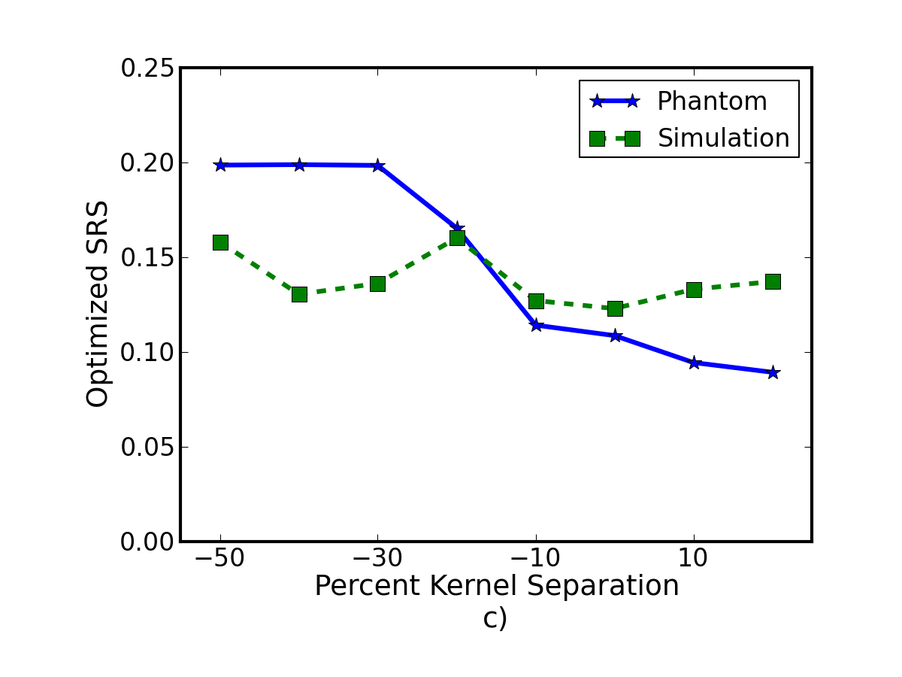

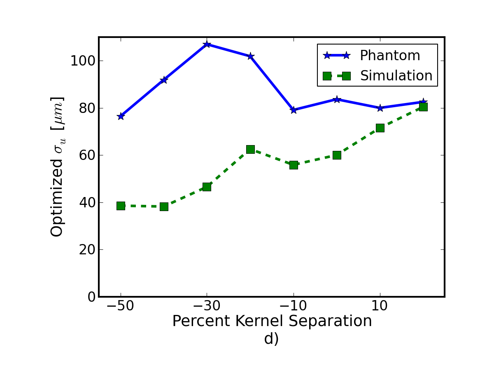

  |optimization_plot|.
  Variation in the optimized regularization parameter with a) the number of
  algorithm iterations, b) image strain, and c) block matching kernel overlap.
  To contrast with c) the optimized regularization parameter multiplied by block matching kernel
  spacing versus block matching kernel overlap is shown in d).

|optimization_plot|\ (a) shows optimized SRS versus the
number of algorithm iterations.  No consistent pattern is observed.  This
suggests the optimization parameters do not strongly depend on the
number of iterations.  As expected, |optimization_plot|\ (b) demonstrates the
optimal SRS increases with increasing image strain.  The
optimal parameter is approximately twice the image strain.  A decrease in
SRS is seen in |optimization_plot|\ (c) with phantom images, but a consistent trend
is absent from the simulation images.  The deviation in optimized parameters in
either case is relatively small given the flatness of the error metric shown in
|e_sigma_plot|.  |optimization_plot|\ (d), which plots :math:`\sigma_u` as opposed
to SRS, is shown to contrast with |optimization_plot|\ (c).
Phantom images again demonstrate a downward trend while simulation images
suggest an upward trend.  Optimized parameters for phantom images and simulation
images are more consistent in |optimization_plot|\ (c) than |optimization_plot|\ (d),
which suggest SRS may be a more consistent parameter than
:math:`\sigma_u`.

Addressing a Carotid Reverberation
==================================

While the Bayesian regularization is effective at removing decorrelation
noise, it is also effective at removing reverberation artifacts.  Reverberation
artifacts are a source of noise in B-mode images, and they are also a source of
noise in strain images.  A reverberation is a received signal that is the result
of multiple scatter events.  The time delay and apparent depth of a
reverberation artifact is longer and deeper than the true source of the original
backscatter event.  The motion of a reverberation artifact is not necessarily
congruent with backscattered signal from local tissue.  In fact, the
displacement of the reverberation may be in the opposite direction direction of
the local tissue.  If the reverberation signal is stronger than the local tissue
inside the matching kernel, an artifactual displacement estimate will be
generated.  However, if we use a regularization method that incorporates
displacement estimates from surrounding matching kernels, the artifact can be
removed.  In this section we demonstrate the removal of a carotid reverberation
and illustrate the algorithm's behavior during execution.

The following images show the area of focus in the longitudinal carotid B-mode
taken with the 18L6 on a Siemen's S2000 clinical machine.  The imaging plane
bisects the common carotid artery throughout almost the entire image.  On the
left the carotid bulb begins, with a thick mass originating at its base.
Observation of a B-mode video clip of the region clearly elucidates the high intensity
reverberation located in the center of the matching kernel.  The reverberation's
motion, upward, is opposite to the motion of the vessel wall, downward.

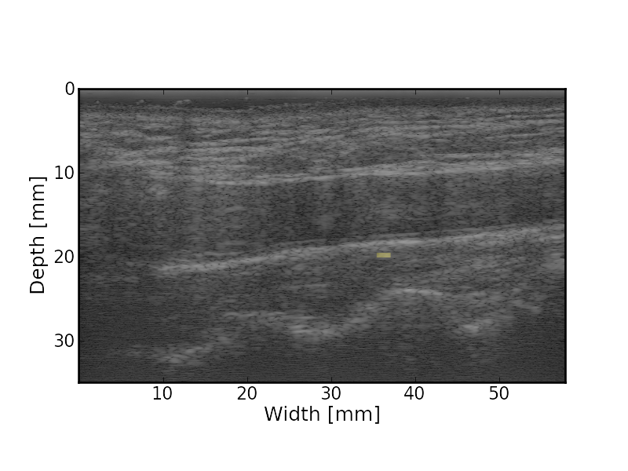

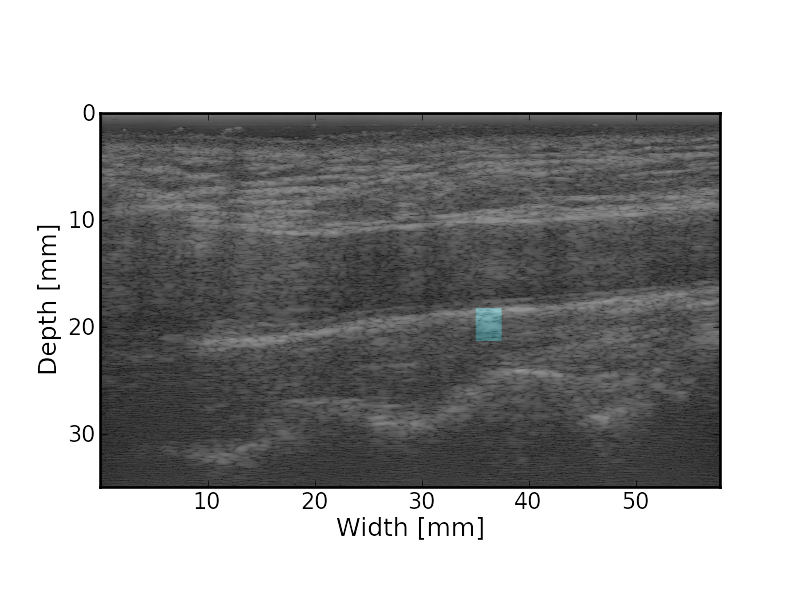

  |reverb_b_mode|. Longitudinal CCA B-mode with highlighted locations of the matching kernel (yellow, top), and the
  search region (cyan, bottom) that are subsequently analyzed in fine detail.

Focusing on the area of interest, we next examine initial probability image for the
displacement of the kernel.

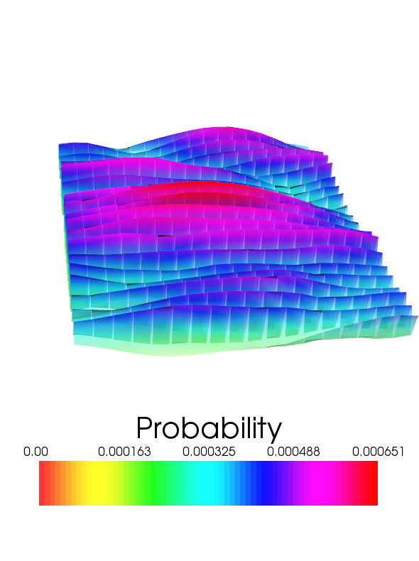

  |prob_image|. Probability image for the matching kernel's displacement.

Each point in the probability image is created by using normalized cross
correlation to compare the RF data in the matching kernel from the
pre-deformation image to the RF data in the post-deformation image.  The result
is shifted by negative one, the theoretical lower bound, and normalized so the
sum of the values add to one.  This is the prior probability for the
displacement of the matching kernel before the algorithm has been applied.  The
peak, the red region, is where the displacement would be estimated.  We see
that the ultrasound's point response function affects the probability
image; the image has rapid oscillations along the axial direction and slowly
developing peaks with relatively low definition in the lateral direction.

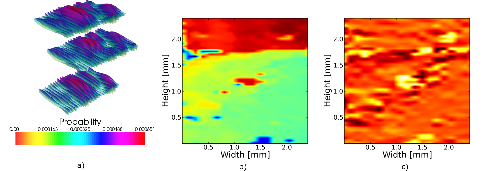

  |iteration_0|.  a) Probability images, b) axial displacement image in the ROI, and
  c) axial strain image in the ROI for iteration 0 (no regularization).

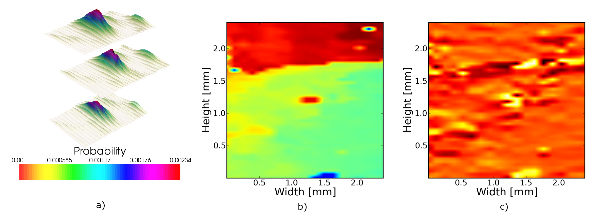

  |iteration_1|.  a) Probability images, b) axial displacement image in the ROI, and
  c) axial strain image in the ROI for iteration 1.

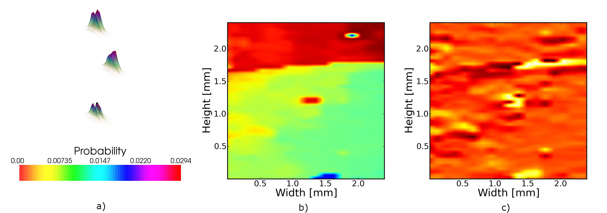

  |iteration_2|.  a) Probability images, b) axial displacement image in the ROI, and
  c) axial strain image in the ROI for iteration 2.

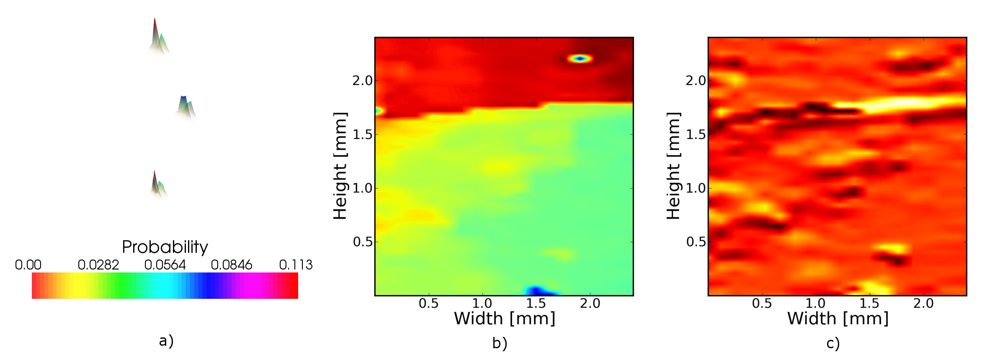

  |iteration_3|.  a) Probability images, b) axial displacement image in the ROI, and
  c) axial strain image in the ROI for iteration 3.

In |iteration_0| to |iteration_3| we examine the evolution of our ROI from no
regularization (iteration zero) to three iterations of our recursive Bayesian
algorithm.  The probability images of our matching kernel of interest (top), a
lateral neighbor (middle), and an axial neighbor (bottom) display what is
happening at specific points while the axial displacement and strain images
display the general situation in the region.

Structures present in the B-mode can be identified in |iteration_0|.  Near the
top of |iteration_0|\ b) we see the change in displacement that occurs at the
vessel wall.  High strain in the vessel wall can be observed in |iteration_0|\
c).  In both |iteration_0|\ b) and |iteration_0|\ c) tracking of the
reverberation's discontinuous motion can be observed in the center of the
image.  Without regularization, peaks in |iteration_0|\ a) are not distinctive.
We also note the extent of the noise in the displacement and strain image.

After the first iteration, the posterior probabilities in |iteration_1|\ a)
concentrate their energy in the same confined region in all three probability
images.  The noise is reduced in |iteration_1|\ b) and |iteration_1|\ c), but
the reverberation artifact is still present.

At the second iteration, |iteration_2|, it is easily visible that all three of
our probability images are bimodal.  One mode corresponds to the displacement of
reverberation while the other mode corresponds to the displacement of the local
tissue.  However, the reverbation peak is still stronger as the artifact is
still observable in |iteration_2|\ b) and |iteration_2|\ c).

Finally, at the third iteration, the local tissue mode dominates in
|iteration_3|\ a) causing the reverberation artifact to be removed from
|iteration_3|\ b) and |iteration_3|\ c).

Improvement of Carotid Strain Images
====================================

In order to examine the performance from data closer to what is expected in
clinical application, we visualize strain images in a carotid plaque case study
and also from porcine liver and a breast cancer case.  A different transducer
was used to collect the carotid RF signal than the phantom images, the Siemens
18L6 linear array (Siemens Ultrasound, Mountain View, CA, USA).  The carotid
images are a longitudinal view of primarily the common carotid with some plaque
into the bulb on the left side of the image.  The source of deformation in this
case is blood pressure.  A second set of images correspond to a radiofrequency
(RF) ablation performed on an open-abdominal *in vivo* porcine model with a
healthy liver.  The study was approved by the research animal care use committee
of the University of Wisconsin-Madison.  Details about this study are presented
in [Rubert2010]_.  The source of deformation in this case was movement of the
ablation electrode and breathing of the animal.  This case used the Siemens 9L4
transducer.  The third set of images are strain images generated from a breast
invasive ductal carcinoma [Xu2010]_ approved by the UW-Madison IRB.  In this
case, the source of deformation is compression of the ultrasound transducer.  RF
data was collected from a Siemen's VFX13-5 transducer to generate the breast
images.

Liver and carotid B-mode images are displayed along with axial strain images
with no regulation, 3×3 median filtering, and three iterations of Bayesian
regularization.  As with the spherical inclusion phantom, the MARD is calculated
to quantify the quality of motion tracking.

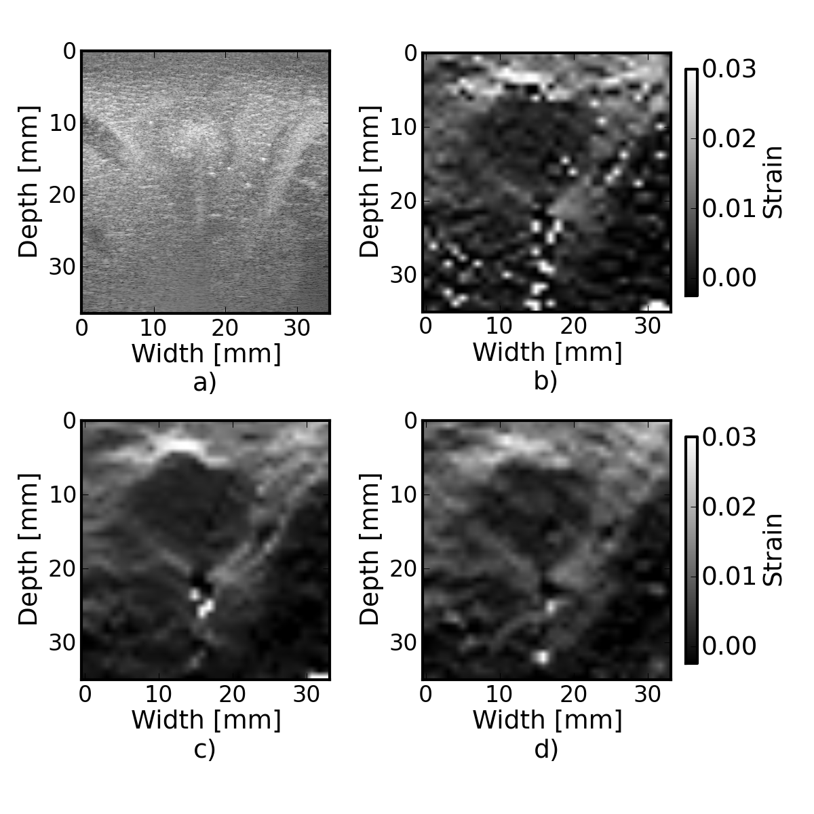

  |comparison_images_liver| Strain images from a liver undergoing RF electrode ablation.  a)
  B-Mode. b) No regularization. c) 3×3 median filter applied to the displacements.  d) Three
  iterations of the proposed regularization algorithm.

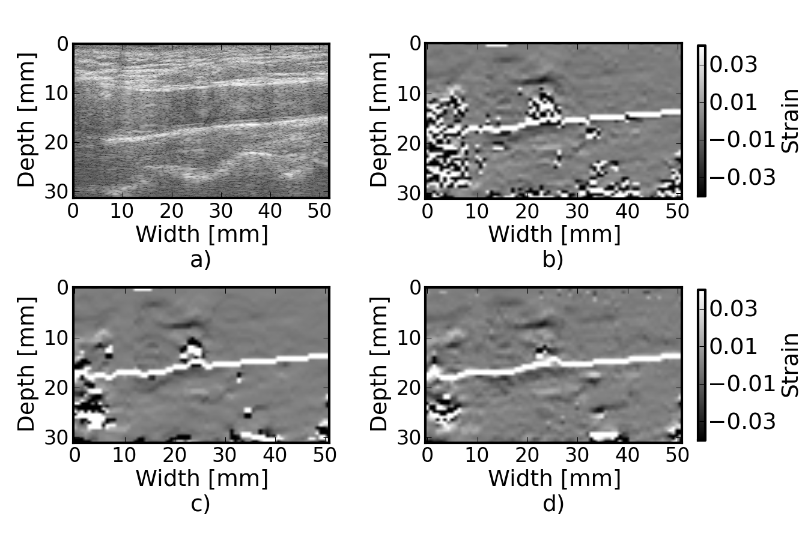

  |comparison_images_carotid| Strain images of an atherosclerotic carotid bulb during systole.
  a) B-Mode.  b) No regularization.  c) 3×3 median filter applied to the displacements.  d) Three
  iterations of the proposed regularization algorithm.

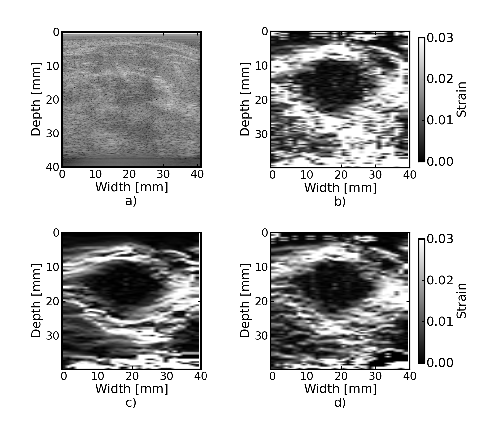

  |comparison_images_breast| Strain images of a breast invasive ductal carcinoma.
  a) B-Mode.  b) No regularization.  c) 5×5 median filter applied to the displacements.  d) One
  iteration of the proposed regularization algorithm.

Results from tracking tissue RF echo signals are shown in
|comparison_images_liver|, |comparison_images_carotid|, and
|comparison_images_breast|.  The ablated liver
tissue observable in |comparison_images_liver|\ (a) causes the reduced strain
region in the strain images.  Both median filtering and Bayesian regularization
remove the majority of peak hopping errors.  The median filtered image appears
smoother while the Bayesian regularization image has more detail, although the
true underlying strain is unknown, so it is difficult to associate a correct
image from appearance.  Bayesian regularization does slightly better at handling
shadowing from the electrode ablation needle at the bottom of the ablated
region.  The MARD were 150.0, 127.6, and 124.1 for no regularization, median
filtering, and Bayesian regularization, respectively.
|comparison_images_carotid| shows an atherosclerotic artery undergoing
compression during systole.  Bayesian regularization removes many of the peak
hopping artifacts in the areas of high strain, roughly 3% and higher.  However, note that in areas
distant from the vessel wall, where there is little to no deformation, Bayesian
regularization introduces additional artifacts compared to the case with no
regularizations.  This may be expected given the poor performance at very low
strains that is observed in |metric_plot_uniform| and |metric_plot_inclusion|.
The MARD was 55.6, 50.5, and 46.6 for no correction, median
filtering, and Bayesian regularization, respectively.  Consistent results are
also visible in the breast cancer image, and the MARD corroborates with 88.0,
73.39, and 68.7 for no regularization, median filter, and Bayesian
regularization.

~~~~~~~~~~
Discussion
~~~~~~~~~~

Block matching based displacement tracking methods can regularize the estimated displacement
to reduce noise artifacts by enforcing the diffeomorphic transformation expected
in images of solid tissue.  Filtering methods such as median filtering take into
account displacements of neighboring tracking kernels and can reduce noise
artifacts, but come at the cost of spatial resolution.  Better regularization
performance is possible when incorporating similarity metric values from
neighboring blocks prior to displacement estimation.

The method described in this chapter is analogous to regularization algorithms
that minimize a cost function involving the similarity metric and the continuity
[Rivaz2008,Jiang2009,Pellot-Barakat2004]_.  However, transforming the
similarity metric image into a probability distribution allows use of the similarity
metric's weight in determining displacements to vary dynamically depending on
the local uncertainty.  The weight of the similarity metric does not depend on its
absolute value.  Instead, weight of the similarity metric is adjusted locally to
the noise conditions in a tracking kernel's search region.  This independence of
local or global noise improves robustness of the local estimated displacements.

Due to its statistical nature, the algorithm encourages a continuous solution,
but it still allows discontinuous motion when it is strongly suggested by the
data.  This is important for |comparison_images_carotid|, where opposing
arterial walls move in opposite directions.

The form of the likelihood term in the Bayesian model suggests that a Gaussian
distribution in the estimated strain is expected since it involves the
difference in displacements and kernel spacing is constant.  The actual strain
distribution depends on the modulus distribution and boundary conditions of the
tissue imaged, but a Gaussian distribution is an appropriate generic form
because of the Central Limit Theorem.  As long as the regularization parameter
is large enough, the algorithm performs across a wide range of strains.  This
robustness can be inferred from the flatness in the latter portion of
|e_sigma_plot|.  If the variance of the Gaussian is presumed to be too small,
large strains are not possible, and regularization will degrade the quality of
motion tracking.  Furthermore, we have shown that the parameter does not have to
be chosen arbitrarily because of its meaningful interpretation in terms of the
expected strain.  In Hayton's original article, he remarked on the complex
interaction of the Gaussian likelihood standard deviation with kernel spacing
[Hayton1999]_.  The term :math:`\mathbf{\sigma_u}` controls the probability of
:math:`\delta u` in :math:`\delta u / \delta x` but the kernel spacing scales
:math:`\delta x` in :math:`\delta u / \delta x`. When we formulate
:math:`\sigma_\varepsilon` as :math:`\sigma_u / \delta_x` the algorithm's
parameters are decoupled into a single parameter with a meaningful
interpretation.  A good SRS can be determined
analytically as opposed to heuristically with a rough knowledge of the expected
strain.  |optimization_plot|\ (b) shows that the optimal parameter increases with
the image strain.  However, the relationship is not expected to be strictly
linear.  A strain image will contain a distribution of strain amplitudes, and
signal decorrelation varies with the applied strain [Varghese1997]_, which will
also affect the optimal parameter.  In an approximate sense, the SRS can be
viewed as the standard deviation of a function that modulates the estimated
strain.
 

As seen in |metric_plot_uniform| and |metric_plot_inclusion|, Bayesian
regularization can greatly increase the quality of motion tracking and dynamic
range of strains that can be imaged.  This improvement is mostly seen at higher
applied deformations, i.e. 5% and above.  For very small strains, application of
the algorithm can decrease image quality compared to no regularization.  The
source of noise at small strains is predominately electronic and quantization
noise [Varghese1997]_, and quantization noise may prevent the algorithm from
being effective at these levels.  This behavior along with the additional
computational expense, suggest it may be desirable to limit application to high
strain situations when applied to a clinical setting.

Various methods, given in the subplots of |metric_plot_uniform| and
|metric_plot_inclusion|, were used to to validate the algorithm.  The SNRe is a
common method for evaluating strain imaging algorithms in the literature that
characterizes the dynamic range and peak SNRe available [Varghese1997]_.
Typically, an algorithm has difficulty at low strains and high strains, which
gives the curve a 'bandpass filter' shape [Varghese1997]_, observable in
|metric_plot_uniform| and |metric_plot_inclusion|.  The regularization greatly
increases the dynamic range at the higher end, but slightly compresses it at the
lower end.  Since the SNRe is calculated on a uniform target, it does not
demonstrate the ability of the algorithm to faithfully reproduce structures,
which is often the purpose of creating the image.  For this reason, we also
evaluated performance with an inclusion target.  For the simulation case, we have
perfect knowledge of the true underlying displacement, so we can calculate the
MADD.  The MADD is a measure of the estimated displacement's fidelity over the
entire image.  In the phantom case, the true displacement is not precisely
known, so the MARD error measurement is used.  The MARD similarly measures the
estimated displacement's fidelity if the motion of the RF can be assumed to
follow the motion of the tissue from which it is generated.  Since the shape of
the MARD curves coincide well with the other error measures, its use in
providing a quantitative assessment of the *in vivo* examples is justified.  The
*in vivo* examples demonstrate the algorithms effectiveness in more realistic
clinical conditions.

Application of regularization of course comes at a computational expense.  The
authors have not attempted a real-time implementation, but the following
observations were made on the computational complexity.  First, the algorithm is
easily parallelizable and was implemented as a multi-threaded filter on a CPU.
The shifting, normalization, and logarithm operations are all parallelizable.
Computation of the likelihood term is parallelizable on a per displacement basis in
a given iteration.  Particular computational expense comes in the calculation of
the likeilood term, which is a convolution-like operation.  This has the
following implications.  Although |e_sigma_plot| suggests a safe choice of SRS
is higher, this will come at an additional computation expense because the
Gaussian term becomes larger.  Also, the size of the search region should be
minimal to reduce calculation of the likelihood terms.  Approaches such as a
multi-resolution pyramid [Shi2007]_ where subsampled search regions that
cover a large area of physical space are used to initialize smaller search
regions may be helpful.

In the removal of a carotid reverberation case study, we showed that, unlike a
median filter, the method is effective at removing reverberation
artifacts.  This is especially important for carotid strain images, where
reverberations are abundant relative to tissues like liver.  In the carotid low
attenuation in the blood and a number of high strength, coherent reflectors at
the muscles walls, artery wall, and blood-lumen interface contribute to a higher
concentration of reverberations.

~~~~~~~
Summary
~~~~~~~

We propose the application of a recursive Bayesian regularization algorithm for
carotid ultrasound strain imaging.  This algorithm applies a probabilistic model to the
similarity metric and imposes a Gaussian distribution on the estimated strain
when incorporating the results of neighboring matching kernels.  Results from
*in vivo*, TM phantom and numerical simulations were presented, and the proposed
algorithm performs better than median filtering of the
displacements.  Application of regularization is particularily appropriate for
images of the carotid artery where reverberations are abundant.

~~~~~~~~~~
References
~~~~~~~~~~

.. sectnum::

