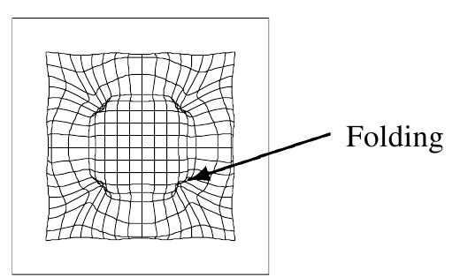

======================================================================
Recursive Bayesian Regularization Applied to Ultrasound Strain Imaging
======================================================================

This chapter describes how a recursive Bayesian regularization algorithm can be
applied during ultrasound displacement estimation to improve the quality of
carotid strain images.  First, we describe regularization's role in the block-
matching approach to deformable image registration.  Then we review
regularization algorithms that have been implemented in the literature.  Next,
we describe the iterative probabilistic approach taken in this work.  Finally,
we present results on simulations, phantoms, and carotid strain image case
studies.

~~~~~~~~~~~~~~~~~~~~~~~~~~~~~~~~~~~~~~~~~~~~~~~~~~~~~~~
Improvement of Strain Image Quality with Regularization
~~~~~~~~~~~~~~~~~~~~~~~~~~~~~~~~~~~~~~~~~~~~~~~~~~~~~~~

In simple block-matching image registration methods, the registration of a block
is isolated to the given block.  Motion of the block is local, and motion of
surrounding regions is not considered in determination of the block's
displacement.  Regularization methods allow displacements and success in
tracking of surrounding regions to influence the local displacement estimate.

Most regularization routines fit into a cost function paradigm.  Without
regularization, the estimated displacement, :math:`\mathbf{\hat{u}_x}`, can
be formulated as

.. math:: \mathbf{\hat{u}_x} = \arg\min_{\mathbf{u_x}}  E_s( \mathbf{u_x} )

Where :math:`E_s` is a similarity metric term, e.g., sum of squared differences,
negative of the correlation coefficient, etc.  When regularization is performed
in a cost function paradigm, an additional term must be minimized.

.. math:: \mathbf{\hat{u}_x} = \arg\min_{\mathbf{u_x}} [ E_s( \mathbf{u_x} ) + \alpha \: E_c( \mathbf{u}_{\mathcal{N}_x}, E_s( \mathbf{u}_{\mathcal{N}_x} )  ) ]

Here :math:`E_c` is a continuity term that depends on the neighboring
displacements and the similarity metric at neighboring displacements.  The
parameter :math:`\alpha` determines the amount of regularization.  A higher
:math:`alpha` will given greater weight to the displacement of surrounding
displacements and increase the amount of regularization.  Different algorithms
will implement their choice of :math:`E_s`, :math:`E_c`, and optimization
technique to minimize the cost function.

The result of regularization is an improved displacement estimate since we can
incorporate our *a priori* knowledge that the displacement is continuous.
However, if the regularization parameter :math:`\alpha` is too large, excessive
smoothing may introduced causing a loss of features and dynamic range in the
strain images.  Regularization of this type is especially important for
block-matching deformable image registration techniques where the motion model
does not assume any continuity.  Motion is considered as a completely local
phenomena.  This contrasts with B-Spline, Elastic Body Spline, or Finite
Element Method (FEM) deformable image registration methods
[Zikic2006,Davis1997,Krucker2002,Craene2009,Zhong2007]_.  In these methods, the motion
model is such that a local point moves in concert with tissues.

While B-Spline deformable transform do not have the same difficulty the
block-matching methods have in enforcing local continuity, they both share a
related problem since the B-Spline deformation basis functions are compactly
supported.  Both block-matching and B-Spline deformable transforms do not
enforce diffeomorphic transform [Rueckert2006,Craene2009]_.  A displacement map that is
diffeomorphic must be continuous, differentiable, and invertible [Craene2009]_.
A diffeomorphic transformation be a one-to-one mapping between the pre and post
deformation image.  Consider the following B-spline grid from Schnabel et. al.
that illustrates non-diffeomorphic behavior [Schnabel2001]_

  B-spline grid demonstrating non-diffeomorphic folding.  Taken from
  [Schnabel2001]_.

.. |folding| replace:: Figure 1

Folding or tearing is not likely or possible in physical tissues, so
diffeomorphic behavior should be enforced.

Peak-hopping errors in block-matching methods will result in non-diffeomorphic
displacement maps.  Since regularization helps to enforce diffeomorphic behavior with
block-matching methods, it helps to remove peak-hopping errors in addition to
generally improving the motion estimates.

~~~~~~~~~~~~~~~~~~~~~~~~~~~~~~~
Prior Efforts in Regularization
~~~~~~~~~~~~~~~~~~~~~~~~~~~~~~~

~~~~~~~~~~~~~~~~~~~~~~~~~~~~~~~~~
Recursive Bayesian Regularization
~~~~~~~~~~~~~~~~~~~~~~~~~~~~~~~~~

~~~~~~~
Results
~~~~~~~

Uniform Strain Simulations and Phantoms
=======================================

Circular Inclusion Simulations and Phantoms
===========================================

Addressing a Carotid Reverberation
==================================

Improvement of Carotid Strain Images
====================================

~~~~~~~~~~
References
~~~~~~~~~~

.. sectnum::

