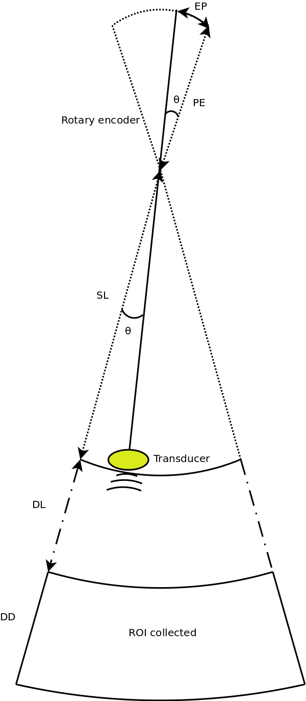

=============================================
High-frequency 3D Ultrasound Characterization
=============================================

High-frequency ultrasound imaging is useful for examining small objects -- it
has the advantage of high resolution at the expense of low penetration.  In this
chapter we explore new high frequency imaging techniques to interrogate the
excised plaques which result from endarterectomy.  First, we describe the methods
used to adapt a commercial high-frequency scanner system to perform low-level 3D
imaging research.  Next, we describe methods to characterize the acoustic
properties of high-frequency reference phantoms necessary to generate parametric
images.  Finally, we present initial 3D parametric images of the excised
plaques.

.. |vs_plaque_system| replace:: Fig. 1

.. |vs_plaque_system_long| replace:: **Figure 1**

.. |vs_plaque_transducer| replace:: Fig. 2

.. |vs_plaque_transducer_long| replace:: **Figure 2**

.. |vs_digital_rf| replace:: Fig. 3

.. |vs_digital_rf_long| replace:: **Figure 3**

.. |rdi_content| replace:: Fig. 4

.. |rdi_content_long| replace:: **Figure 4**

.. |rdixml| replace:: Fig. 5

.. |rdixml_long| replace:: **Figure 5**

.. |vs_field_of_view| replace:: Fig. 6

.. |vs_field_of_view_long| replace:: **Figure 6**

~~~~~~~~~~~~~~~~~~~~~~~~~~~~~~~~~~~~~~~~~~~~~~~~~
Collection and analysis of 3D radiofrequency data
~~~~~~~~~~~~~~~~~~~~~~~~~~~~~~~~~~~~~~~~~~~~~~~~~

VisualSonics Vevo 770 system
============================

.. highlights::

  |vs_plaque_system_long|. VisualSonics Vevo 770 imaging system.  The Vevo 770
  supports multiple transducers and has a standard console for interaction
  common to commercial imaging systems.  The system also comes with a motion
  table designed to secure and position the transducer (right).  Typically,
  animals are imaged on a platform equipped with physiological monitoring and
  anesthesia systems, but this has been replaced with a water bath to image the
  excised tissues.

VisualSonics is a Toronto, Canada company that manufactures high-frequency
ultrasound imaging systems designed for pre-clinical research on small animal
targets.  Anatomical and real-time physiological imaging of mice and rats is
possible with resolutions up to 30 μm and frame rates up 240 frames per second
(fps).  Primary features of the system are intended to allow longitudinal,
non-invasive monitoring of anatomical and hemodynamic features as well as for
theraputic intervention.  Some of these features include 2D B-Mode, 3D B-Mode
with a stepper motor system, M-Mode, pulse-wave Doppler, power Doppler, tissue
Doppler, and contrast agent imaging.  An ancillary feature of the system is the
output of radio-frequency (RF) raw data for basic analysis.  In this section we
describe methods to harness the RF output to perform advanced imaging research.

The Vevo 770 system is the last generation of Vevo line systems that are
designed around rotated single-element transducers; beginning with the Vevo 2100
and later, the transducers are high frequency linear array systems.
The newer linear array transducer systems have better capabilities for
pre-clinical imaging: a programmable transmit focus and dynamic receive focusing
allow for a greater depth of field and better lateral resolution [Madsen2010]_.
However, the single-element, high-frequency, wide bandwidth transducers of the
Vevo 770 are desireable for the purpose of creating parametric ultrasound images.
As discussed later, the simpler transducer geometry allows the system to be
modeled during quantification of TM phantom acoustic properties.  The same
transducer can then be used in the collection of planar reflector, TM phantom,
and tissue signals.

A photograph of the Vevo 770 imaging system is shown in |vs_plaque_system| with
a close-up of the transducer assembly in |vs_plaque_transducer|.   The single
element transducer rests at the end of a shaft whose pivot point is high within
the body of the case assembly.  The angular position is measured with a rotary
encoder above the pivot point and scan conversion is necessary for proper
display.  In order to achieve high frame rates, the transducer is rotated quickly
about the pivot point by a motor in the transducer housing.  To facilitate good
coupling between the transducer and a living specimen outside of a water bath,
the transducer element is encapsulated by a plastic basin and a replaceable thin
film over the active element.  The thin film must be placed on the transducer
and the scanhead filled with water prior to each application.

.. highlights::

  |vs_plaque_transducer_long|. The Vevo 770 transducer (white) is held by a
  clamp connected to a precise linear stepper motor (top).  The transducer
  element is suspended in a water filled capsule by a rod whose pivot point is
  high in the assembly housing above the clamp.

Two options exist on the system to collect RF data: a BNC output exists for
triggered signal acquisition with an external oscilloscope or other
analog-to-digital (A/D) device, or RF data can be collected with an on-board A/D
board integrated with the *Digital-RF* software module if available.  An advantage to
the latter system is an integrated preview of the acquired data at the time of
acquisition along with coordinated 3D acquisition via system software
control of the stepper-motor.

A variety of transducers are available that differ in their focal length,
aperature, center frequency, and bandwidth.  The transducer selected was a
RMV710B that has a center frequency of 25 MHz,
which is on the lower end the center frequency for available transducers.  This
transducer outputs frequencies upto 37.5 MHz, with an axial resolution of 70 μm,
lateral resolution of 140 μm, focal length 15 mm, and a maximum field of view of
20.0 mm.  The RMV710B was selected because the frequency was low enough to
penetrate the plaque and the field of view was large enough to encompass the
entire sample.

Volume concatenation, storage, and processing
=============================================

RF acquisition is performed in M-mode and is considerably slower than B-mode
rates.  The collection of a single 3D data set covering an entire plaque takes
approximately two hours.  RF acquisition was previously limited to single 2D
frames, but we worked with VisualSonics engineers such that RF acquisitions can
be collected in 3D with the optional high-precision stepper motor.  Data is
stored in a pair of non-standard plain text and binary files that contain system
settings and raw data respectively with B-mode and saturation image of the
region-of-interest (ROI) window for the first frame along with the RF data.  A/D
conversion is 12 bit with 71 dB dynamic range, 410 MS/s sampling rate, and 73 dB
gain.  

.. image:: images/vs_digital_rf.png
  :width: 10cm
  :height: 7.34cm
  :align: center
.. highlights::

  |vs_digital_rf_long|.  The *Digital-RF* user interface on the VisualSonics
  Vevo 770.  System B-Mode is shown in the upper right with a red overlay of the
  RF collection ROI.  The lower right shows the ROI window B-Mode and
  saturation content, which is saved in the acquired file along with the RF
  data.  The time and frequency content a selected A-line in the ROI window is
  shown in the lower right.

Data collection is well integrated into the user interface of the machine, but
buffer limits on the A/D card limit the length of acquisition to a subset of the
field of view, |vs_digital_rf|.  When data files are exported in *RAW* format,
two files are saved for each acquisition.  A file with the *.rdb* extension is a
binary format file.  This *.rdb* contains three images in sequence in sequence:
two image of the ROI selected in the scout window followed by the RF data.
Regardless of whether the 3D acquisition occurs, the ROI images are
always 2D images.  These images contain the content found in the system preview
of the scan ROI before scan conversion.  First is a B-Mode image in two byte
unsigned integer format written sequentially in A-lines.  All binary data is in
*Little Endian* format, i.e. the least significant byte (LSB) precedes the most
significant byte (MSB).  A saturation image with the same size as the B-Mode
images follows.  The saturation image is again in two-byte unsigned integer
format, but the content is boolean; a non-zero sample indicates that the
digitizer was saturated at that datum.  The ROI data is followed by RF
data in the acquired volume of interest.  Unlike the ROI images, the RF
data is in a two-byte signed integer format.  The RF data is written
sequentially by samples within an A-line, followed by A-lines within a frame,
followed by the frame in the volume.  There is more than one pulse-echo data
segment saved for each A-line.  To allow signal averaging with the transducer
fixed in a given position, an average A-line signal is save followed by the
individual pulse-echo contents.  For the beta 3D Digital-RF acquisition software
available, though, only a single pulse-echo acquisition is possible per A-line
when in 3D mode.  Information on the number of A-lines, averaged signals, etc.
required to read, analyze, and scan convert the binary data must be extracted
from the metadata header file.

Each *.rdb* binary file has a *.rdi* metadata header file associated with it.
This file has three sections, Image Info, Image Data, and Image Parameters.  The
Image Info section contains information related to the current acquisition such
as an operator defined labels, the number of frames, or the acquisition time.
The Image Data section contains information on byte offsets to A-line locations
in the binary file for the ROI B-mode, ROI saturation, and the RF data.
Finally, the Image Parameters section contains system settings such as the
transmit pulse settings, time-gain compensation (TGC) settings, characteristics
of the current transducer, ECG settings, or the stepper motor position.  Example
content from an *.rdi* is shown in |rdi_content|.

::

  "=== IMAGE INFO ==="
  "Study Name","QuickStudy 201001201737"
  "Image Id","54HTKMSSMJCKL2JSKMMF1TPCDW"
  "Image Label",""
  "Image Frames","136"
  "Image Lines","250"
  "Image Acquisition Per Line","1"
  "Image Acquisition Size","4256","bytes"
  ...
  "=== IMAGE DATA ==="
  "ROI Data Offset - B-Mode","0","bytes"
  "ROI Data Size - B-Mode","73472","bytes"
  "ROI Data Offset - Saturation","73472","bytes"
  "ROI Data Size - Saturation","73472","bytes"
  "Image Data Offset - Frame 0 - Line 0 - Acq 0","146944","bytes"
  "Image Data Offset - Frame 0 - Line 1 - Acq 0","151200","bytes"
  ....
  "=== IMAGE PARAMETERS ==="
  "RF-Mode/ActiveProbe/Notes","Rat Cardiology"
  "RF-Mode/ActiveProbe/Sample-Time","154","µs"
  "RF-Mode/BModeSoft/V-Relative-Frame-Rate","4"
  "RF-Mode/ActiveProbe/Focal-Length","15","mm"

.. highlights::

  |rdi_content_long|.  Example data from a Vevo 770 *.rdi* file.  Example
  content from the three sections of the ASCII plain text content, Image Info,
  Image Data, and Image Parameters, are given.

Each parameter is described on a line with two to three fields delimited by
quotations and commas.  The first field is generally a key name.  In the Image
Parameters section, this can take a hierarchical form delimited by a forward
slash.  The second field is the value for the given key, which will contain an
array of comma delimited numbers for an array of values.  An optional third
field contains the units for the value.  The voluminous amount of Image
Parameters results in a large file; a typical size is 35,000 lines.

Parameters for parsing the binary file can be found or derived from the Image
Info section, which makes the Image Data section largely redundant.  Parametric
image formation and scan conversions relies on content dispersed throughout the
Image Parameters section.  To facilitate the extraction of values of a given key
and conversion from plain text to the appropriate data type, library was develop
to parse the header content into an intermediate eXtensible Markup Language
(XML) form [Bray2008]_.  The advantages of XML in for this data set include its broad
support under diverse tools and programming languages as an open standard, a
native text-based and hierarchical form, and some explicit specification of data
types.  The structure of the *.rdi* is transformed into an XML hierarchy by
considering the main three sections as top level elements and division and
sorting of the keys in the Image Parameters section into a hierarchy of child
elements.  This structure was determined by parse and example header file instance
with a Python [Rossum2011]_ script and defined using an XMLSchema [Fallside2004]_

::

  <?xml version="1.0" encoding="UTF-8" standalone="no" ?>
  <rdi xmlns:xsi="http://www.w3.org/2001/XMLSchema-instance" xsi:noNamespaceSchemaLocation="rdi.xsd">

  <image_info>
    <Study_Name>QuickStudy 201001201737</Study_Name>
    <Image_Id>54HTKMSSMJCKL2JSKMMF1TPCDW</Image_Id>
    <Image_Label/>
    <Image_Frames>136</Image_Frames>
    <Image_Lines>250</Image_Lines>
    <Image_Acquisition_Per_Line>1</Image_Acquisition_Per_Line>
    <Image_Acquisition_Size>4256</Image_Acquisition_Size>
    <Animal_ID/>
    <Acquisition_Mode>Digital RF-Mode</Acquisition_Mode>
    <Acquisition_Date>1/20/2010</Acquisition_Date>
    <Acquisition_Time>5:42:14 PM</Acquisition_Time>
    <Acquisition_Operator>Default Operator</Acquisition_Operator>
  </image_info>

  <image_data/>

  <image_parameters>
    <RF-Mode>
      <ActiveProbe>
        <Notes>Rat Cardiology</Notes>
        <Sample-Time units="µs">154</Sample-Time>
        <Focal-Length units="mm">15</Focal-Length>
        <Acceleration-Limit-Slope>0</Acceleration-Limit-Slope>

.. highlights::

  |rdixml_long|.  Content of the header file in |rdi_content| after
  transformation into XML format.

Scan conversion
===============

.. highlights::

  |vs_field_of_view_long|.  Diagram of the Vevo 770 geometric parameters used in
  field of view calculations.  The transducer sits at the end of a shaft, and
  the angle of rotation is recorded by a rotary encoder attached to an extension
  of the shaft across the pivot point.  Parameters stored in the metadata file
  include PE, the pivot-to-encoder distance, SL, the shaft length, DL, the
  delay length in the water path from transducer to start of acquisition, DD,
  the digitizer depth, and EP, the encoder position.

Rotational scan version.

Doxygen content?

~~~~~~~~~~~~~~~~~~~~~~~~~~~~~~~~~~~~~~~~~~~~~~~~~~
Reference phantom development and characterization
~~~~~~~~~~~~~~~~~~~~~~~~~~~~~~~~~~~~~~~~~~~~~~~~~~

Phantom design
==============

Information from Ernie's paper.

Attenuation characterization
============================

sos_atten

Phase velocity characterization
===============================

sos_atten

Absolute backscatter measurement
================================

high freq paper.

~~~~~~~~~~~~~~~~~~~~~~~~~~~~~~~~~~~
Parametric images of excised plaque
~~~~~~~~~~~~~~~~~~~~~~~~~~~~~~~~~~~

Each
acquisition consists of 250 beam lines separated by approximately 60 μm, 2128
samples (3.9 mm), and up to 250 frames separated by 200 μm to 100 μm
depending on the length of the plaque specimen.  For the lengths of the plaques
we examined, which ranged from approximately 20 mm to 40 mm, this filled the
system limit on acquisition.  Resulting files are approximately 150 per
volumettric slice.  Three to five volumetric slices are required to encompass
the majority of an excised plaque's volume.  Some longer plaques may require
larger inter-frame spacing because of memory limitations, although the
resolution in the elevational direction is nominally 140 μm for the RMV710B
transducer.

new images

~~~~~~~~~~
References
~~~~~~~~~~

