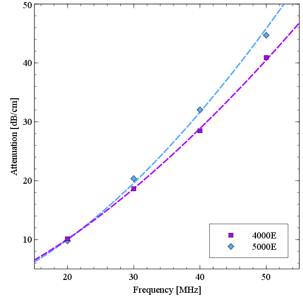

===================================================
Chapter 6 : High Frequency Phantom Characterization
===================================================

.. sectnum::
  :prefix: 6.

Next, we describe methods to characterize the acoustic properties of
high-frequency reference phantoms that are necessary to generate parametric
imaging based on quantitative ultrasound features with the reference phantom
method.  Recently, Madsen et al. [Madsen2010]_ developed tissue-mimicking (TM)
phantoms with ultrasonic properties of human arteries at very high frequencies
[Lockwood1991]_.  Accurate characterization of the acoustic properties of these
new phantoms poses additional challenges relative to the same characterization
at lower frequencies.  In this chapter, we describe the methods applied to
characterization of these phantoms.  Methods to determine the attenuation
coefficient, phase velocity, and absolute backscatter coefficient are
described. [#]_

.. [#] This chapter is adapted from McCormick, M, Madsen,
  E., Deaner, M., and Varghese, T.  *Absolute Backscatter Coefficient Estimates of
  Tissue-Mimicking Phantoms in the 5-50 MHz Frequency Range*.  Journal of the
  Acoustical Society of America.  In Review.

.. |size_distribution| replace:: Fig. 6.1

.. |size_distribution_long| replace:: **Figure 6.1**

.. |substitution_apparatus| replace:: Fig. 6.2

.. |substitution_apparatus_long| replace:: **Figure 6.2**

.. |panametrics_spectrum| replace:: Fig. 6.3

.. |panametrics_spectrum_long| replace:: **Figure 6.3**

.. |average_waveform| replace:: Fig. 6.4

.. |average_waveform_long| replace:: **Figure 6.4**

.. |substitution_pulse| replace:: Fig. 6.5

.. |substitution_pulse_long| replace:: **Figure 6.5**

.. |spectrogram_fig| replace:: Fig. 6.6

.. |spectrogram_fig_long| replace:: **Figure 6.6**

.. |saran_trans_coef| replace:: Fig. 6.7

.. |saran_trans_coef_long| replace:: **Figure 6.7**

.. |attenuation_plot| replace:: Fig. 6.8

.. |attenuation_plot_long| replace:: **Figure 6.8**

.. |delay_times| replace:: Fig. 6.9

.. |delay_times_start| replace:: Figure 6.9

.. |delay_times_long| replace:: **Figure 6.9**

.. |sos_method| replace:: Fig. 6.10

.. |sos_method_long| replace:: **Figure 6.10**

.. |backscattered_spectra| replace:: Fig. 6.11

.. |backscattered_spectra_long| replace:: **Figure 6.11**

.. |harmonics| replace:: Fig. 6.12

.. |harmonics_long| replace:: **Figure 6.12**

.. |waveforms| replace:: Fig. 6.13

.. |waveforms_long| replace:: **Figure 6.13**

.. |vs_screenshots| replace:: Fig. 6.14

.. |vs_screenshots_long| replace:: **Figure 6.14**

.. |bsc| replace:: Fig. 6.15

.. |bsc_long| replace:: **Figure 6.15**

.. |attenuation_table| replace:: Table 6.1

.. |attenuation_table_long| replace:: **Table 6.1**

.. |sos_table| replace:: Table 6.2

.. |sos_table_long| replace:: **Table 6.2**

~~~~~~~~~~~~~~~~~~~~~~~~~
Tissue-mimicking phantoms
~~~~~~~~~~~~~~~~~~~~~~~~~

The TM phantoms examined in this chapter are produced as reference phantoms for
use at high frequencies [Madsen2010]_.  Each phantom is macroscopically uniform.
The base material of the phantoms consists of a mixture of agarose, propylene
glycol, Germall Plus (preservative), and ultra-filtered whole bovine milk.
Scattering is due to randomly distributed glass beads.  Two phantoms are
examined with different glass bead concentrations (mass per unit volume) and
different diameter distributions (catalog numbers 4000E and 5000E, Potter
Industries, Inc., Valley Forge, Pennsylvania, USA).  The two phantoms will
henceforth be referenced as the '4000E phantom' and '5000E phantom',
respectively.  The diameter distributions of the two glass bead categories that
are utilized in these phantoms are shown in |size_distribution|; mean scatterer
diameters of the 4000E and 5000E phantoms are 5.40 μm and 5.16 μm, respectively. The diameters
are measured by placing beads in an agarose suspension and viewing under an optical
microscope.  Approximately 500 diameter measurements are made for each bead
source.  The diameter percentage is calculated by binning the measurements
and dividing by the total frequency.  The percentage is also calculated
with the kernel density estimation (KDE) technique [Rosenblatt1956,Parzen1962a]_; a Gaussian kernel is used
with bandwidth automatically calculated using the method of Silverman
[Silverman1986]_.
The concentration of the 4000E bead is 6.00 g/L, and that of the 5000E beads is
15.60 g/L.

.. highlights::

  |size_distribution_long|: Size distribution of the TM phantom glass bead
  scatterers.  a) 4000E and 5000E distribution determined with a histogram
  divided by the total frequency.  b) 4000E and 5000E distribution determined
  with the KDE method.

~~~~~~~~~~~~~~~~~~~~~~~~~~~~
Attenuation characterization
~~~~~~~~~~~~~~~~~~~~~~~~~~~~

Attenuation is measured with the standard narrowband substitution technique
[AIUM1995,Madsen1999]_.  Attenuation, the rate of decrease in amplitude with
depth, *z* of the amplitude, *A*, of an pressure pulse is assumed to be linearly
proportional to the amplitude of the pulse,

.. math:: \frac{dA}{dz} = - \alpha A

*Eqn. 6.1*

.. epigraph::

  where α denotes the attenuation coefficient.  The amplitude of the
  acoustic wave decreases exponentially with time,

.. math:: A(t) = A_0 \exp( -\alpha z )

*Eqn. 6.2*

.. epigraph::

  if *A*\ :sub:`0` is the initial wave amplitude.

To measure the attenuation coefficient with the substitution method, we measure
the wave amplitude in a water-only path and after insertion of a TM sample with
known thickness.  Taking the ratio of the equation in both situations allows us
to remove the *A*\ :sub:`0` constant and solve for the attenuation coefficient.

.. image:: images/substitution_apparatus.png
  :width:  14cm
  :height: 10.5cm
  :align:  center
.. highlights::

  |substitution_apparatus_long|:  Water tank with experimental apparatus for
  the narrowband substitution technique.  The transducers are suspended
  in the tank by a system of mounts with translational and rotational degrees of
  freedom.  A heater keeps the water at a constant 22.0º C.  For calculation of
  both the phase velocity and the attenuation coefficient, signal is collected
  from a water-only path (shown), and with the sample placed in the path of the
  transducers (not shown).  A function generator and pulse amplifier provide
  input to the transmitting transducer, and the oscilloscope and computer are
  to record the received signal.

The experimental apparatus layout is illustrated in |substitution_apparatus|.
The water tank is filled with degassed, reverse osmosis water to provide a
medium for ultrasound propagation.  Since the acoustic properties of water, in
particular the sound speed, can change with temperature, the tank water is kept
at a controlled 22.0 °C by a Haake DC10 heater (Thermo Fisher Scientific Inc.).
Especially at high frequencies, it is important to temporarily turn off the
circulating heater during signal acquisition to reduce vibrations that would
impact time delays and cause jitter while averaging sweeps.  For the same
reasons, it is critical to ensure the experimenter does not make contact with
the water tank while data is collected.

A Wavetek model 81 Function Generator is set to burst mode to generate a
sinusoid tone burst of 30 wavelengths.  In the *narrowband* substitution method,
measurements are made independently at individual frequencies.  The narrowband
measurement frequency
is the frequency of the sine waves in the tone burst.  While a theoretical
narrowband input would be a continuous sinusoid for all time, the signal can
effectively be considered narrow band near the center of the tone burst where
edge effects decrease to negligible levels.  The use of a tone burst instead of a
continuous wave is required for two reasons: the transducers have a limited
power dissipation capacity, and the start of the burst serves as a fiducial
marker when determined delays for speed of sound calculations.  The input
function generator signal is amplified by a model 75A250A radiofrequency (RF)
amplifier (Amplifier Research, Souderton, PA, USA) to provide a high voltage
excitation of the ultrasound transducers.

A sealed, co-axial BNC (Bayonet Neill-Concelman) connection to the transducers
is made to the transducers.  The signal is transmitted and received by a V358 50
MHz center frequency unfocused transducer pair (Olympus Panametrics-NDT, Waltham,
MA, USA).  The transducers are aligned by peaking the received signal with a
micrometer controlled translation unit (Ardel Kinematic Inc., Stratford, CT,
USA) and gimbal mount (Newport Oriel, Stratford, CT, USA). The transducers are
separated by a relatively close 42 μs delay (62.5 mm signal propagation path) to
prevent attenuation of the signal.  These transducers, serial numbers 630314 and
630315, are well matched in their spectral response with a -6 dB bandwidth from
28 MHz to 65 MHz as shown in |panametrics_spectrum|.  In practice we find that
sufficient signal can be obtained from 10 MHz to 70 MHz.

.. image:: images/panametrics_spectrum.tif
  :width:  14cm
  :height: 6.3cm
  :align:  center
.. highlights::

  |panametrics_spectrum_long|:  Impulse response of the two transducers, serial
  number 630314 and 630315, used to measure the sound speed and attenuation of
  the phantom sample.  Measurements are provided by Olympus Panametrics-NDT and
  performed per ASTM E1065.

The received signal is digitized and displayed with the WaveRunner LT342
oscilloscope (LeCroy, Chestnut Ridge, NY, USA).  The received signal was
collected at 500 MS/s, and ten independent sets of 100 averaged pulses were
transferred to a computer for further offline analysis.

Vibration from the buildings or other sources can cause jitter in received
waveform, which will decrease the averaged amplitude.  A guard against this
source of error is to plot the waveform before and after averaging, as in
|average_waveform|.

.. image:: images/13Nov08TMBlood--20.00-MHz.eps
  :width: 10cm
  :height: 7.5cm
  :align: center
.. highlights::

  |average_waveform_long|:  Received waveform from the 5000E sample before and
  after averaging.  Noise is removed from averaged waveform, but the amplitude
  does not decrease, which can occur when jitter is present.

Frequency-dependent attenuation causes distortion at the beginning and the end
of the tone burst.  In order to ensure that we are measuring the amplitude at
the narrowband portion of the signal, we calculate the root-mean-square
amplitude where correlation with a 20 cycle sine wave of the excitation wave is
peaked.  If the received signal is viewed in the time-frequency plane, only the
central portion of the tone burst is effectively narrowband.  As shown in
|substitution_pulse|\ c) and |substitution_pulse|\ d), the edges of the signal,
which have lower local frequency content, experience less attenuation.  A
spectrogram, |spectrogram_fig|, demonstrates that in a frequency-time plane,
the power spectral density of the signal is narrowband only at the center of the
tone burst.

.. highlights::

  |substitution_pulse_long|: Averaged, received signals obtained using the narrowband substitution method.
  a) water-only signal at 20 MHz, b) 5 mm sample inserted with the center
  frequency at 20 MHz, c) water-only signal at 40 MHz, and d) sample inserted
  with the center frequency at 40 MHz.  Time is relative to excitation at the
  source transducer and the plotted time axes limits are kept consistent to
  demonstrate time shifts.  Amplitudes are kept consistent at each frequency,
  but the excitation amplitude is adjusted with frequency so sufficient
  signal-to-noise ratio is obtained without saturation and non-linear
  propagation.  The dramatic effect of frequency-dependent attenuation on the signal
  shape can be seen in d).

.. highlights::

  |spectrogram_fig_long|: Spectrogram of the water-only signal at 40 MHz. a)
  Signal amplitude versus time.  b) Spectrogram where the power spectral density
  is mapped to colors and shown over the same time period.  A moving Hanning
  window of 64 points is used to calculate the power spectral density with an
  overlap of 32 points and zero-padding to 512 points.  The signal is only
  narrow-band around 40 MHz at the center of the tone burst.

When sound is transmitted through the water-only path, its amplitude decreases
across :math:`z_1`, the distance from the transmitting transducer to where the
start of the sample will be placed, across :math:`d`, the thickness of the
sample, and :math:`z_2`, the distance from the end of the sample to receiving
transducer.

.. math:: A_w = A_0 \exp( -\alpha_w z_1 ) \exp( -\alpha_w d ) \exp( -\alpha_w z_2 )

*Eqn. 6.3*

When sound propagates through the surrounding water and sample, the received
amplitude is,

.. math:: A_s = A_0 \exp( -\alpha_w z_1 ) T \exp( -\alpha_s d ) \exp( -\alpha_w z_2)

.. epigraph::

  where *T* is the total transmission coefficient of the two thin films enclosing the
  sample.  When constructing the substitution method sample, the material used
  is the same as that produced during creation of the backscatter phantom but is
  covered by 12.2 μm thick Saran Wrap® film inside an acrylic cylinder.  The
  transmission coefficient, while nearly constant at lower frequencies, deviates
  at high frequencies, as shown in |saran_trans_coef|.  The transmission
  coefficient, *T*, is given by [Wear2005]_

.. image:: images/saran_trans_eqn.png
  :width: 14cm
  :height: 2.23cm
  :align: center

*Eqn. 6.4*

.. epigraph::

  where *Z*\ :sub:`w`, *Z*\ :sub:`s`, and *Z*\ :sub:`Saran`, are the acoustic
  impedances of water, the sample, and Saran Wrap respectively, *f* is the
  frequency, *c*\ :sub:`Saran` is the speed of sound in Saran, *α(f)*
  is the attenuation coefficient of the Saran Wrap in *Np/m*, and *l* is the
  thickness of each thin layer.  In our case *c*\ :sub:`Saran` is 2400 *m/s*,
  :math:`\alpha (f) [Np/m] = 5.0 \, f^{1.5}`\, the Saran density, ρ\ :sub:`Saran`
  is 1.69 *g/mL*.  Thickness of the Saran Wrap, which was 25 μm in previous
  cases, is re-measured, and the other properties, are assumed to be the same
  as those fit in Wear et al. [Wear2005]_.  Acoustic impedance, *Z*, for a
  material is the product of its density and speed of sound.  The density of the
  TM material was 1.045 g/mL for the 4000E phantom and 1.062 g/mL for the 5000E
  phantom.  Methods to obtain values for speed of sound of the test materials
  used in the attenuation coefficient calculation are described in the next
  section.

.. highlights::

  |saran_trans_coef_long|:  Transmission coefficient of the two thin Saran Wrap
  layers covering the production sample used in attenuation estimation
  experiments.  Note the dependence on frequency.

.. epigraph::

  Again, the attenuation coefficient, α, in dB/cm is calculated using the signal
  amplitude in the absence of the sample, *A*\ :sub:`w`, the signal amplitude with the sample in place, *A*\
  :sub:`s`.  Taking the two equations that define the attenuation in water-only and
  water-with-sample cases and dividing them,
  solving for α, and placing the result in decibels per centimeter,
  we obtain:

.. math:: \alpha (f) = \frac{20}{d} \log_{10} ( \frac{A_w T_{total}}{A_s} ) + \alpha_w (f)

*Eqn. 6.5*

The thickness of the test cylinder is 5.00 mm as measured with a calibrated
micrometer.  This is significantly thinner than the larger 'hockey-puck'
cylinders used at lower frequencies to limit high frequency attenuation.

Attenuation of water, α\ :sub:`w`, which is negligible at lower frequencies, must
be accounted for at high frequencies.  Attenuation of water is proportional to
the square of frequency from 3-70 MHz [Kay1995]_, and in dB/cm is

.. math:: \alpha_w (f) [dB/cm] = 2.08e^{-3} \, f^2

*Eqn. 6.6*

.. epigraph::

  when *f* is in MHz.

Results of attenuation coefficient characterization for both the 4000E and 5000E
phantom is shown in |attenuation_plot|.  Values from fitting to a power law model

.. math:: \alpha (f) [dB/cm] = \alpha_0 f^n

*Eqn. 6.7*

are tabulated in |attenuation_table|.

.. highlights::

  |attenuation_plot_long|:  Measured attenuation for the 4000E phantom and 5000E
  phantom.  Dashed lines show the results of fitting to a power law model.

=================== ====================  =========== ============================
 TM phantom          α\ :sub:`0` [dB/cm]   n           Coefficient of determination (R\ :sup:`2`\ )
------------------- --------------------  ----------- ----------------------------
 4000E               0.107                 1.52        0.9997
 5000E               0.069                 1.66        0.9979
=================== ====================  =========== ============================

.. highlights::

  |attenuation_table_long|: Parameters for a power law fit to the TM phantom
  attenuations.

~~~~~~~~~~~~~~~~~~~~~~~~~~~~~~~
Phase velocity characterization
~~~~~~~~~~~~~~~~~~~~~~~~~~~~~~~

Speed of sound is another fundamental acoustic property.  Tissue vary to some
degree; for instance, fat has a lower sound speed (1478 m/s) and tendon has a higher sound speed
(1670 m/s) [Culjat2010]_.  However, the canonical sound speed assumed by
clinical scanners for soft tissues is 1540 m/s.

The speed of sound is then obtained by inserting the change in time delay, Δ*t*,
and sample thickness, *d*, into the following equation [Wear2007]_

.. math:: c = \frac{c_w}{1 + \frac{c_w \Delta t}{ d }}

*Eqn. 6.8*

.. epigraph::

  if Δ*t* is the difference in the time delay between
  water-with-sample and water-only cases, *t*\ :sub:`w` - *t*\ :sub:`s`.  The speed of sound
  in pure water, *c*\ :sub:`w`\ , at 22º C is 1488.3 m/s [DelGrosso1972]_.

Considerable changes in the shape of the pulse occur because of frequency
dependent attenuation (see |substitution_pulse|).  As with the attenuation
coefficient, this poses challenges to measuring the quantity needed to calculate
the speed of sound, the time delay of a tone burst.  When measuring the delay of
a pulse or tone burst, there are different velocity definitions depending on how
the delay is defined.  The *signal velocity* results from measuring the delay of
the front of a pulse, *group velocity* from the center of a pulse, and *phase
velocity* if the delay of a single frequency component is measured [Wear2007]_.
The phase velocity is the most desirable because signal velocity and group
velocity have broad spectral content.  In general there is dispersion in phase
velocity, so it is difficult to apply signal or group velocity results to
other situations where the spectral content differs.

To precisely obtain the phase velocity, the same narrowband pulse zero-crossing
location is found in the tone burst of the water-only signal and the
water-with-sample signal.  First, we find the delay to a zero-crossing at the
center of the water-only tone burst.  To locate this zero-crossing, we first
find the 'start' of the received tone burst.  The 'start' of the tone is where
the signal exceeds the electronic noise that comes before the tone burst.  The
noise level is quantified by measuring the standard deviation of the first 100
samples of the received waveform.  The start of the signal is taken as the
sample where the received signal exceeds eight times the noise standard
deviation.  An approximate center of the pulse is found by moving 15 periods
past the start.  The closest zero-crossing is linearly interpolated from the
samples to obtain a precise delay for the water-only signal.  The procedure is
repeated for the water-with-sample signal, but instead of moving 15 periods past
the start, the offset is the closest zero-crossing to the difference between the
water-only zero-crossing and the water-only start.  This ensures the same
relative zero-crossing in the tone burst is used as the delay for both the
water-only and the water-with-sample cases.  This will be true as long as the
distortion at the front edge of the signal does not approach half a period,
which has empirically proven to be a valid assumption.  |delay_times_start|
shows the delay samples selected in this process at 50.0 MHz for the water-only
signal and after the 5000E signal is inserted.

.. highlights::

  |delay_times_long|:  Delay samples used in phase velocity calculations.
  Measurements made at 50 MHz.  An offset from the water signal start sample,
  a), to a zero-crossing at the center of the water-only tone burst, b), is used
  to find the corresponding zero-crossing, d), given the water-with-sample start, c).

An alternative method to the above is to take the delay to be the lag to the
maximum of the cross-correlation of the two signals.  A more precise location of
the cross-correlation peak can be obtained with parabolic interpolation of
the peak.  Of course, the broad-band edges of the tone burst are included in
the cross-correlation calculation.  Results for both methods are shown in
|sos_method|.  The calculated phase velocities are similar, but the
zero-crossing method trend is closer the expected dispersion.  According to the
Kramers-Krönig relations [Waters2000,Mobley2003]_, increased attenuation with frequency will cause an
increase in phase velocity with frequency.  Since attenuation increases
monotonically with frequency, it is expected that phase velocity will increase
monotonically with frequency.  Although, the observed dispersion is minute
compared to the variation found in soft tissues.  The phase velocity for both
phantoms at 30 MHz is shown in |sos_table|.

.. highlights::

  |sos_method_long|:  Phase velocity for the 5000E phantom calculated when the
  delay is determined with two different methods: zero-crossing in the
  narrowband portion of the signal, and lag of the cross-correlation peak.

============= ======================
 TM phantom    Phase velocity [m/s]
------------- ----------------------
 4000E         1541.02
 5000E         1540.64
============= ======================

.. highlights::

  |sos_table_long|: Phase velocity for the phantoms characterized at 30 MHz
  calculated with the narrowband zero-crossing method.

~~~~~~~~~~~~~~~~~~~~~~~~~~~~~~~~
Absolute backscatter estimation
~~~~~~~~~~~~~~~~~~~~~~~~~~~~~~~~

Calculation of the absolute backscatter coefficient (BSC), the differential
scattering cross section per unit volume at a scattering angle of 180 degrees,
follows the method described by Chen et al. [Chen1993,Madsen1984]_.  Using a
single element ultrasound transducer, pulses are propagated through water and
into the material of interest, and the spectrum of the received backscattered
signal voltage determines the BSC after correcting for characteristics of the
transducer, instrumentation properties, and ultrasonic properties of intervening
materials.

.. math::  BSC (f) \approx \frac{\langle V_g(f) V_g^*(f) \rangle}{C^2 \Vert T(f) B_0(f) \Vert^2 \int \int \int \Vert A(\mathbf{r}, f ) \Vert^4 d \mathbf{r} }

*Eqn. 6.9*

The backscattered signal *V*\ :sub:`g`'s spectrum is averaged from many
uncorrelated locations in the phantom to obtain the power spectrum.  The term
*C* is a constant that accounts for windowing of the signal, and is 0.63 for the
Hamming Window.  *A(r,f)* is the complex superposition coefficient determined by
the geometric properties of the transducer.  A planar reflector is then used to
determine *T(f) B*\ :sub:`0`\ *(f)*, where *T(f)* represents the complex transfer
function of the transducer, and *B*\ :sub:`0`\ *(f)* is the complex superposition
coefficient for the uniform monopole radiator assumed to exist on the transducer
surface [Madsen1984]_.

Generation of spectra
=====================

The transducer used for backscatter analysis was the 710B on a Vevo 770 scanning
system (VisualSonics, Inc., Toronto, Canada).  Further details on the methods
used to adapt the Vevo 770 for quantitative ultrasound imaging research can be
found in Appendix A.  This transducer has a center frequency of about 25 MHz,
and a broad bandwidth, 82% fractional bandwidth at -6dB, as illustrated in
|backscattered_spectra|.  The transducer active element is a spherical cap with
a projected aperture of 3.5 mm and 15.0 mm radius of curvature.  The received
signal was digitized at 420 MS/s with 12 bit precision.

.. highlights::

  |backscattered_spectra_long|: Power spectrum derived from radiofrequency data
  acquired using the 710B transducer for the planar reflector and TM phantoms taken at
  10% transmit power.

The Vevo 770, designed for high frequency imaging of small
animal targets, is easily saturated when presented with signal from a strong
planar reflector that experiences the relatively weak attenuation of a water path.  To
prevent saturation, a liquid-liquid interface where the two liquids have closely matched
acoustic impedances is used [Hall2001]_.  The interface reported by Hall et
al. [Hall2001]_ was recreated, which consists of a brominated hydrocarbon mixture covered by
water.  The hydrocarbon consisted of 39.018% by weight 1-bromoheptane (99%
purity, Acros Organics, New Jersey, USA) and
60.982% by weight 1,6-dibromohexane (97% purity, Aldrich Chemical Co., Milwaukee, WI, USA).
The planar amplitude reflector reflection
coefficient is 0.0138 [Hall2001]_.  An additional receive gain of -5.0 dB in
the planar reflector case relative to the TM phantom signal gain is still required.
The reflector was carefully aligned with a gimbal mount to obtain the highest possible amplitude for the
backscattered signal.  To prevent non-linear effects, planar reflector and TM
phantom signal is collected at 10% transmit power.  At 10% power, a
reasonable tradeoff is achieved that reduces non-linear effects in the planar
reflector signal while leaving sufficient signal-to-noise ratio in the TM
phantom signals.  At higher transmit powers, harmonics introduce lobes into the
spectrum as shown in |harmonics|.

.. highlights::

  |harmonics_long|: Planar reflector spectrum when the 710B transducer is
  excited at 100% transmit power.  Lobes in the upper part of the spectrum are
  introduced by harmonics generated during non-linear propagation.

The single element transducer can be moved laterally and elevationally, and 1200
independent Fourier spectra of the scattering instances are averaged to obtain
the backscattered power spectrum, shown in |backscattered_spectra|.  The 5000E phantom is
covered with a thin Saran Wrap® layer as previously described in the
substitution experiment, and the 4000E phantom was covered with a 128 μm-thick
TPX® (polymethyl-pentene) layer.  A TPX® layer is advantageous relative to a
Saran layer because of its low reflection coefficient, which minimizes
reverberation effects especially at higher frequencies.  The gated window for
spectral analysis in the phantom is placed at the focus beyond the surface in an
area free from any reverberation artifacts and devoid from the high amplitude
response at the surface of the TM phantom.  To verify these conditions, data is
collected using the
online Visualsonics Digital-RF user interface and saved data are utilized for
analysis.
Sample waveforms from the gate used in calculation of the phantom spectra are
shown in |waveforms|\ a) and b).  The reflection waveform from the reference
planar interface is shown in |waveforms|\ c).  Also, screenshots from during
acquisition, e.g. |vs_screenshots|, demonstrate use of the system's real-time B-Mode
display, which is a convenient method to ensure that these conditions are met.
Reverberations between the transducer-water interface and the water-phantom
interface are a possible source of artifact.  These reverberations appear to be
present in the |vs_screenshots|\ a) B-Modes images while they are not present in the RF
plotted in |vs_screenshots|\ a) nor in |waveforms|\ a).  This appears to be is explained by the
distinct operation of the Vevo 770 during B-Mode image acquisition and Digital-RF
acquisition.  For B-Mode acquisition for small animal imaging, the scout-window
shown will rotate the transducers at very fast rates to achieve the 200+
frames-per-second required for small animal imaging while continuously
transmitting and receiving ultrasound pulses.  The reverberation does not have an
opportunity to dissipate in this situation.  On the other hand, Digital-RF
operation is closer to M-Mode data collection; the positioning of the transducer
is much slower, and the reverberations are not present in the received signal.
In the B-Mode and RF we note the presence of larger scatterers in the 4000E
phantom relative to the 5000E phantom, which is consistent with
the diameter distribution shown in |size_distribution|.

.. highlights::

  |waveforms_long|: Waveforms from the a) 4000E and b) 5000E phantom around the focal region along with c) the
  planar reflector waveform.

.. highlights::

  |vs_screenshots_long|:  Screenshots in Digital-RF mode on the Vevo 770 when
  collecting phantom data from the a) 4000E and b) 5000E phantoms.

Faran scattering model
======================

Measured BSC are compared to those predicted by the theoretical model of Faran
[Faran1951]_.  The medium density is 1.045 g/mL and 1.062 g/mL, respectively,
and the glass bead longitudinal speed of sound is 5572 m/s, with a density of
2.380 g/mL and shear wave speed of 3376 m/s.  The bead mass per volume phantom
is 6.0 kg/m\ :sup:`3` and 15.6 kg/m\ :sup:`3` for the 4000E and 5000E
phantom, respectively.  Superposition using the diameter distribution given in
|size_distribution| is assumed.  The total mass of the diameter distribution,
*m*\ :sub:`g`, is

.. math:: m_g = \rho_m \sum_{i=1}^N \frac{\pi}{6} D_i^3 g(D_i), \; \; \; \; \; D_1 = 0,\: D_N = D_{max}

*Eqn. 6.10*

.. epigraph::

  where *ρ*\ :sub:`m` is the bead mass density, *D* is the diameter of
  the bead, and *g(D)* is the diameter distribution.
  Next, the bead number density - the number of beads of a given
  diameter per unit volume - is calculated.  The bead number density, *ρ*\ :sub:`n`\ *(D)*, is

.. math:: \rho_n (D) = \frac{\rho_V}{m_g} g(D)

*Eqn. 6.11*

.. epigraph::

  where *ρ*\ :sub:`V` is the bead concentration (mass per unit volume).
  The backscatter coefficient, a function of frequency *f*, results from
  summing the backscatter for a single bead, *BS*\ :sub:`s`\ *(f,D)*
  multiplied by the bead number density,

.. math:: BSC(f) = \sum_{i=1}^N BS_s (f, D_i) \rho_n(D_i)

*Eqn. 6.12*

The amplitude attenuation coefficient of the thin layer covering the phantom is
assumed to take the form

.. math:: \alpha (f) = \alpha_0 \; f^{n}

*Eqn. 6.13*

.. epigraph::

  where α\ :sub:`0`  = 2.26 Np/m/MHz\ :sup:`1.285` and n  = 1.285 for the 4000E
  TM phantom α\ :sub:`0`  = 5.0 Np/m/MHz\ :sup:`1.5` and n  = 1.5 in the 5000E
  case.

Backscatter coefficient results
===============================

Variations in the BSC versus frequency  from both phantoms are displayed in
|bsc|.  Since the spectral plots in |backscattered_spectra| suggested there may
be sufficient signal-to-noise ratio up to 45 MHz, analysis is displayed over the
entire range from 0 to 50 MHz.  There are significant
differences between the two phantoms' BSC's, which are amplified at high
frequencies.  This relationship is observed in both the Faran calculation and
reference reflector results.  Differences in the predicted BSC of the Faran calculation
results are much greater in the 15-30 MHz range than the 5-15 MHz range.  The
linear slope in the log-log graph with a slope near four indicates Rayleigh
scattering in the 6-15 MHz range.  Power law regression to the experimental data
results in a slope of 3.76 and a coefficient of determination, *R*\ :sup:`2`, of
0.997 for the 5000E phantom.  This is expected more for the 5000E phantom
because of the smaller bead diameter distribution evident in
|size_distribution|.

The lower BSC of the 4000E phantom may explain the noisier appearance of the
curve, although the dips at 21 MHz and 25.5 MHz are consistently observed with
other sets of TM phantom and planar reflector data (not shown).  The general
trend of the 4000E reference reflector BSC appears to be correct, although there are
some oscillations not found in the Faran calculation curve.  The reference
reflector BSC values are higher in the 5-35 MHz frequency range before converging with the
Faran calculation.  The mean and standard
deviation of the absolute percent difference of the 4000E reference reflector values from the
Faran calculation values from 5-50 MHz are 53.6% ± 44.8.
Agreement between the Faran calculation and reference reflector results for the
5000E is very close in the 5-15 MHz frequency range.  The reference reflector BSC values
are higher from 15-35 MHz before also converging again.  The mean and standard
deviation of the absolute percent difference of the 5000E reference reflector values from the
Faran calculation values from 5-50 MHz are 46.6% ± 27.9.

.. highlights::

  |bsc_long|: Absolute backscatter coefficient for the two TM phantoms examined.
  A curve derived from the phantom composition and Faran scattering theory for
  spherical scatterers is displayed along with results phantom and planar
  reflector RF data. Dashed lines are the Faran predicted BSC for the acoustic
  properties assumed for the component materials.  Curves with markers represent
  the experimental results.  In a), we present Faran curves for both the
  histogram approximation of size distribution and the KDE approximation of the
  size distribution.  The same data is present in b), but with logarithmic
  scaling on both axes.  We only plot the KDE Faran curves, but we also show
  results from power law fit of the 5000E reference reflector data in the 6-15
  MHz range.

In this chapter, methods are presented that can be used to measure the absolute
backscatter coefficient at high frequencies.  Accurate measurement of this
quantity has proven difficult for low frequencies [Wear2005]_, and additional
challenges caused by alignment and attenuation make it significantly more difficult at high
frequencies.  There are a number of input parameters and assumptions in the
broadband BSC reference reflector calculation that can be sources for error.

Approximation of the acoustic field amplitude in the scattering volume depends
on a model of a single element spherical capsule transducer with uniform
apodization [Madsen1984]_.  The Vevo 770 approximates this configuration.  Ideally, the
aperture radius and radius of curvature would be empirically determined by
acoustic field measurements with a hydrophone.  A hydrophone with sufficiently
small footprint for the short wavelength encountered was unavailable, so the
geometrical properties provided by manufacturer specifications were applied.

Calculation of the BSC also relies on measurement of the sample speed of sound
and attenuation coefficient.  We saw that high sampling frequencies are required for
precise measurement of the speed of sound, and linear interpolation of the
zero-crossing can increase the precision of delay measurement.  Care has to be
taken to prevent offsets in the delay from occurring due to building vibration,
inadvertent load on the apparatus by the experimenter, or vibrations of the
transducer from water flow from the tank heater.  Distortion of the signal at
the pulse edges, as shown in |substitution_pulse|, makes determination of the phase velocity
challenging for frequencies of 30 MHz or higher.  Successful attenuation
measurement relies on proper alignment and sufficient signal amplitude.  The
transducers must be placed close together to prevent excessive signal loss in the water
path.  This requires precise alignment of the transducers.  The
TM specimen used for substitution needs to have a small width to prevent signal loss, but this
also makes precise width measurement more important.  High excitation voltages
are required to obtain adequate signal at high frequencies, but these same high
voltages cannot also be used at lower frequencies because non-linear
propagation will occur in water.

There are three significant differences in the two phantoms examined in this
chapter:
the thin layer material covering the phantom and the glass bead size
distribution and concentration.  Incorrect assumptions of the thin layer
properties would affect the measured BSC, and incorrect assumptions on the bead
distribution density would result in an incorrect Faran calculation.

Kernel density estimation is investigated as a method to improve estimation of
the bead diameter distribution, but this was found to have negligible effects on
the BSC curves.  However, there was a very high sensitivity of the
Faran BSC curves to rare, large diameter beads; a large number of diameter
measurements were required before reasonable results were obtained.  Due to the
cubic relationship between diameter and volume, the large diameter beads are
significant in the calculation in the total mass of a bead distribution.  In
turn, this affects the bead number density, which shifts the theoretical BSC
curve up or down.  The presence of the rare, large scatterers influences the
shape of the curve in the non-Rayleigh regions.  In practice, it is easier to
obtain agreement between experimental and theoretical results when the bead
diameter distribution is much smaller than the wavelength (Rayleigh scattering),
and the distribution lacks rare outliers.

~~~~~~~~~~
References
~~~~~~~~~~

