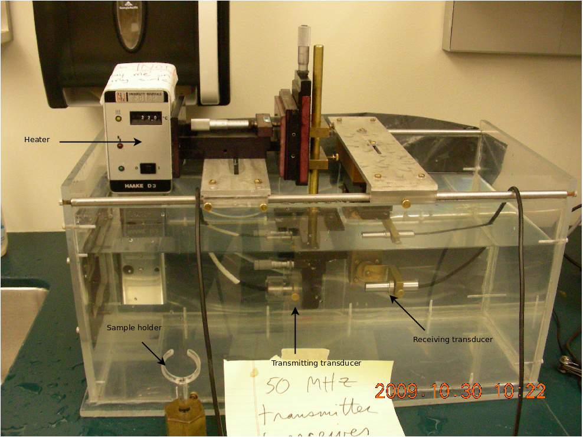

=======================================
High Frequency Phantom Characterization
=======================================

Next, we describe methods to characterize the acoustic properties of
high-frequency reference phantoms necessary to generate parametric images.
Recently, Madsen et al. [Madsen2010]_ developed tissue-mimicking (TM) phantoms
with ultrasonic properties of human arteries at very high frequencies
[Lockwood1991]_.  Accurate characterization of the acoustic properties of these new
phantoms pose additional challenges relative to the same characterization at
lower frequencies.  In this chapter, we describe the methods applied to
characterization of these phantoms.  Methods to determined the attenuation
coefficient, phase velocity, and absolute backscatter coefficient are described.

.. |substitution_apparatus| replace:: Fig. 1

.. |substitution_apparatus_long| replace:: **Figure 1**

~~~~~~~~~~~~~~~~~~~~~~~~~~~~
Attenuation characterization
~~~~~~~~~~~~~~~~~~~~~~~~~~~~

Attenuation was measured with the standard narrowband substitution technique
[AIUM1995,Madsen1999]_.  Attenuation, the rate of decrease in amplitude with
depth, *z* of the amplitude, *A*, of an pressure pulse is assumed to be linearly
proportional to the amplitude of the pulse,

.. math:: \frac{dA}{dz} = - \alpha A

.. epigraph::

  where :math:`\alpha` is the attenuation coefficient.  The amplitude of the
  acoustic wave decreases exponentially with time,

.. math:: A(t) = A_0 \exp( -\alpha z )

.. epigraph::

  if :math:`A_0` is the initial wave amplitude.

To measure the attenuation coefficient with the substitution method, we measure
the wave amplitude in a water-only path and after insertion of a sample with
known thickness.  Taking the ratio of the equation in both situations allows us
to remove the :math:`A_0` constant and solve for the attenuation coefficient.

.. highlights::

  |substitution_apparatus_long|:  Water tank used for making methods with the
  substitution technique.  The transducers are suspended in the tank by a system
  of mounts with translational and rotational degrees of freedom.  A heater
  keeps the water at a constant 22º C.  For calculation of both the phase
  velocity and the attenuation coefficient, signal is collected from a
  water-only path (shown), and a with the sample placed in the path of the
  transducers (not shown).  A function generator and pulse amplifier provide
  input to the transmitting transducer, and the oscilloscope and computer used
  to record the received signal.

This method involves measuring the
ultrasound signal in a water tank with a transmitting and receiving transducer,
then repeating the signal acquisition after introducing a sample of known
thickness into the water.  The shift in arrival time was used to calculate the
speed of sound, and the amplitude ratio was used to calculate the material's
attenuation [AIUM1995,Madsen1999]_.

The equipment and setup used has been described previously [Madsen2010]_, and
includes a Wavetek model 81 Function Generator set to burst mode, generating a
sinusoid of 30 wavelengths at the target frequency.  The input signal is
amplified by a model 75A250A radiofrequency (RF) amplifier
(Amplifier Research, Souderton, PA, USA).  The signal is transmitted and
received by a V358 50 MHz center frequency unfocused transducer pair (Olympus
Panametric-NDT, Waltham, MA, USA).  The transducers were aligned by peaking the
received signal with a micrometer controlled translation unit (Ardel Kinematic
Inc., Stratford, CT, USA) and gimbal mount (Newport Oriel, Stratford, CT, USA).
The compressional wave was transmitted through deionized water maintained
at 22.0 °C by a Haake DC10 heater (Thermo Fisher Scientific Inc.).  However, the
circulating heater was temporarily turned off during signal acquisition to reduce
vibrations that would impact time delays and cause jitter while averaging sweeps
with the WaveRunner LT342 oscilloscope (LeCroy, Chestnut Ridge, NY, USA).  The
transducers were separated by a 42 μs delay (62.5 mm signal propagation path).
The received signal was collected
at 500 MS/s, and ten independent sets of 100 averaged pulses were transferred to a computer
for further offline analysis.

A sample of the material used in the production of the backscatter phantom was
between 12 μm thick Saran Wrap® film inside an acrylic cylinder.  The thickness of
the test cylinder was 5.00 mm measured with a calibrated
micrometer.  The density of the TM material was 1.045 g/mL for the 4000E phantom
and 1.062 g/mL for the 5000E phantom.

Considerable changes in the shape of the pulse occurred because of frequency
dependent attenuation (see |substitution_pulse|).  To precisely obtain the phase
velocity, the same narrowband pulse location was obtained by finding the same
offset from the delay where the pulse exceeded the noise level in both the
water-only and water + sample path.  The noise level was quantified by measuring
the standard error of the first 100 samples of the received waveform.  The start of
the signal was taken as the sample where the received signal exceeded eight
times the noise standard error.  The offset from the start of the pulse to the
narrowband section of signal varied with the frequency measured.  The closest
zero crossing was linearly interpolated from the samples to obtain a precise result.  The
speed of sound is then obtained by inserting the change in time delay, Δt, and
sample thickness, d, into the following equation [Wear2007]_

.. math:: c = \frac{c_w}{1 + \frac{c_w \Delta t}{ d }}

.. |substitution_pulse| replace:: Fig. 2

.. |substitution_pulse_caption| replace::

  (color online).  Averaged, received signals obtained using the narrowband  substitution method.  a)
  water-only signal at 20 MHz, b) 5 mm sample inserted with the center
  frequency at 20 MHz, c)
  water-only signal at 40 MHz, and d) sample inserted with the center frequency at 40 MHz.  Time is
  relative to excitation at the source transducer and the plotted time axes limits
  are kept consistent to demonstrate time shifts.  Amplitudes are kept consistent
  at each frequency, but the excitation amplitude was adjusted with frequency so
  sufficient signal-to-noise ratio was obtained without saturation and non-linear
  propagation.  The dramatic effect of non-linear attenuation on
  the signal shape can be seen in d).

The speed of sound in pure water, c\ :sub:`w`\ , at 22º C is 1488.3 m/s [DelGrosso1972]_.

The attenuation coefficient, α, in dB/cm is calculated using the signal
amplitude in the absence of the sample, A\ :sub:`w`, the signal amplitude with the sample in place, A\
:sub:`s`, the transmission coefficient of the thin layer material holding the
sample in place, T\ :sub:`total`, and the thickness of the sample, d.

.. math:: \alpha (f) = \frac{20}{d} \log_{10} ( \frac{A_w T_{total}}{A_s} ) + \alpha_w (f)

Attenuation of water, α\ :sub:`w`, which is negligible at lower frequencies, must
be accounted for at high frequencies. The transmission coefficient of the
Saran Wrap® layer, a function of frequency, was calculated using Equation 3 from
Wear et al. [Wear2005]_ where the speed of sound in Saran Wrap® was found to be 2400 m/s, density 1.69
g/mL, thickness 12.2 μm, and amplitude attenuation coefficient is given by

.. math:: \alpha (f) = \alpha_0 \; f^{n}

where α\ :sub:`0`  = 2.26 Np/m/MHz\ :sup:`1.5` and n  = 1.285 for the 4000E
TM phantom α\ :sub:`0`  = 5.0 Np/m/MHz\ :sup:`1.5` and n  = 1.5 in the 5000E
case.

Only the amplitude at the narrowband, i.e. central, portion of the pulse was used
for calculating the attenuation.  As shown in |substitution_pulse|\ c) and
|substitution_pulse|\ d), the edges of the signal, which have lower local frequency content, experience less attenuation.
sos_atten

~~~~~~~~~~~~~~~~~~~~~~~~~~~~~~~
Phase velocity characterization
~~~~~~~~~~~~~~~~~~~~~~~~~~~~~~~

sos_atten

~~~~~~~~~~~~~~~~~~~~~~~~~~~~~~~~
Absolute backscatter measurement
~~~~~~~~~~~~~~~~~~~~~~~~~~~~~~~~

high freq paper.

~~~~~~~~~~
References
~~~~~~~~~~
