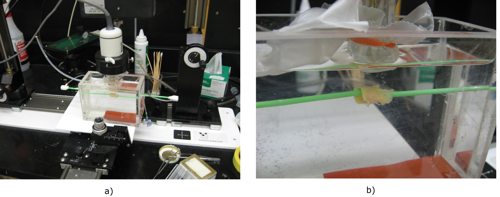
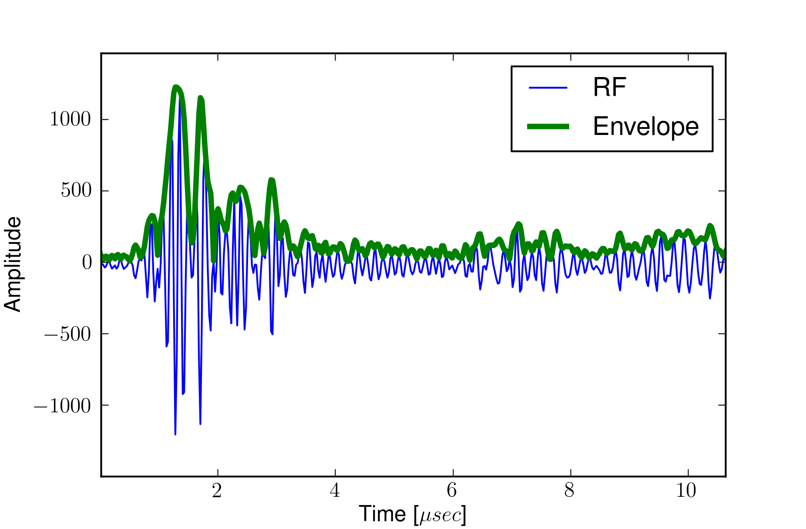

==================================================
Chapter 7 : High-frequency Plaque Characterization
==================================================

.. sectnum::
  :prefix: 7.

High-frequency ultrasound imaging is useful for examining small objects -- it
has the advantage of high resolution at the expense of low penetration.  In this
chapter new high frequency imaging techniques are explored for interrogation of
the excised plaques which result from endarterectomy.  First the materials and
methods used to create these images are described.  Note that many other details
are found in Appendix A.  Then, initial 3D parametric images of the excised
plaques are presented.

.. |apparatus| replace:: Fig. 7.1

.. |apparatus_long| replace:: **Figure 7.1**

.. |envelope| replace:: Fig. 7.2

.. |envelope_long| replace:: **Figure 7.2**

.. |pat142| replace:: Fig. 7.3

.. |pat142_long| replace:: **Figure 7.3**

.. |pat144| replace:: Fig. 7.4

.. |pat144_long| replace:: **Figure 7.4**

~~~~~~~~~~~~~~~~~~~~~~~~~~~~~~~~~~~~~~~~~~~~~~~
Creation of parametric images of excised plaque
~~~~~~~~~~~~~~~~~~~~~~~~~~~~~~~~~~~~~~~~~~~~~~~

As mentioned in the Chapter 2, strain imaging holds promise because it is a
direct measure of the local load the tissue is experiencing as opposed to
approaches where measurements or assumptions of composition, geometry, and
loading are used in a computational model or statistical classification to imply
loading.  An advantage to this approach is that errors from modeling
simplifications and parameter measurements do not accumulate as significantly.
The reference phantom method is analogous for ultrasonic tissue parameter
characterization.  Diffraction effects are measured empirically in a phantom
environment similar to that expected *in situ* with minimal modeling or
assumptions.

Approximately two weeks following the *in vivo* carotid ultrasound
examination and TCD recording, patients undergo surgery for plaque excision.
Endarterectomy specimens are retrieved immediately following surgery for
scanning and returned the same day to pathology for analysis and histology
preparation.  Samples are examined in a water bath and suspended between two
catheter sheaths.  A picture of the experimental setup is shown in |apparatus|.

.. highlights::

  |apparatus_long|: High-frequency apparatus.  The transducer is fixed to a 3D
  motion table and lowered into the water bath.  A disposable transducer cover
  is covered with coupling gel and held to the transducer with a rubber band for
  safety reasons.  The plaque is suspended between two catheter sheaths and the
  stepper motor moves the transducer parallel to the longitudinal direction of
  the plaque.

VisualSonics Vevo 770 is used for ultrasound radiofrequency acquisition.  The
system for 3D collection and processing of RF data on the Vevo 770 is described
in Appendix A.

The transducer selected is a RMV710B that has a center frequency of 25 $MHz$,
which is on the lower end the center frequency for available transducers.  This
transducer outputs frequencies up to 37.5 MHz, with an axial resolution of 70
μm, lateral resolution of 140 μm, focal length 15 mm, and a maximum
field of view of 20.0 mm.  The RMV710B is selected because the frequency is
low enough to penetrate the plaque and the field of view is large enough to
encompass the entire sample.

RF acquisition was previously limited to
single 2D frames, but we worked with VisualSonics engineers such that RF
acquisitions can be collected in 3D with the optional high-precision stepper
motor.  Each acquisition consists of 250 beam lines separated by
approximately 60 μm, 2128 samples (3.9 mm), and up to 250 frames
separated by 200 μm to 100 μm depending on the length of the plaque
specimen.  Some longer plaques may require larger inter-frame spacing because of
memory limitations, although the resolution in the elevational direction is
nominally 140 μm for the RMV710B transducer.

Each
acquisition consists of 250 beam lines separated by approximately 60 μm, 2128
samples (3.9 mm), and up to 250 frames separated by 200 μm to 100 μm
depending on the length of the plaque specimen.  For the lengths of the plaques
scanned, which ranged from approximately 20 mm to 40 mm, this filled the
system limits on acquisition.  The collection of a single 3D data set covering an entire
plaque takes approximately one to two hours.  Resulting files are approximately 150 per
volumetric slice.  Three to five volumetric slices are required to encompass
the majority of an excised plaque's volume.  Some longer plaques may require
larger inter-frame spacing because of memory limitations, although the
resolution in the elevational direction is nominally 140 μm for the RMV710B
transducer.

IBS images are created with a reference phantom created by Dr. Ernest Madsen
from UW-Madison.  The reference phantom is made of the 5000E material
characterized in Chapter 6.  The reference phantom was scanned with the same
transducer and system settings as utilized for scanning the plaque specimen.
This includes the plastic covering over the transducer that prevents
contamination of the transducer by plaque. Reference power spectra are obtained
by averaging 30 lines per plane over 60 planes.  Fourier spectra with 50%
overlap are calculated using a Fast Fourier Transform with 128 Hamming windowed
points (240 μm), and the bandwidth used ranged from 6.6 MHz to 29.6 MHz where
the spectrum was flat.  The BSC of the reference phantom is interpolated from
the values measured with the reference reflector in Chapter 6.  Attenuation in
the plaque was assumed to be the same as reference phantom, which is reasonable
for arterial plaque specimens according values reported in the literature
[Hoskins2007,Lockwood1991]_ The backscatter was calculated using the expression
[Liu2007]_

.. math::   BSC_s(f) = \frac{BSC_r(f) S_s(f)}{S_r(f)}

Log compression and linear interpolation were applied to the displayed IBS.
Identical dynamic ranges and color transform functions were used in all corresponding images.

~~~~~~~~~~~~~~~~~~~~~
B-Mode image creation
~~~~~~~~~~~~~~~~~~~~~

The received pulse-echo signal, RF data, is
highly oscillatory.  An envelope of the RF data reflects local scattering
amplitude, and this is what comprises a B-Mode image.

.. highlights::

  |envelope_long|: Sample RF signal and its corresponding envelope.

Calculation of the RF envelope is often performed with the analytic signal.  The
analytic signal is used to decompose a signal into its local amplitude and local
phase [Felsberg2001,Woo2008a]_ [#]_.  The analytic signal, *f*\ :sub:`A`\ *(x)*, of a real
signal, *f(x)*, is defined to be

.. math::  f_A(x) = f(x) - i \, f_H (x)

.. [#] Local phase is a 1D concept, and the analytic signal is not defined for multi-dimensional signals.  To split a multi-dimensional image into structural and energetic information, see the monogenic signal [Felsberg2001]_.

Where *f*\ :sub:`H`\ *(x)* is the Hilbert Transform of *f(x)* given by

.. math::  f_H(x) = \frac{1} {\pi} \int_{-\infty}^{\infty} \frac {f(x')}{x' - x} \, dx'

The Hilbert Transform can be calculated without performing
convolution by applying the following property in Fourier space,

.. math::  F_H(\xi) = F(\xi) \cdot i \, \text{sgn} (\xi)

As a result, the analytic signal's representation in Fourier space is

.. image:: images/bmodeeqn1.png
  :align: center
  :width: 7cm
  :height: 1.99cm

Even though it does not have ideal properties when applied to a discrete
signal [Bracewell2000]_ an approach to calculate the analytic signal is then
to calculate the Fourier Transform, multiply the first half by two, multiply the
second half by zero, and take the inverse Fourier Transform.

For narrow band signals, the local phase, *ϕ(x)*, and the local energy,
*A(x)*, of *f(x)* can be interpreted as [Felsberg2001]_

.. image:: images/bmodeeqn2.png
  :align: center
  :width: 7cm
  :height: 1.92cm

After the envelope, *A(x)*, is calculated, post-processing can be performed.
The majority of an ultrasound image's content is speckle, random scattering
caused by scatterers much smaller than the excitation wave.  Speckle's amplitude has
a Rayleigh distribution [Wagner1983]_.  Since the Rayleigh distribution is
skewed to lower values and a small proportion of the amplitudes have very large
values, a logarithmic intensity transform is commonly applied to the envelope to
improve image contrast.

~~~~~~~~~~~~~~~~~~~~~~~~~~~~~~~~
3D high frequency plaque volumes
~~~~~~~~~~~~~~~~~~~~~~~~~~~~~~~~

Gross photographic images taken prior to ultrasound scanning, B-mode images
derived from the RF, and integrated backscatter (IBS) images for two patients
are shown in the following figures.

.. highlights::

  |pat142_long|: Images taken from the plaque excised from Subject 142.
  A large, diffuse hemorrhagic region shows decreased backscatter.
  a) Gross photographic image, b) close-up gross image, c) B-Mode
  volume rendering, and d) integrated backscatter volume rendering.

.. highlights::

  |pat144_long|: Images of the excised plaque from Subject 144.
  The gross photographs in a) and b) show a primarily fibrous plaque with some calcified areas.
  The ultrasound B-Mode, c), and IBS, d),  show the presence of fibrous and calcified areas well.
  Segments from the catheter sheath are seen in the front and back of c) and d).
  To reduce saturation from numerous calcified areas, data was collected with -10 dB gain relative to |pat142|\ a), which explains the larger impact of electronic noise in c).
  }}

Subject 142 shows a possible high-risk plaque with an extensive hemorrhagic area
that may have been the result of recent rupture events.  There were strong
indications of inflammation when this plaque was removed.  The backscatter
coefficient is consistently low throughout the hemorrhagic areas.  This
condition that is typically considered high risk is re-enforced by the fact that
microembolic signals were detected with transcranial Doppler for Subject 142
(Table 8.1).  The result for Subject 144 on the other hand, depicts a likely
stable plaque with smooth, unulcerated walls and strong fibrous and calcified
tissue throughout.

The tip of the flow divider, also known as the tuning fork, can be easily
located in these images.  This fiducial marker can be used to identify the
corresponding region in *in vivo* data.

~~~~~~~~~~
References
~~~~~~~~~~
