=============================================================
Chapter 9 : *In vivo* Quantification of Carotid Plaque Strain
=============================================================

.. sectnum::
  :prefix: 9.

Finally, we present results from *in vivo* characterization of carotid plaque
strain with diagnostic ultrasound via an externally applied transducer.  First,
the algorithms to generate the strain images and reduce the results are
described.  This includes an explanation of how the algorithms described in
Chapters 3, 4, and 5 are applied as an integrated algorithm.
Additionally, new features are covered, including the hierarchical framework for
increasing motion tracking robustness.
Finally, case studies of exemplar subjects are presented.

.. |scalespace| replace:: Fig. 9.1

.. |scalespace_long| replace:: **Figure 9.1**

.. |companding| replace:: Fig. 9.2

.. |companding_long| replace:: **Figure 9.2**

.. |displacement_sequence_options| replace:: Fig. 9.3

.. |displacement_sequence_options_long| replace:: **Figure 9.3**

.. |strain_sequence_options| replace:: Fig. 9.4

.. |strain_sequence_options_long| replace:: **Figure 9.4**

.. |plaque_regions| replace:: Fig. 9.5

.. |plaque_regions_long| replace:: **Figure 9.5**

.. |strain_axial_plot| replace:: Fig. 9.6

.. |strain_axial_plot_long| replace:: **Figure 9.6**

.. |strain_shear_plot| replace:: Fig. 9.7

.. |strain_shear_plot_long| replace:: **Figure 9.7**

.. |strain_lateral_plot| replace:: Fig. 9.8

.. |strain_lateral_plot_long| replace:: **Figure 9.8**

.. |strain_metric_plots| replace:: Fig. 9.9

.. |strain_metric_plots_long| replace:: **Figure 9.9**

.. |hypoechoic| replace:: Fig. 9.10

.. |hypoechoic_long| replace:: **Figure 9.10**

.. |geometry| replace:: Fig. 9.11

.. |geometry_start| replace:: Figure 9.11

.. |geometry_long| replace:: **Figure 9.11**

.. |turbulence| replace:: Fig. 9.12

.. |turbulence_start| replace:: Figure 9.12

.. |turbulence_long| replace:: **Figure 9.12**

.. |wallshear| replace:: Fig. 9.13

.. |wallshear_start| replace:: Figure 9.13

.. |wallshear_long| replace:: **Figure 9.13**

.. |shadowing| replace:: Fig. 9.14

.. |shadowing_long| replace:: **Figure 9.14**

.. |out_of_plane| replace:: Fig. 9.15

.. |out_of_plane_long| replace:: **Figure 9.15**

.. |downsampling_schedule| replace:: Table 9.1

.. |downsampling_schedule_long| replace:: **Table 9.1**

~~~~~~~~~~~~~~~~~~~~~~
Hierarchical framework
~~~~~~~~~~~~~~~~~~~~~~

Multi-level motion tracking
===========================

Multi-resolution motion tracking methods have long been established as the way to
increase the speed and robustness of medical image registration
[Wu2003,Likar2001,Wu2000,Crum2004,Tzovaras1994,Schnabel2001,Vemuri1998,Zitova2003]_.
In general, a coarse-to-fine tracking scheme is applied by performing
registration of the image pair at multiple resolutions.  Results from
registration at a coarser resolution level are used to initialize the
registration problem at the next, finer resolution level.  The lower resolution
images are often subsampled, so motion tracking is faster.  Even
though multiple registration operations are performed at every level, including
the finest level at the original image resolution, the overall motion tracking
method is often quicker than a single non-hierarchical registration.  By
initializing the search close to the true displacements at finer levels, the
solution space that must be examined in a more computationally taxing setting
is greatly reduced.  Also, local minima in the solution associated with the high
frequency content in the fine resolution images are avoided.  This improves
robustness of the algorithm.

Multi-resolution methods have also been applied to ultrasound strain imaging.  Yeung
et al. and Pellot-Barakat et al. have developed multilevel regularized,
block-matching algorithm for tracking ultrasound speckle
[Yeung1998,Pellot-Barakat2004]_.  In Yeung et al., coarser level images
were not subsampled on the premise that high-frequency speckle information would
be lost.  Instead, the multi-resolution notion is applied by changing the
matching-block size and the search region extent.  Displacements are initially
found with a large matching-block and wide search region and are transitioned to a
small matching-block and confined search region.  The large matching-blocks are
not as sensitive to decorrelation noise.  Smaller matching-blocks are not as
affected by intra-block non-rigid motion and are capable of more precise
displacements.  Shi and Varghese discussed a multilevel where coarser levels
were downsampled versions of the envelope image [Shi2007]_.  Instead of only
using displacements at coarser levels to initialize the search region at finer
levels, Bai et al., combined the cross-correlation results from window lengths
at multiple levels to determine the displacements at the finest level
[Bai1999]_.  Basarab et al. found that iterative application of
multi-resolution initialization can improve results [Basarab2008]_.  Chen et al.
applied the multi-level approach to a quality-guided (seed propagation)
algorithm [Chen2010a]_.

Multi-resolution methods are particularly useful when imaging arteries, where
there is motion discontinuity at the artery wall.  Other block-matching motion
tracking algorithms often propagate match-block search regions from prior
displacements of high confidence [Jiang2009,Basarab2008]_.  These restricted
search regions reduce the detection of local minima in the similarity metric
(peak-hopping errors).  This continuity cannot be assumed when the artery walls
move apart, and search region initialization from a coarser level plays a
similar role.

In this work a multi-level block-matching algorithm is used for motion tracking
of carotid plaque images.  As with the previously discussed works, displacements
tracked at coarser levels are interpolated to initialize the search region
location at lower levels.  Image sets at every level are created with a
scale-space representation of the images [Lindeberg1994]_.  The scale-space
representation is chosen because it has many desirable properties including the
*non-enhancement* property, i.e.  local extrema are not enhanced
[Lindeberg1994]_.  If the local extrema are enhanced, artifactual features may
be tracked by the similarity metric.  Each level in the scale-space is created
by filtering the input radio-frequency (RF) image with discrete Gaussian that
has a variance *(f/2)*\ :sup:`2` if *f* is the decimation factor.  A three-level
image pyramid is created.  The decimation factor for each level is given in
|downsampling_schedule|.  Since image content is much denser in the axial
direction, higher decimation is allowed in that direction.  An example set of
scale-space images are shown in |scalespace|.

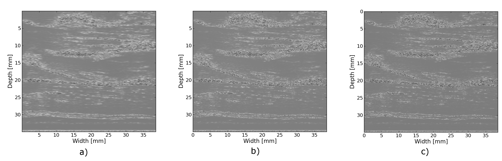
.. highlights::

  |scalespace_long|:  Scale-space images for multi-resolution motion tracking.
  Carotid plaque RF data in the longitudinal view for Subject 157 is shown.
  The levels, whose decimation factors are given in |downsampling_schedule|,
  are a) level 1, b) level 2, and c) level 3.

=========== ========================= ===========================
Level        Axial decimation factor  Lateral decimation factor
----------- ------------------------- ---------------------------
1            3                        2
2            2                        1
3            1                        1
=========== ========================= ===========================

.. highlights::

  |downsampling_schedule_long|: Downsampling schedule for multi-resolution
  image registration.

Search region refinement
========================

As previously mentioned, restriction of a matching-block's search region as
finer levels in the pyramid are explored can increase the robustness of
tracking.  For the results explored in this chapter, a simple linear function
was applied to reduce the search region size from the coarsest level to the finest level.
The value of these parameters is shown in |displacement_sequence_options|.  The
search region size is expressed as a factor of the matching-block size, and it is
greater than 1.  Note that even if the search region factor was specified to be
the same at the top level and the bottom level, the search region still shrinks
in physical size since the matching-block size is specified in pixels and
decimation occurs between levels.

While search region restriction can improve robustness, this is not true if
there is poor motion tracking in the upper levels.  If inaccurate motion
tracking occurs at upper levels, the erroneous displacement will propagate to
the finer levels.  To counter this phenomenon, erroneous displacements are detected and
replaced before using them to initialize the center of the search region at
lower levels.  Peak-hopping errors present themselves as irrationally high
strains because they cause a discontinuity in the estimated displacement field.
To prevent the propagation of peak-hopping errors, a strain image is generated
at the higher levels.  Pixels whose strain magnitude exceeds a threshold are
marked for replacement.  Displacements are then linearly interpolated across a
cluster of errant pixels if the pixels are in the center of the image, or they
are extrapolated with the slope of the closest good displacement pixels at the
edge of the image.  This process is repeated to remove any outliers that remain
or were introduced.

Inter-level matching-block scaling
=====================================

Signal de-correlation within a matching-block is partially caused by the strain within
the block [Varghese1996]_.  The de-correlation of the matching-block can be
reduced by appropriate scaling, 'companding',  the matching block by the local strain
[Chaturvedi1998,Chaturvedi1998a]_.  In the hierarchical construct, the strain
found at higher levels can be used to stretch or compress the matching block
before performing cross-correlation at lower levels.  This is applied to this
algorithm by resampling the matching-block with windowed-sinc interpolation
after anisotropically scaling the block by a factor

.. math:: s_i = 1 + e_{ii}^*

*Eqn. 9.1*

.. epigraph::

  where the scaling factor is one plus the normal strain in that direction if the
  strain is small.  Improvement of the strain signal-to-noise ratio (*SNRe*), described in
  Chapters 3 and 4, for a uniform phantom is demonstrated in |companding|.  There
  is a significant improvement in the *SNRe* when scaling the matching block.  The
  amount of this improvement increases with the increase in strain magnitude.

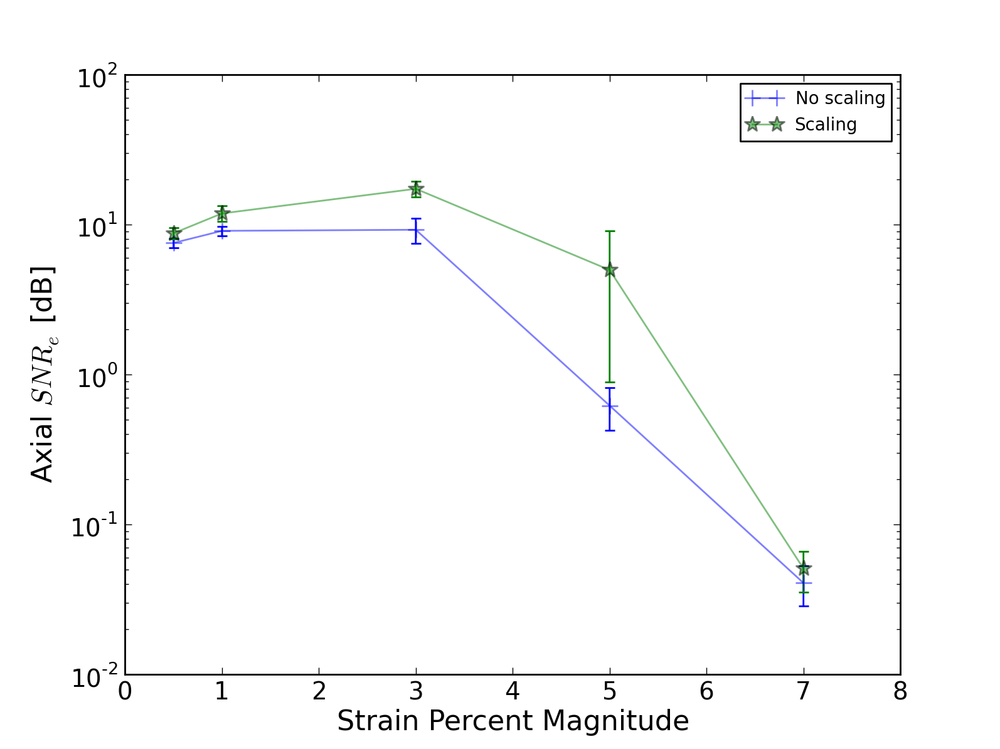
.. highlights::

  |companding_long|: Axial strain *SNRe* versus strain magnitude when scaling
  the matching-block according to the strain obtained in the previous level and
  without scaling.

~~~~~~~~~~~~~~~~~~~~~~~
Displacement estimation
~~~~~~~~~~~~~~~~~~~~~~~

Motion tracking is performed with a hierarchical block-matching technique,
implemented in C++.  A multi-resolution, multi-threaded block-matching
framework is implemented on top of the Insight Toolkit [Ibanez2005,Yoo2002]_.
The similarity metric used for comparing a matching-block in the pre-deformation
image in its search region in the post-deformation image is normalized
cross-correlation.  Recursive Bayesian regularization, described in Chapter 3,
is used to improve the quality of the tracked displacements at each level.
Parabolic interpolation is used to find subsample displacements at the upper
levels, and windowed-sinc interpolation with numerical optimization, described in
Chapter 4, is used to find subsample displacements at the final level.
A central-difference gradient with an order of accuracy of 4, explained in
Section 5.2.1, is used to estimate strains at the higher levels where
displacement vector sampling is very coarse.  Strains at the higher levels are
used to remove peak-hopping pixels and to scale the matching-block in subsequent
levels.  

Displacements are tracked from a continuous sequence of RF data collected on the
longitudinal views of the carotid with the Siemens Antares clinical ultrasound
system (Siemens Ultrasound, Mountain View, CA, USA).  Patients are scanned prior
to a carotid endarterectomy procedure after receiving informed consent on a protocol approved by the
University of Wisconsin-Madison Institutional Review Board (IRB).  The Siemens Antares
VFX13-5 transducer is excited at 11.4 MHz to collect RF at a sampling rate of 40
MHz to a depth of 4 cm.  A dynamic frame skip and displacement interpolation
algorithm, explained in Section 5.4.1, generates a sequence of incremental
displacement images that are evenly spaced in time.

Values of the parameters used in the algorithm are summarized in the
configuration file shown in |displacement_sequence_options|.
Upsampling on the input two byte signed integer input RF data is performed with
windowed-sinc interpolation.  The size of the matching-block is specified in
samples.  To ensure the window is centered on a point, the length of the
matching-block is specified as a radius so that the length of the window is *2 r
+ 1* if *r* is the radius.

::

  # displacement-sequence options input file.
  ---
  files:
    # The input image.  It should be a 3D image where the first two dimensions
    # are space, and the third dimension is time.
    sequenceImage: @SEQUENCE_IMAGE@
    # File name prefix for output files.
    outputPrefix:  @OUTPUT_PREFIX@

  parameters:
    # Any point with a strain component above the given value in the higher levels
    # will have its displacement interpolated by surrounding areas.
    maximumAbsStrainAllowed: 0.075
    # Upsampling ratio of the input images.
    upsample: [ 2.0, 2.0 ]
    # Axial direction of the image.
    axialDirection: 1

    # Related to the matching block.
    block:
      # Block Radius at the top level.
      topBlockRadius:    [ 15, 28 ]
      # Block Radius in at the bottom level.
      bottomBlockRadius: [ 10, 18 ]
      # Block overlap. 1.0 is no overlap. 0.5 is 50% overlap.
      blockOverlap:      1.0
      # In the multiresolution method, scale the matching block by the strain
      # estimated at higher levels.
      scaleByStrain:     true

    # Related to the search region.
    searchRegion:
      # Search region radius at the top level is the following factor times the block radius.
      # The factors at intermediate levels between the top level and bottom level
      # are linearly interpolated.
      topFactor:     [ 2.2, 1.4 ]
      # Search region radius at the bottom level is the following factor times the block radius.
      bottomFactor:  [ 1.1, 1.1 ]

    # Related to the Bayesian regularization.
    regularization:
      # Strain regularization parameter.
      strainSigma: [ 0.07, 0.07 ]
      # Maximum number of iterations during regularization at the bottom level.
      maximumIterations: 3

    # Related to the sequential calculation of displacements.
    sequence:
      # The index of the first frame to use as the fixed image.  A value of -1
      # indicates the use of the first index available.  Counts from 0.
      startFrame: @START_FRAME@
      # The index of the last frame to use as the moving image.  A value of -1
      # indicates the use of the last index available.  Counts from 0.
      endFrame:   @END_FRAME@
      # In the case of a static frame skip, this value is the number of frames
      # to between the fixed and moving frame during analysis.  In the case of
      # a dynamic frame skip, i.e. doDynamicFrameSkip = true, the following
      # value is the maximum number of frames to skip.
      frameSkip:          6
      # Use a dynamic frame skip.  See also 'frameSkip'.  If this value is set
      # to true, the frame skip is varied throughout the sequence by using the
      # strain between the fixed and moving image.
      doDynamicFrameSkip: true
      # In a dynamic frame skip analysis, the maximum absolute strain *in the axial direction* that should be observed in
      # a frame skip for best quality.  This value should be the maximum strain
      # that good motion tracking is expected.  The observed maximum strain is
      # smaller than this value, then the frame skip is increased.
      maximumAbsFrameStrain: 0.05
      # In a dynamic frame skip analysis, the percentage of pixels that are
      # allowed over the maximumABSFrameStrain before the frame skip is
      # decreased.
      percentFrameStrainOverMaximumStrain: 2.0
      # We crop the region for the above two strain characteristics to be examined
      # by the following fractional values on both the upper and lower bounds of
      # both directions.
      dynamicStrainCharacteristicsCrop: [ 0.1, 0.30 ]
      # Number of iterations when calculating the inverse displacement for
      # calculating incremental displacements from larger frame skips.
      inverseDeformationIterations: 15
  ...

.. highlights::

  |displacement_sequence_options_long|: Relevant sections from the algorithm configuration file
  for motion tracking used to analyze the plaques studied in this chapter.

~~~~~~~~~~~~~~~~~
Strain estimation
~~~~~~~~~~~~~~~~~

Eulerian incremental frame-to-frame strains at the final level are estimated
using the modified least squares estimator described in Section 5.2.3.  Prior to
strain estimation, the displacements are filtered with a small 3×3 median filter
to remove outliers.  Parameters of the strain sequence estimation are shown in
the configuration file, |strain_sequence_options|.  Note that the output file
names contain a reference to the input data they were derived from, a version
stamp, and a description of their content.  The version stamp is from a source
code versioning system (VCS) and is a unique identifier that can be used to
obtain the state of the source code when the given results were produced.  The
input data identifier, source code version, and algorithmic parameters in the
configuration file constitute full provenance of the analysis, which ensures
repeatability and reproducibility.

::

  # strain-sequence options input file.
  ---
  # The file path prefix.  The input is assumed to be
  #   <filePrefix>_Version_<version_stamp>_DisplacementVectorSequence.mha
  # or
  #   <filePrefix>_Version_<version_stamp>_TrackedMovingFrame*DisplacementVectors.mha
  # The output will be
  #   <filePrefix>_Version_<version_stamp>_StrainTensorSequence.mha
  #   <filePrefix>_Version_<version_stamp>_OrderedPrincipalStrainSequence.mha
  #   <filePrefix>_Version_<version_stamp>_EstimatedStrainTensorSequence.mha
  #   <filePrefix>_Version_<version_stamp>_EstimatedOrderedPrincipalStrainSequence.mha
  # or
  #   <filePrefix>_Version_<version_stamp>_TrackedMovingFrame*StrainTensors.mha
  #   <filePrefix>_Version_<version_stamp>_TrackedMovingFrame*OrderedPricipalStrains.mha
  #   <filePrefix>_Version_<version_stamp>_TrackedMovingFrame*EstimatedStrainTensors.mha
  #   <filePrefix>_Version_<version_stamp>_TrackedMovingFrame*EstimatedOrderedPrincipalStrains.mha
  filePrefix: @FILE_PREFIX@
  # The method used to calculate the gradient.  Valid values are "GRADIENT" for a
  # numerical gradient calculation or "BSPLINE" for a B-spline approximation
  # gradient. "LEASTSQUARES" for modified linear least squares.
  method: LEASTSQUARES
  # The ratio of B-spline control points to displacement points.  One value for
  # each direction.  This parameter is only relevant when method = BSPLINE.
  bSplineControlPointRatio: [1.2, 1.1]
  # The radius for performing median filtering on the displacement components.
  # Each value with the isotropic radius for the corresponding radius component.
  # A value of 0 indicates no median filtering will be applied.
  displacementMedianFilterRadius: [1, 1]
  # The radius for calculating the linear least squares line fit when calculating
  # the displacement gradients.  This parameter is only relevant when method =
  # LEASTSQUARES.
  leastSquaresStrainRadius: [3, 3]
  ...

.. highlights::

  |strain_sequence_options_long|: Configuration file showing the parameters used
  to calculate incremental strain tensor images from the sequence if incremental
  tracked displacements.

~~~~~~~~~~~~~~~~~~~~~~~~~~~~~~~~~
Calculation of derived quantities
~~~~~~~~~~~~~~~~~~~~~~~~~~~~~~~~~

The final purpose of non-invasive *in vivo* characterization of carotid plaque
deformation is to generate a quantity that indicates vulnerability to failure or
plaque rupture, thrombogenesis, and ultimately ischemic burden.  A number of
quantities are derived from the strain tensor over the cardiac cycle as
potential indicators of plaque vulnerability.  First, regions-of-interest (ROIs) that segment the plaque are
created by a radiologist.  These ROIs are drawn in a B-Mode image generated from
the same RF data used to perform motion tracking.  B-Mode and color flow images
taken with clinical imaging features of the scanning system at the time of
acquisition are also available to the radiologist to help distinguish
atherosclerotic plaque from the lumen and surrounding tissues.  Three
end-diastolic frames in a dataset are segmented, which delineates two complete
cardiac cycles.  Contiguous regions are segmented in the image at end-diastole.
Often there will be two components corresponding to an anterior and posterior
component.  However, a highly stenotic plaque may be segmented as a single
connected component.  Also, due to acoustic shadowing, a plaque may be
subdivided into more than two connected components where the echo signal has reasonable
amplitudes.

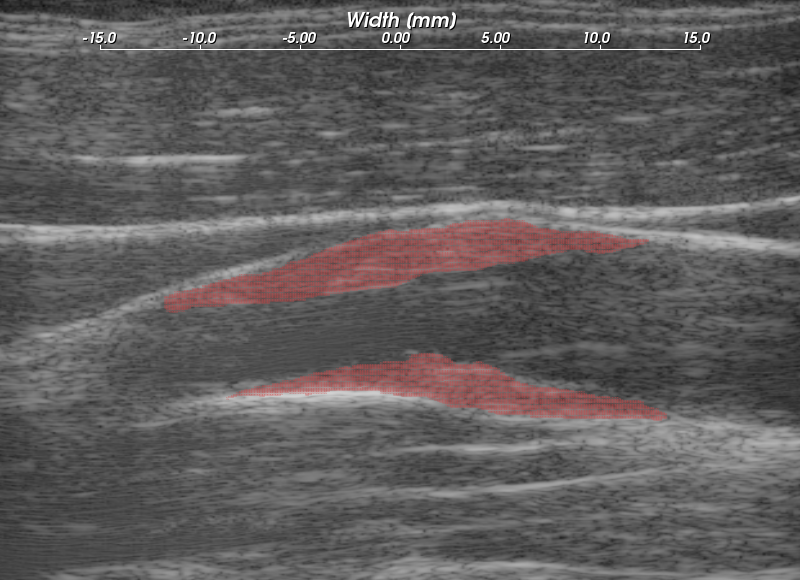
.. highlights::

  |plaque_regions_long|: Subject 157 ROIs where the particle strains explored in
  |strain_axial_plot| - |strain_metric_plots|, are tracked over the cardiac
  cycle.

A binary connected component image is transformed into a mesh.  Strains tensors
and displacement vectors are accumulated on particles in the mesh as described
in Section 5.4.2.  Eigen analysis is performed on the accumulated strain tensors
to calculate the principal strains, described in Section 5.3.1.  The principal strains are
used to evaluate the strain metrics: maximum
principal strain, maximum shear strain, total strain energy, and distortional
energy.  The motivation and definitions of these strain metrics is
discussed in Section 5.3.3.  To summarize, these metrics define scalars derived
from the second-rank tensor that serve as yield criteria, quantities such that if they
exceed a threshold, the material will begin to fail.  The maximum principal
strain suggests that the tissue can only withstand a certain normal strain.
Maximum shear strain assumes the material can only withstand a certain shear
strain.  For a given strain tensor, there is one direction where the maximum
normal strain occurs and the maximum shear strain occurs, and the maximum
principal and shear strain give the values of these quanities in that direction.
Total strain energy and distortional energy yield criteria implying that failure is
an energy dependent process.  Plaque is a complex material that contains
cholesterole, fibrous, calcified, smooth muscle, and hemorrhagic components connected into an
amorphous mass.  It is also living tissue that dynamically changes its content and
connectedness in response to processes like remodeling and inflammation.  Therefore, it is difficult to predict *a priori* the yield
criteria that best describes the failure process.

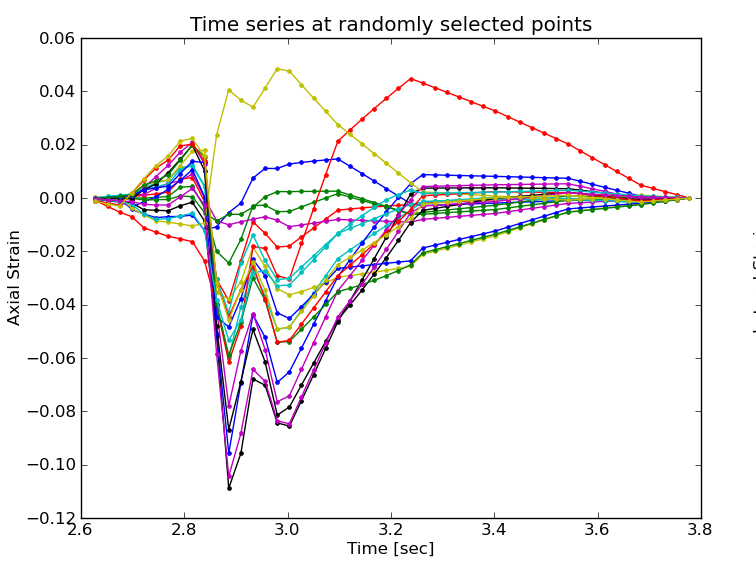
.. highlights::

  |strain_axial_plot_long|:  Axial strain over the cardiac cycle for 20 randomly
  selected particles from ROIs highlighted in |plaque_regions|.

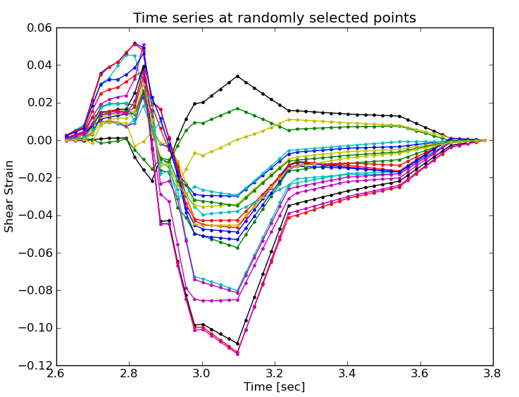
.. highlights::

  |strain_shear_plot_long|:  Shear strain over the cardiac cycle for 20 randomly
  selected particles from ROIs highlighted in |plaque_regions|.

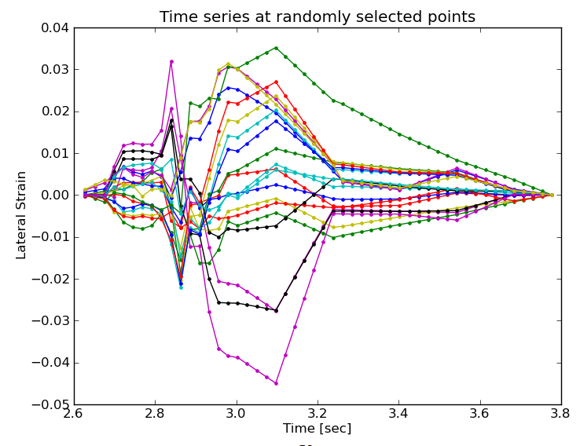
.. highlights::

  |strain_lateral_plot_long|:  Shear strain over the cardiac cycle for 20 randomly
  selected particles from ROIs highlighted in |plaque_regions|.

Plots of the strain components and strain metrics for Subject 157 are shown in
|strain_axial_plot| - |strain_metric_plots|.  Twenty randomly selected
particles, i.e. mesh points, in the ROIs shown in |plaque_regions| are singled out and
their accumulated strain values plotted against time.  Possibly due to movement
in and out of the imaging plane or motion tracking errors, a drift in the
accumulated strain is often observed [Shi2007]_.  When there is significant
out-of-plane motion, this drift may be explained by the fact that a particle is
not accumulating over the same volume of tissue.  To compensate for this, the
offset at the end of the cycle is linearly removed from every curve.  All
quantities should start from zero and return to zero if the system is
steady-state.  While is true in that the tissue obviously remains intact over
the examination, some real drift may exist due to breathing, muscle tone, etc.

Recall from Section 5.1.2 that axial strain refers the normal component of the
strain tensor along the axis of the ultrasound beam.  In this case,
|plaque_regions| and |geometry|,
the ultrasound axial direction is to some degree aligned with the radial
direction of the vessel.  As blood pressure increases, compression is expected
in the radial direction [Hansen2010]_, which is consistent with the mostly
negative strains observed at systole in |strain_axial_plot|.

In contrast, the shear strains shown in |strain_shear_plot| are primarily
positive.  As indicated by the displacement vectors in |geometry|\ a), the
tissue is consistently sheared from left-to-right in the image,
inferior-to-superior in the subject, for both the anterior and posterior ROI.
The magnitude of the shear strain is higher than the axial or lateral strains in
|strain_axial_plot| or |strain_lateral_plot|.

Lateral strains in |strain_lateral_plot| demonstrate systole and diastole clearly
as with the other plots, but do not have a consistent sign.   Some strains are
positive, which indicates stretching (Chapter 5).  The orientation of the plaque
and the mechanical loading it experiences does not consistently align with the
lateral transducer direction, which explains this variance.

Components of the strain tensor can have positive or negative sign, but all
strain metrics should be strictly positive.  This is true for all the strain
metrics in |strain_metric_plots|.  If this was not true, strain estimation
noise or excessive out-of-plane motion could be suspected.  All metrics show a
high strain during systole with a slow retraction during diastole.  The
separation of high strains is accented in the distortional energy plot of
|strain_metric_plots|\ d) because of squared terms in its expression.  The
piecewise linear pattern in all plots is attributed to the dynamic frame skip
technique, Section 5.4.1.  The linearity validates the incremental displacement
interpolation algorithm in Section 5.4.1, and the increased duration of the
piecewise segments during diastole shows success in the automatic strain
assessment method.  Some improvements could be made to the automatic strain
assessment method to decrease the frame skip slightly at the end of systole
here.

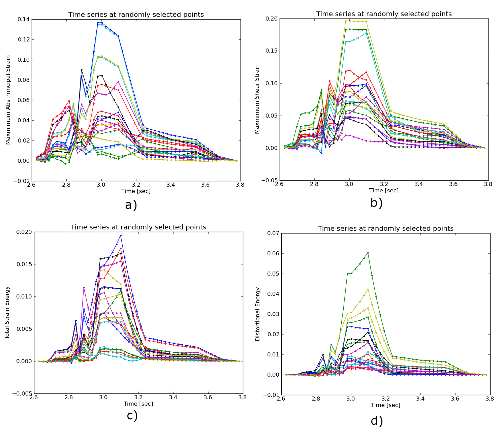
.. highlights::

  |strain_metric_plots_long|: Strain metrics over the cardiac cycle for 20 randomly
  selected particles from ROIs highlighted in |plaque_regions|.
  a) Maximum principal strain, :math:`max\left\{ | \lambda_1 | , | \lambda_2 | \right\}`, 
  b) maximum shear strain, :math:`\lambda_1 - \lambda_2`,
  c) total strain energy, :math:`\frac{1}{2} E \left( \lambda_1^2 + \lambda_2^2 \right)`,
  and d) distortional energy, :math:`\frac{1}{2} E \left( \lambda_1 - \lambda_2 \right)^2`.

Over the cardiac cycle, the three components of the strain tensor, the maximum
principal strain, maximum shear strain, total strain energy, and distortional
energy vary over time and over a contiguous region.  For each of these values,
three scalar statistics are calculated per cardiac cycle.  The mean peak-to-peak
value reflects the average strain in a region.  Since material failure is likely
to occur at a location of high strain, the 90\ :sup:`th` percentile of the
peak-to-peak value is also calculated.  A 90\ :sup:`th` percentile is used
instead of the absolute maximum because outliers sometimes arise from part of
the ROI crossing into the lumen or movement out-of-plane.  Third, the standard
deviation of the particle peak-to-peak value is found.  This is because strain
heterogeneity may mark the presence of highly varying strains beyond the
resolution of the system.  These three values are found for all strain metrics
and strain components.  The mean, 90\ :sup:`th` percentile, and standard
deviation of the sum of the magnitude of the time-derivative is also computed.
The time-derivative is considered because it is hypothesized that viscoelastic
behavior may also contribute to the fatigue failure process.  Strain values for
five subjects are tabulated in Appendix B.

~~~~~~~~~~~~~~~~~~~~~~
*In vivo* case studies
~~~~~~~~~~~~~~~~~~~~~~

In this section, six *in vivo* plaque case studies are examined that demonstrate
different behaviors.  These results suggest that strain imaging may measure the end
effect of many factors that influence plaque vulnerability: composition
(|hypoechoic|), morphology, (|geometry|), hemodynamics (|turbulence|), and
angiogenesis (|wallshear|).  Limitations due to acoustic shadowing in |shadowing|, and
out-of-plane motion in |out_of_plane|, are also illustrated.

Hypoechoic plaque with high strain
==================================

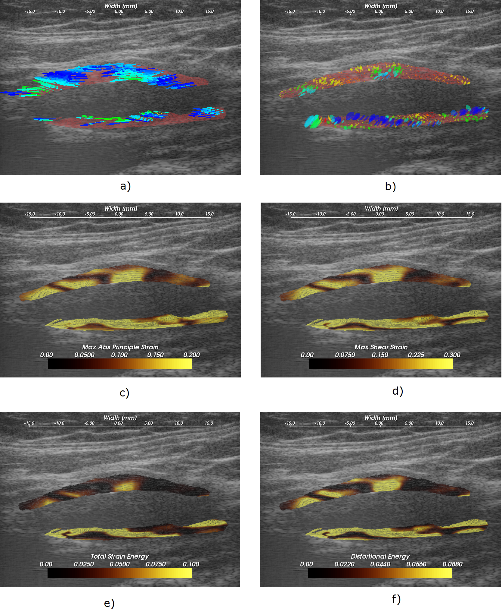
.. highlights::

  |hypoechoic_long|: A hypoechoic atherosclerotic mass, often classified as 'soft' plaque, that
  exhibit high strain throughout the plaque.  a) Accumulated displacement
  vectors (movement is primarily in superior direction), b) strain tensor
  ellipses, c) maximum absolute principal strain, d) maximum shear strain, e)
  total strain energy, and f) distortional energy.

As discussed in Section 2.3.1, hypo-echoic B-Mode presentation is associated
with lipid or hemorrhagic plaque content.  It has traditionally been
hypothesized that soft plaques may be a sign of vulnerability.  In |hypoechoic|,
a hypoechoic plaque from the right side of Subject 154 is shown to have high strains throughout the plaque.  Strain
in the posterior plaque segment (found deeper in the image), is higher than
the anterior plaque segment.  This pattern is common, and could be related to
material properties of the tissue surrounding the anterior
segment compared to the material properties surrounding the posterior segment,
or it could be related to the compression supplied by the transducer
[Maurice2008a]_.  The mean peak-to-peak maximum absolute principal strain is
0.23 and the 90\ :sup:`th` percentile is 0.41 in the posterior segment (Table B.1).
There is little difference in the distribution of the strain metrics in this
case with the possible exception of the total strain energy, which is more
reserved in the anterior segment.  These strain tensor ellipses allow
easy comprehension of the magnitude, orientation, and distribution of the strain.
The changing orientation of the ellipses explain the contours of low strain
metric amplitude in |hypoechoic|\ c)-f); low strain metric amplitude occurs as transitions in the orientation of deformation.  Displacements illustrated in |hypoechoic|\ a)
are large and predominantly lateral, which underscores the need for good lateral
tracking.

Importance of morphology
========================

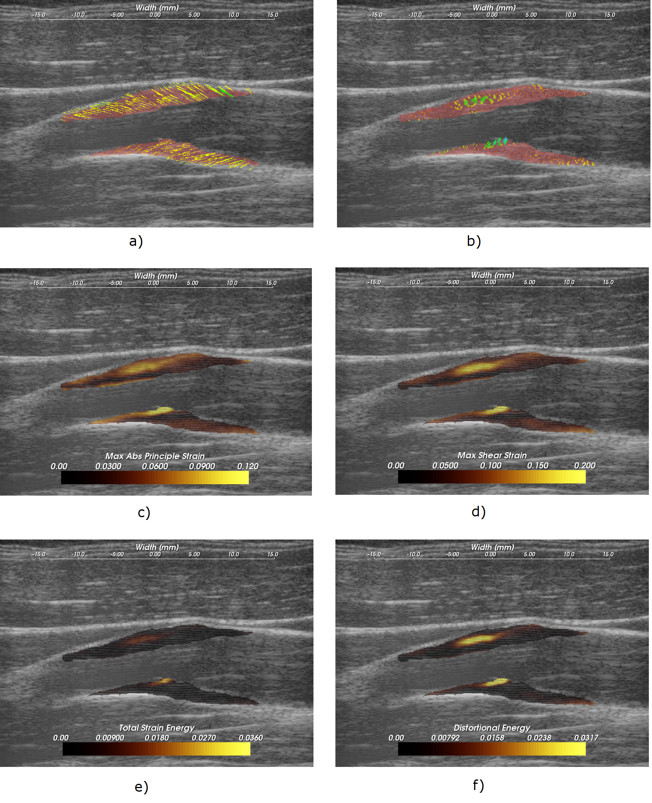
.. highlights::

  |geometry_long|: Strain pattern in an echogenically homogeneous plaque that
  varies depending on the geometry of the plaque and its position relative to
  blood flow. a) Displacement vectors, b) strain tensor ellipses, c) maximum
  absolute principal strain, d) maximum shear strain, e) total strain energy,
  and f) distortional energy.

As discussed in Section 2.2 and 2.3, the dominant focus of various imaging and other
diagnostic techniques is on identification of plaque composition.  While
composition may be an important factor in plaque vulnerability, it is not the
only factor.  In |geometry|, a plaque with a relatively homogeneous B-Mode
echogenicity is shown, which implies that its composition may be homogeneous.
However, when mechanical loading is applied via the pulse pressure, a
heterogeneous strain distribution results.  Strain is highest in the center of
the larger anterior plaque region and falls off towards its edges.  The area of
the posterior plaque segment that protrudes into the lumen experiences much
higher strain than other areas.

Subtle but significant differences in the strain metrics shown in |geometry|\
c)-f) are apparent.  The squared terms in the total strain energy and
distortional energy accentuate the locations of highest strain compared to the
maximum absolute principal strain and the maximum shear strain.  These images
are from the left side of Subject 157.

Strain with turbulent flow
==========================

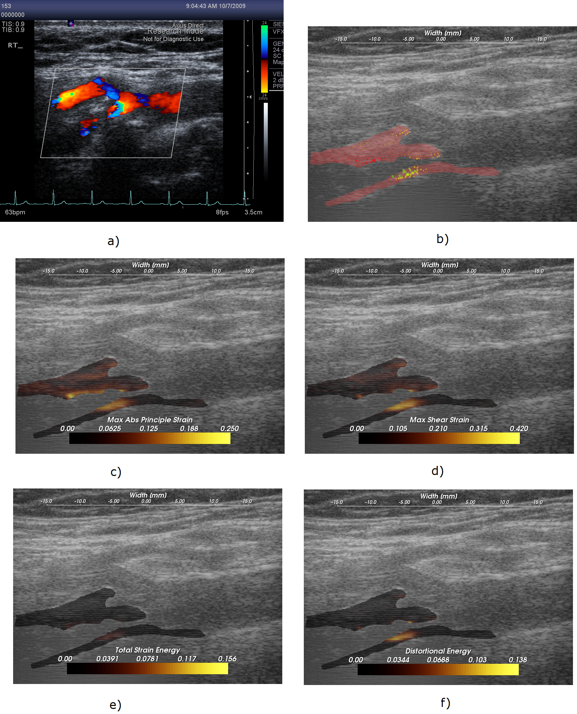
.. highlights::

  |turbulence_long|: High strain adjacent to turbulent flow that follows a
  narrow inlet in the ICA.  a) Color flow from the scanner interface, b) strain
  tensor ellipses, c) maximum absolute principal strain, d) maximum shear strain, e)
  total strain energy, and f) distortional energy.

|geometry_start| emphasizes that morphology is an important factor in plaque
vulnerability, and strain imaging captures that factor.  The material
composition does not independently predict plaque vulnerability as commonly
assumed, but the importance of a necrotic core, for example depends on its
location within the mechanical environment [Makris2010]_.  |turbulence_start|
suggests that hemodynamics are also a factor in plaque vulnerability.  Aliasing in the
color flow image, shown in |turbulence|\ a), can be attributed to the turbulent flow that
occurs as the blood squeezes through the small patency in the plaque at the base
of the internal carotid artery (ICA).  High strain is seen in the plaque
immediately adjacent to this location of turbulent flow.

Strain at the plaque-adventitia interface
=========================================

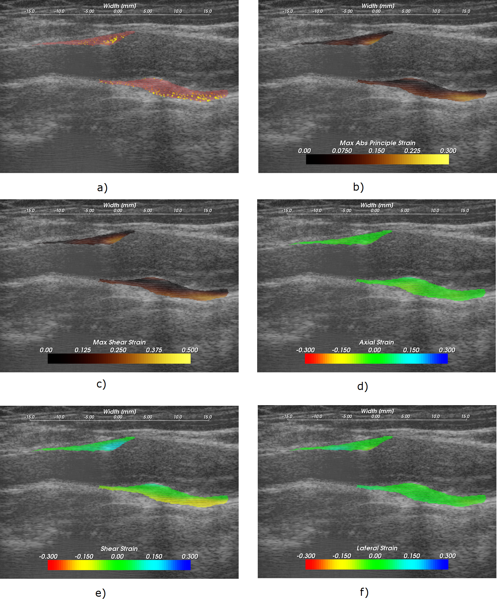
.. highlights::

  |wallshear_long|: High strain near the interface of the plaque with the
  surrounding tissue that occurs with lateral motion of the plaque.  a) Strain
  tensor ellipses, b) maximum absolute principal strain, c) maximum shear
  strain, d) axial strain, e) shear strain, f) and lateral strain.

Recall that angiogenesis has also been proposed in the literature as a possible factor leading to
plaque vulnerability [McCarthy1999,Lusby1982,Hiyama2010,Vicenzini2007]_.  As
plaques become larger, the vasa vasorum that provided blood to the artery wall
can grow to feed the enlarged tissue.  These fissures are expected to cause
instability associated with the adventitia-plaque boundary where angiogenesis
originates.  |wallshear_start| shows high strains at this location occurring during
lateral motion of the plaque that may be associated with this phenomenon.  These
images are from the left side of Subject 156.

Examining the strain tensor ellipses or the strain metric images, we easily
locate the areas of high strain.  A single component of the strain tensor does
not always provide sufficient information.  In this case, for example, the high
strain is not apparent in the axial or lateral strain images.  Note that the
ellipses are orientated at an angle of 3π/4 because of the orientation and
deformation of the plaque.  This off-axis orientation explains why the strain is
best reflected in the shear strain component in this case.  If the plaque was
orientated in a more horizontal direction relative to the transducer, the strain
would then arise in the lateral component.

Again, note that the area of the anterior plaque that protrudes into the lumen is
subject to high strains.

Calcified plaque with shadowing
===============================

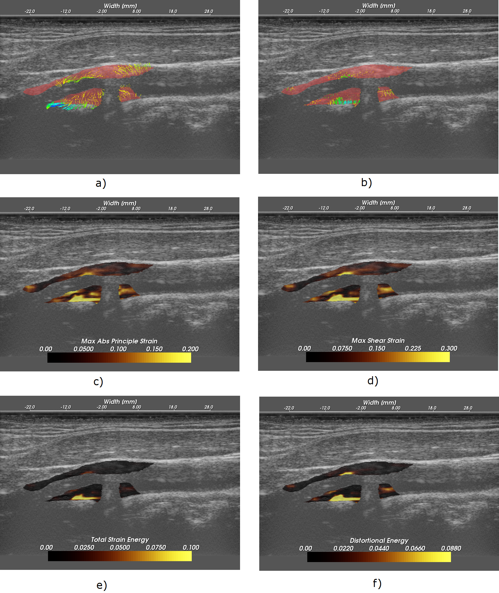
.. highlights::

  |shadowing_long|: Low strain in a calcified plaque, but high strain in other
  areas.  a) Displacement vectors, b) strain tensor ellipses, c) maximum
  absolute principal strain, d) maximum shear strain, e) total strain energy,
  and f) distortional energy.

It is well known that calcified plaques are associated with high acoustic
attenuation and that they are extremely stiff.  The increased attenuation explains the
acoustic shadowing on these images of the left side of Subject 158.  As the
displacement vectors indicate in |shadowing|\ a), this plaque undergoes a
torsional motion when subject to the pressure pulse.  Very little strain occurs
in the highly calcified region that causes the shadowing.  In other areas of
the plaque that appear to have heterogeneous calcification, very high strains
occur.  Examination of the strain time series suggests that this may result from a
combination of heterogeneous calcification, morphology, and hemodynamics.

This case also illustrates a limitation of non-invasive externally applied
ultrasound imaging.  Motion tracking cannot be performed when calcified plaques
attenuate the ultrasound beam to undetectable levels.  Furthermore, the 2D
imaging method can only capture a small subset of the imaging planes available.
For a heterogeneous structure like carotid plaques, a critical region may be
overlooked.  Additionally, not all components of the 3D strain tensor are
captured.  Strain imaging in the transverse plaque is made more difficult by the
motion pattern that occurs in this direction and refraction of the beam by the
artery wall [Hansen2009a,Hansen2010a]_.

Artifact from out-of-plane motion
=================================

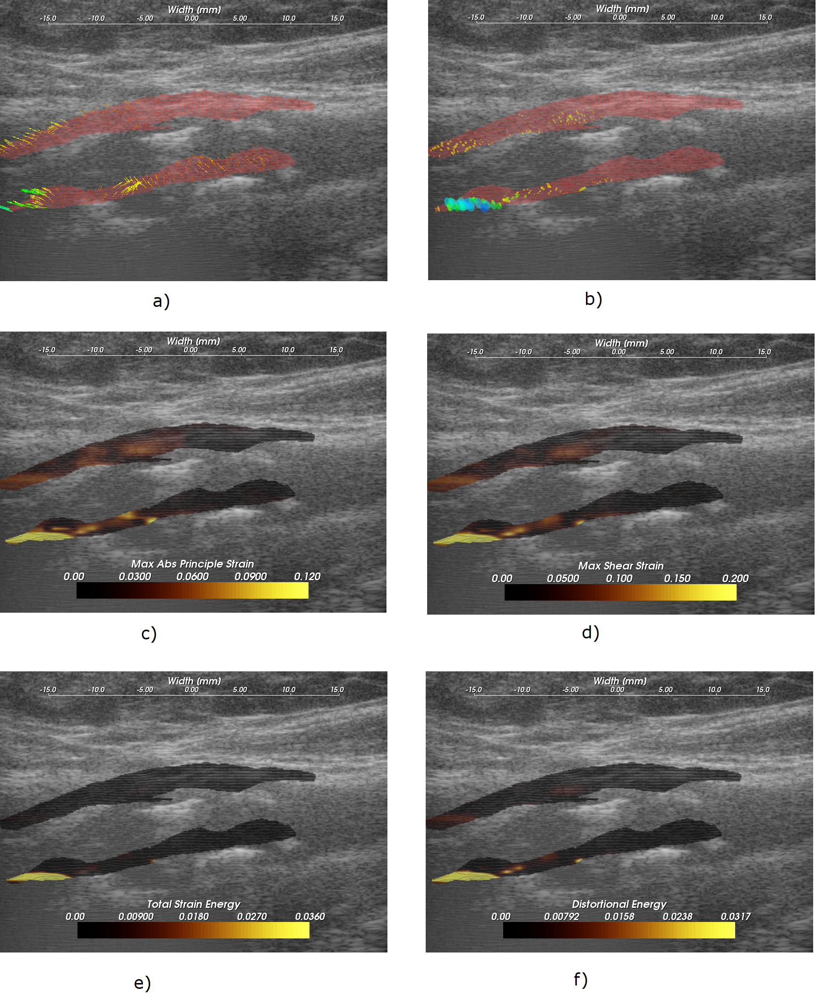
.. highlights::

  |out_of_plane_long|: High accumulated strain artifacts attributable to
  out-of-plane motion. a) Displacement vectors, b) strain tensor ellipses, c) maximum
  absolute principal strain, d) maximum shear strain, e) total strain energy,
  and f) distortional energy.

Finally, a case where artifactual high strains occur with data from the left
side of Subject 153 is displayed in |out_of_plane|.  At the edge of ROIs such as
this one, the vessel is twisting away from the plane of the transducer.  This has
multiple negative effects.  Out-of-plane motion is increased, which causes
signal decorrelation and increases strain image noise.  Out-of-plane
motion also means a particle does not track the same volume of tissue over time.
Furthermore, orientation of the principal axes of the strains accumulated may
differ, which will not result in the correct accumulation of the strain tensor.

~~~~~~~~~~
References
~~~~~~~~~~

