===============================================
Chapter 5: Calculating Strain from Displacement
===============================================

In this chapter, theory and techniques necessary to create strain tensor images
from displacement images are described with attention paid towards issues relevant
to strain imaging of the carotid artery with external ultrasound.  First,
the definition of the strain tensor in continuum mechanics and the
physical explanation that follows is reviewed.  The nomenclature as it
applies to diagnostic ultrasound strain imaging is covered.  Next, a number of
methods to estimate the displacement gradient, which is needed to calculate the
strain tensor, are presented.  Once the strain tensor has been estimated,
permutations can be computed that ease interpretation and derived scalar quantities
that be used for statistical analysis of plaque vulnerability.  Finally, methods
to calculate accumulated strain in digital ultrasound strain images over the
cardiac cycle are explained.

.. |points| replace:: Fig. 5.1

.. |points_long| replace:: **Figure 5.1**

.. |segments| replace:: Fig. 5.2

.. |segments_long| replace:: **Figure 5.2**

.. |two_segments| replace:: Fig. 5.3

.. |two_segments_long| replace:: **Figure 5.3**

.. |ds_normal_dia| replace:: Fig. 5.4

.. |ds_normal_dia_long| replace:: **Figure 5.4**

.. |ds_perpendicular_dia| replace:: Fig. 5.5

.. |ds_perpendicular_dia_long| replace:: **Figure 5.5**

.. |ds_normal_eulerian_dia| replace:: Fig. 5.6

.. |ds_normal_eulerian_dia_long| replace:: **Figure 5.6**

.. |linear_array| replace:: Fig. 5.7

.. |linear_array_long| replace:: **Figure 5.7**

.. |cylinder| replace:: Fig. 5.8

.. |cylinder_long| replace:: **Figure 5.8**

.. |input_known_displacements| replace:: Fig. 5.9

.. |input_known_displacements_long| replace:: **Figure 5.9**

.. |expected_strains| replace:: Fig. 5.10

.. |expected_strains_long| replace:: **Figure 5.10**

.. |rf_inputs| replace:: Fig. 5.11

.. |rf_inputs_long| replace:: **Figure 5.11**

.. |tracked_displacements| replace:: Fig. 5.12

.. |tracked_displacements_long| replace:: **Figure 5.12**

.. |central_difference_strain| replace:: Fig. 5.13

.. |central_difference_strain_long| replace:: **Figure 5.13**

.. |higher_order_accurate| replace:: Fig. 5.14

.. |higher_order_accurate_long| replace:: **Figure 5.14**

.. |gradient_recursive_gaussian_strain| replace:: Fig. 5.15

.. |gradient_recursive_gaussian_strain_long| replace:: **Figure 5.15**

.. |lsq| replace:: 5.16

.. |lsq_long| replace:: **Figure 5.16**

.. |lsq_vessel| replace:: Fig. 5.17

.. |lsq_vessel_long| replace:: **Figure 5.17**

.. |lsq_vessel_axial_strain| replace:: Fig. 5.18

.. |lsq_vessel_axial_strain_long| replace:: **Figure 5.18**

.. |bspline_strain| replace:: Fig. 5.19

.. |bspline_strain_long| replace:: **Figure 5.19**

.. |strain_ellipses| replace:: Fig. 5.20

.. |strain_ellipses_long| replace:: **Figure 5.20**

.. |frame_skip| replace:: Fig. 5.21

.. |frame_skip_long| replace:: **Figure 5.21**

.. |higher_coefficients| replace:: Table 1

.. |higher_coefficients_long| replace:: **Table 1**

~~~~~~~~~~~~~~~~~~~~~
5.1 The strain tensor
~~~~~~~~~~~~~~~~~~~~~

5.1.1 Mechanical model
======================

An *in situ* plaque prior to failure is a continuous, solid-body at a gross
level, and solid-body continuum mechanics can be applied.  Solid-body continuum
mechanics treats a body as a collection of infinitesimal volumes of material.
We are concerned with the motion of this collection of infinitesimal volumes
over time.  This may be rigid body motion, translation and rotation, or
deformation of the body.

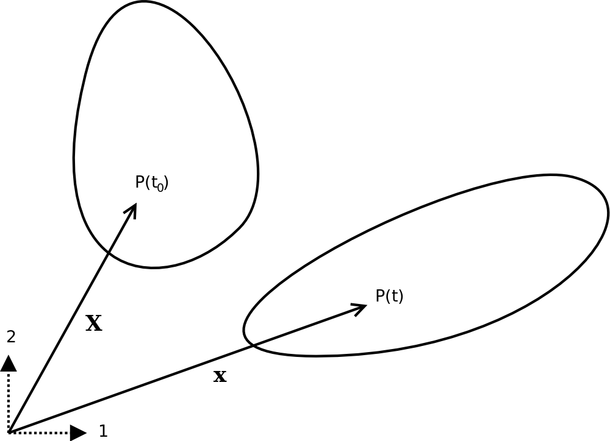
.. highlights::

  |points_long|: 2D solid body at reference time *t*\ :sub:`0`, and after motion
  at time *t*.  The vector **X** defines the position of point *P*\ (*t*\ :sub:`0`\ )
  in the reference configuration, and the vector **x** defines the point's
  position after motion.  The vector **u** is the difference between the two
  vectors and the displacement of *P*.

Consider a point, *P*, within a body at the time *t*\ :sub:`0` whose location is
defined by the vector **X**.  Motion occurs and *P*\ (*t*) is now located at **x**.
That is, :math:`\mathbf{x} = \mathbf{x}( \mathbf{X}, t )` and
:math:`\mathbf{x} ( \mathbf{X}, t_0 ) = \mathbf{X} )`.  Here **X** defines the
reference configuration.  We will consider the location of *P* after motion occurs
to be the reference location plus a displacement, **u**, i.e.

.. math:: \mathbf{x} = \mathbf{X} + \mathbf{u}( \mathbf{X}, t )

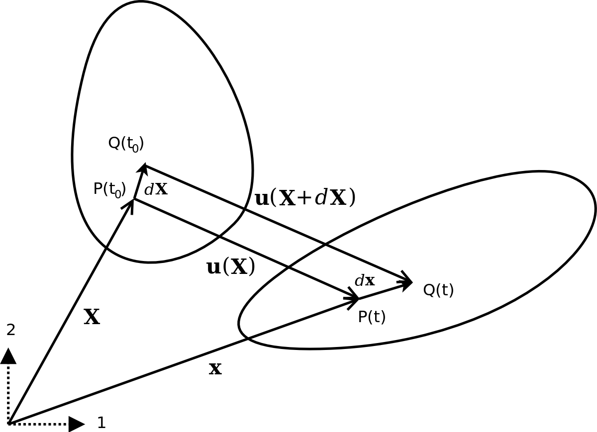
.. highlights::

  |segments_long|:  A different length segment extending from point *P* to point *Q*
  in the reference configuration, *d*\ **X**, and after deformation, *d*\ **x**.

Let us examine the motion of infinitesimally small line segments within the
body.  The line segment at **X**, *d*\ **X**, at time *t* becomes *d*\ **x**.  This
is illustrated in |segments|.  The nearby point *Q* is located in the post- and
pre-deformation states at

.. math:: \mathbf{x} + d\mathbf{x} = \mathbf{X} + d\mathbf{X} + \mathbf{u}( \mathbf{X} + d\mathbf{X}, t )

.. epigraph::

  It is clear from |segments| that

.. math:: d\mathbf{x} = d\mathbf{X} + \mathbf{u}( \mathbf{X} + d\mathbf{X}, t) - \mathbf{u}( \mathbf{X}, t)

.. epigraph::

  This can be expressed with the second-order tensor called the displacement
  gradient [Lai1993]_, :math:`\nabla \mathbf{u}`.  In 2D Cartesian coordinates:

.. math:: \nabla \mathbf{u} = \begin{bmatrix} \dfrac{\partial u_1}{\partial X_1} & \dfrac{\partial u_1}{\partial X_2} \\ \dfrac{\partial u_2}{\partial X_1} & \dfrac{\partial u_2}{\partial X_2} \end{bmatrix}

.. epigraph::

  If **F**, the *deformation gradient* [Lai1993]_ is defined by :math:`\mathbf{F} \equiv I + \nabla \mathbf{u}`, then

.. math:: d \mathbf{x} = d \mathbf{X} + \nabla \mathbf{u} \, d \mathbf{X} = \mathbf{F} d \mathbf{X}

Strain, which quantifies the distortion that occurs in a material, is defined
when investigating the expression for the inner product between two differential
segments before and after deformation.  When we compare the two segments
:math:`d \mathbf{x}^{(1)}` and :math:`d \mathbf{x}^{(2)}`

.. image:: images/two_segments.png
  :align: center
  :width: 6cm
  :height: 1.09cm

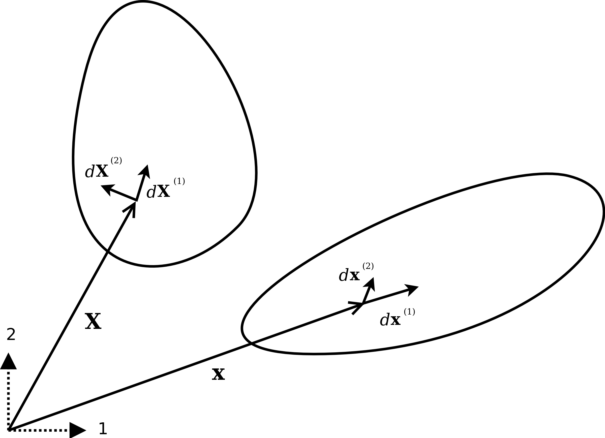
.. highlights::

  |two_segments_long|: Two differential segments in the reference configuration,
  :math:`d \mathbf{x}^{(1)}` and :math:`d \mathbf{x}^{(2)}`,
  and after motion occurs. :math:`d \mathbf{X}^{(1)}` and :math:`d \mathbf{X}^{(2)}`

Observe that

.. image:: images/two_segments2.png
  :align: center
  :width: 6cm
  :height: 1.0cm

.. epigraph::

  It is from this model that the different expressions for the strain tensor
  arise.

5.1.1.1 Infinitesimal strain
----------------------------

If there are very small deformations, :math:`(\nabla \mathbf{u})^T \nabla \mathbf{u}`
becomes negligible, and

.. math:: \mathbf{F}^T \mathbf{F} \approx \mathbf{I} + \nabla \mathbf{u} + (\nabla \mathbf{u})^T \equiv \mathbf{I} + 2 \mathbf{E}

.. epigraph::

  where

.. math:: \mathbf{E} = \frac{1}{2} ( (\nabla \mathbf{u} )^T + \nabla \mathbf{u})

Note that **E** is a second-rank tensor since :math:`\nabla \mathbf{u}` is a
second-rank tensor, and it is symmetric because we have the transpose added to
itself.  The tensor **E** is the *infinitesimal strain* [Lai1993]_, also known as
*engineering strain* or *small strain*.  We then have:

.. math:: d \mathbf{x}^{(1)} \cdot d \mathbf{x}^{(2)} = d \mathbf{X}^{(1)} \cdot d \mathbf{X}^{(2)} + 2 d \mathbf{X}^{(1)} \cdot \mathbf{E} d \mathbf{X}^{(2)}

.. epigraph::

  Therefore, the change in the inner product is an additive term with
  transformation of the original vectors being performed by the strain tensor.

For Cartesian coordinates in Einstein notation,

.. math:: E_{ij} = \frac{1}{2} ( \frac{\partial u_i}{\partial X_j} + \frac{\partial u_j}{\partial X_i} )

.. epigraph::

  and in 2D the infinitesimal strain tensor is explicitly defined as,

.. math:: \mathbf{E} = \begin{bmatrix} \dfrac{\partial u_1}{\partial X_1} & \dfrac{1}{2}( \dfrac{\partial u_1}{\partial X_2} + \dfrac{\partial u_2}{\partial X_1}) \\ \dfrac{1}{2}( \dfrac{\partial u_1}{\partial X_2} + \dfrac{\partial u_2}{\partial X_1}) & \dfrac{\partial u_2}{\partial X_2} \end{bmatrix}

We can elucidate the physical meaning of the infinitesimal strain tensor by
examining special cases for :math:`d \mathbf{X}^{(1)}` and :math:`d
\mathbf{X}^{(2)}`.  First, let us consider when :math:`d \mathbf{X}^{(1)} = d
\mathbf{X}^{(2)} = dS \, \mathbf{e_1}` where **e**\ :sub:`1` is the unit
basis in direction 1 and *dS* is the length of *d*\ **X**, and *ds* is
the deformed length of :math:`d \mathbf{x}^{(1)} = d \mathbf{x}^{(2)}`.

.. image:: images/ds_normal.png
  :align: center
  :width: 8cm
  :height: 1.698cm

.. highlights::

  |ds_normal_dia_long|: Two line segments, :math:`d \mathbf{X}^{(1)} = d
  \mathbf{X}^{(2)} = dS \, \mathbf{e_1}` get transformed to a segment of length
  *ds* after deformation.

For small deformations, :math:`(ds + dS)( ds - dS) \approx 2 dS( ds - dS )`, and

.. math:: \frac{ ds - dS }{dS} = \mathbf{e_1} \cdot \mathbf{E} \mathbf{e_1} = E_{11}

Therefore, *E*\ :sub:`11` is equal to the unit elongation (or shortening) for the segment
in the direction of **e**\ :sub:`1`.  Similarly, *E* :sub:`22` is the
unit elongation for the segment that is in the direction of
**e**\ :sub:`2`.  These diagonal elements of **E** constitute the
*normal strains* [Lai1993]_.  Note that

.. math:: 100 \, \frac{ds - dS}{dS} \equiv \% \mbox{ elongation of } dS

Therefore, in the small strain case, a normal strain component multiplied by 100 is equal to
the percent elongation.  A positive normal strain indicates an extension of
*dS*, and a negative normal strain indicates a shortening of *dS*.

Secondly, instead of examining parallel segments centered at **X**, let us
investigate perpendicular segments.

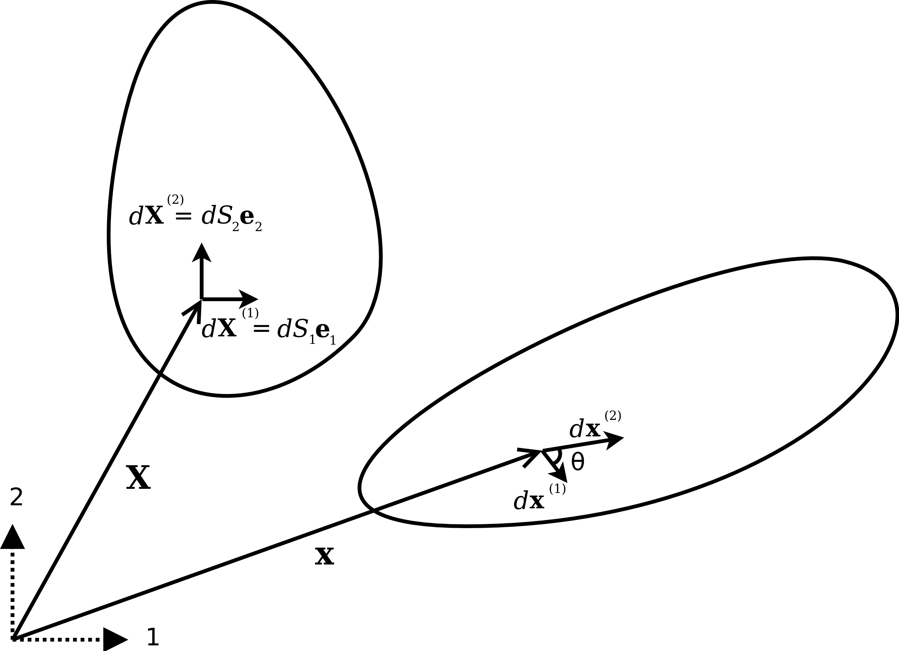
.. highlights::

  |ds_perpendicular_dia_long|:  Relative change that occurs, which is orthogonal
  in the reference configuration.

Let :math:`d \mathbf{X}^{(1)} = dS_1 \, \mathbf{e_2}` and :math:`d
\mathbf{X}^{(2)} = dS_2 \, \mathbf{e_2}`, :math:`\Vert d \mathbf{x}^{(1)} \Vert = ds_1`,
:math:`\Vert d \mathbf{x}^{(2)} \Vert = ds_2`, and the angle between
:math:`\mathbf{x}^{(1)}` and :math:`\mathbf{x}^{(2)}` is θ.

.. image:: images/ds_perpendicular.png
  :align: center
  :width: 6cm
  :height: 1.424cm

.. epigraph::

  If we define :math:`\theta = \pi / 2 - \gamma`, then :math:`\gamma` is the
  change in angle that occurs between :math:`\mathbf{x}^{(1)}` and :math:`\mathbf{x}^{(2)}`.

.. math:: \sin \gamma = \cos( \pi / 2 - \gamma )

.. epigraph::

  For small strain

.. math:: \sin \gamma \approx \gamma, \; \frac{dS_1}{ds_1} \approx 1, \; \frac{dS_2}{ds_2} \approx 1

.. math:: \gamma = 2 \, E_{12} = 2 \, E_{21}

That is, for infinitesimal strain, the decrease in angle between orthogonal
segments is equal to twice the diagonal component of the strain tensor, the
*shear strain* [Lai1993]_.

5.1.1.2 Lagrangian strain
-------------------------

Beginning again without presuming there are very small
deformations, we start at |two_segments| and subtract
:math:`d \mathbf{X}^{(1)} \cdot d \mathbf{X}^{(2)}` from both sides of the
equation:

.. image:: images/lagrangian.png
  :align: center
  :width: 11cm
  :height: 1.634cm

.. epigraph::

  where :math:`\mathbf{E}^* = \frac{1}{2} ( \mathbf{F}^T \mathbf{F} - \mathbf{I})`
  is the *Green-Lagrangian strain tensor* [Lai1993,Haupt2002]_.  This is a
  finite strain tensor that specifies strain in terms of the reference
  configuration.

Again examining the situation in |ds_normal_dia|, where
:math:`d \mathbf{X}^{(1)} = d \mathbf{X}^{(2)} = d \mathbf{X} = dS \mathbf{e}_1`
and :math:`||d\mathbf{x}|| = ds`,

.. math:: ds^2 - dS^2 = 2 dS \mathbf{e}_1 \cdot \mathbf{E}^* dS \mathbf{e}_1

.. math:: E_{11}^* = \frac{ ds^2 - dS^2}{2 dS^2}

Similarly, if :math:`d \mathbf{X} = ds \, \mathbf{e}_2`,

.. math:: E_{22}^* = \frac{ds^2 - dS^2}{2 dS^2}

And, if we again look at |ds_perpendicular_dia|, where
:math:`d \mathbf{X}^{(1)} = ds_1 \mathbf{e}_1` and :math:`d \mathbf{X}^{(2)} =
dS_2 \mathbf{e_2}` deform to :math:`d \mathbf{x}^{(1)} = ds_1 \mathbf{m}` and
:math:`d \mathbf{x}^{(2)} = ds_2 \mathbf{n}` where **m** and **n** are unit
vectors,

.. math:: ds_1 ds_2 \mathbf{m} \cdot \mathbf{n} = 2 dS_1 dS_2 \mathbf{e}_1 \cdot \mathbf{E}^* \mathbf{e}_2

.. math:: E_{12}^* = \frac{ds_1 ds_2}{2 dS_1 dS_2} \cos( \mathbf{m}, \mathbf{n})

The expression of :math:`\mathbf{E}^*` in terms of the displacement gradient is

.. math:: \mathbf{E}^* = \frac{1}{2}( \nabla \mathbf{u} + (\nabla \mathbf{u})^T + (\nabla \mathbf{u})^T \nabla \mathbf{u} )

In Einstein summation notation,

.. math:: E_{ij}^* = \frac{1}{2}(\frac{\partial u_i}{\partial X_i} + \frac{\partial u_j}{\partial X_i} + \frac{1}{2} \frac{\partial u_m}{\partial X_i} \frac{\partial u_m}{\partial X_j}

The explicit components in a 2D Cartesian coordinate system are,

.. image:: images/lagrangian_explicit.png
  :align: center
  :width: 9.5cm
  :height: 3.07cm

5.1.1.3 Eulerian strain
-----------------------

Instead of specifying motion in terms of the reference configuration, it can be
specified in the deformed configuration,

.. math:: d \mathbf{X} = \mathbf{F}^{-1} d \mathbf{x}

where **F**\ :sup:`-1` is the inverse of **F** [Lai1993]_,

.. math:: \mathbf{F} = \begin{bmatrix} \dfrac{\partial X_1}{\partial x_1} & \dfrac{\partial X_1}{\partial x_2} \\ \dfrac{\partial X_2}{\partial x_1} & \dfrac{\partial X_2}{\partial x_2} \end{bmatrix}

Again considering the deformation of two small segments in the volume,

.. image:: images/eulerian1.png
  :align: center
  :width: 7cm
  :height: 1.74cm

Subtracting the above from :math:`d \mathbf{x}^{(1)} \cdot d \mathbf{x}^{(2)}`
to again obtain an expression for the change in the inner product between the
two segments,

.. image:: images/eulerian2.png
  :align: center
  :width: 11cm
  :height: 1.62cm

.. epigraph::

  where :math:`\mathbf{e}^* = \frac{1}{2} (\mathbf{I} - (\mathbf{FF}^T)^{-1})` is
  the *Eulerian-Almansi strain tensor* [Lai1993,Haupt2002]_. This is a finite
  strain tensor that specifies strain in terms of the deformed configurations.

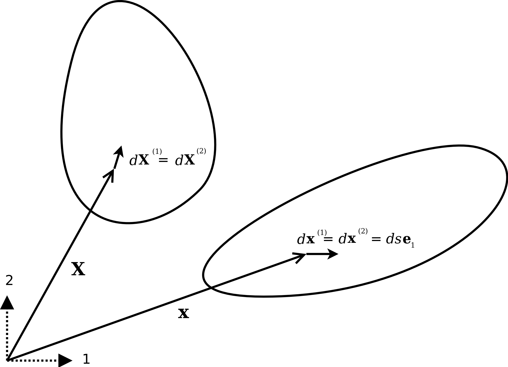
.. highlights::

  |ds_normal_eulerian_dia_long|:  Two identical line segments, this time in the
  deformed configuration, are transformed from a segment of length *dS*.

As shown in |ds_normal_eulerian_dia|, if
:math:`d \mathbf{x}^{(1)} = d\mathbf{x}^{(2)} = d \mathbf{x} = ds \mathbf{e}_1`
and :math:`||d \mathbf{x}|| = dS`, then

.. math:: ds^2 - dS^2 = 2 dS \mathbf{e}_1 \mathbf{e}^* dS \mathbf{e}_1

.. math:: e_{11}^* = \frac{ds^2 - dS^2}{2 dS^2}

And, when considering two segments :math:`d\mathbf{x}^{(1)} = ds_1 \mathbf{e}_1`
and :math:`d\mathbf{x}^{(2)} = ds_2 \mathbf{e}_2` that deformed from
:math:`d\mathbf{X}^{(1)} = dS_1 \mathbf{n}` and
:math:`d \mathbf{X}^{(2)} = dS_2 \mathbf{m}` where **n** and **m** are unit
vectors,

.. math:: - dS_1 dS_2 \, \mathbf{n} \cdot \mathbf{m} = 2 \, ds_1 ds_2 \, \mathbf{e}_1 \cdot \mathbf{e}^* \mathbf{e}_2

.. math:: e_{12}^* = \frac{ -dS_1 dS_2 \cos( \mathbf{n}, \mathbf{m} )}{2 ds_1 ds_2}

Since :math:`\mathbf{F}^{-1} = \mathbf{I} - \nabla_x \mathbf{u}` [Lai1993]_
(:math:`\nabla_x` indicates differentiation with respect to coordinates of the
deformed configuration),

.. image:: images/inverse_deformation_gradient.png
  :align: center
  :width: 9cm
  :height: 1.23cm

and

.. math:: \mathbf{e}^* = \frac{1}{2}( \nabla_x \mathbf{u} + (\nabla_x \mathbf{u})^T - (\nabla_x \mathbf{u})^T \nabla_x \mathbf{u}

In Einstein summation notation,

.. math:: e_{ij}^* = \frac{1}{2}(\frac{\partial u_i}{\partial x_i} + \frac{\partial u_j}{\partial x_i}) - \frac{1}{2} \frac{\partial u_m}{\partial x_i} \frac{\partial u_m}{\partial x_j}

Explicitly in 2D Cartesian coordinates,

.. image:: images/eulerian_explicit.png
  :align:  center
  :width:  9.5cm
  :height: 3.3cm

5.1.2 Application in ultrasound
===============================

By applying various medical imaging modalities, strain images of tissues can be
created by performing deformable image registration of tissue after
deformation to another pre-deformation image.  This technique has been applied
in multiple imaging modalities.  Strain in atherosclerotic tissues was imaged by
Rogowska et al. [Rogowska2004,Rogowska2006]_ with optical coherence tomography
as well as by others [Stamper2006,Chan2004]_.  Recently, the high resolutions
of X-ray computed tomography (CT) were used to create high quality strain images
of a breast phantom [Han2010]_.  Creation of displacement images in magnetic
resonance imaging (MRI) is unique in that does not need to use traditional image
registration techniques, but pulse sequences can generate displacement
images using the physics of image acquisition [Fowlkes1995,Bishop1995,Hardy1995,Plewes2000,Lin2008,Korosoglou2008,Neizel2009,Shehata2010]_.

Diagnostic ultrasound has the longest history of calculating strain
[Ophir2001,Ophir2000,Parker1996,Parker2011]_.  In one of the earliest papers,
Ophir et al. [Ophir1991]_ calculated strain using:

.. math:: s_i = \frac{t_{i+1} - t_i}{2dz/c}

.. epigraph::

  where the *s*\ :sub:`i` is the local strain, *t*\ :sub:`i+1` and *t*\ :sub:`i` are
  the time shifts of windows on an A-line, *dz* is the distance between the
  windows, and *c* is the speed of sound in tissue.  As shown in |linear_array|,
  an A-line, denotes an amplitude line of the radio-frequency (RF) echo-signal created by sending a beam of
  ultrasound into a tissue.  If the speed of sound in tissue is constant, this
  dimensionless quantity is equivalent to a single component of the infinitesimal
  strain tensor described in Section 5.1.1.1.  Since this component of strain is
  along the beam axis, it is also called the *axial strain*.  In a linear array where
  all A-lines are acquired along parallel directions, as shown in |linear_array|, the  term axial refers to
  the same direction across the entire image.  Note that for sector arrays, this
  may not be the case.  In the usual operation and clinical presentation of
  linear array data, the axial direction is the vertical or depth direction in an image.
  If beam steering occurs, the beams will remain parallel, but the axial
  direction no longer corresponds to the vertical direction of the image.  

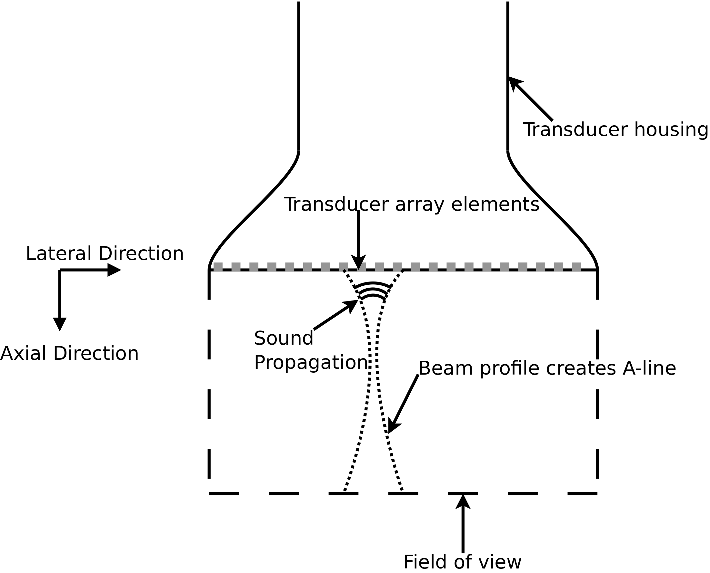
.. highlights::

  |linear_array_long|: Diagram of a medical linear ultrasound array.  Small
  transducer elements on the surface of the handheld transducer send sound
  concentrated over a beam in the tissue, which creates a line in the image.
  The axis of this beam determines the *axial direction* of the strain tensor,
  and the direction orthogonal is the *lateral direction*.

In conventional ultrasound imaging, a B-Mode image is formed by repeatedly
changing the location of the ultrasound beam sent into the tissue.  In a linear array,
the spacing of the A-lines is determined by the transducer element spatial
density or pitch.  This direction which is orthogonal to the axial direction is the
*lateral direction*.  In the carotid images shown in this work, the lateral
direction corresponds to the horizontal direction in the B-mode image.  Resolution in this direction
is not directly determined by the excitation frequency as it is in the axial
direction, but by the beam width.  As a consequence, resolution in this
direction is much lower [Hansen2010]_.  Also, shifts do not depend on sound
speed assumptions; they are statically determined by the geometry of the
transducer.  In *in vivo* carotid images used in this study, for example, the
number of samples in a 40×40 mm image in the axial direction is 2076 in the
axial direction and 244 in the lateral direction.  This near ten-fold disparity
in the resolution is associated with the difficulty in calculating lateral
strains.  The majority of the literature has focused on axial strains because
the lateral strains do not exhibit a useable signal-to-noise ratio.  Only until recently
have algorithmic improvements, such as regularization described in Chapter 3 or
other improvements described in Chapters 4 and 9, enabled the use of the
lateral strain component.

*Shear strain* in ultrasound strain imaging usually refers to the strain between
the axial and lateral directions.  Since displacement estimates in the axial direction
are of higher quality than those in the lateral directions, some have only
calculated the derivative of displacement in the axial direction with respect to
the lateral direction and called this *axial shear* [Thitaikumar2008a]_.

Of course, while axial, lateral, and shear strain provide all components of a 2D
strain tensor, physical tissues are 3D.  The number of independent components in a
symmetric, second-rank tensor is:

.. math:: n_c = D \frac{D+1}{2}

.. epigraph::

  Note that there are six components in the 3D strain tensor; two addition shear strain
  components and one additional normal strain component.  While there is on-going
  research to obtain these components, there are a number of technological
  limitations at this time that prevent full population of the strain tensor with
  ultrasound.  The third direction of a linear array, the *elevational
  direction*, has a resolution at the level of or worse than the lateral
  resolution.  Technology to commercially develop a 2D matrix-array of transducer
  elements is only emerging.  Challenges here include creation of the 2D array
  elements and acquiring the appropriate channel count in the system
  [Wygant2008,Martinez-Graullera2010]_.  In terms of motion tracking,
  computational challenges exist in terms of data storage and processing.  Also,
  frames rates are slower with volumetric imaging, which in some cases allow
  too much motion to take place between image sets.  However, progress in 3D
  strain imaging is taking place [Byram2010,Po2010,Lopata2007,Rao2008,Fisher2010]_.
  Currently, the primary benefit of 3D imaging systems are not necessarily to obtain all components
  of the strain tensor, but to prevent tissue from moving outside of the imaging
  plane, which makes motion tracking difficult.

~~~~~~~~~~~~~~~~~~~~~~~~~~~~~~~~~~~~~~~~~~~~~~~~~~~
5.2 Methods for estimating strain from displacement
~~~~~~~~~~~~~~~~~~~~~~~~~~~~~~~~~~~~~~~~~~~~~~~~~~~

In Section 5.1.1, it was shown how strain tensors are composed of the symmetric part of
the displacement gradient.  Therefore, in order to compute the strain tensor,
the displacement gradient must first be estimated.  Accurate calculation of the
displacement gradient is a challenge for two reasons.  First, the output of
block-matching methods is discrete instead of continuous displacement fields.
Secondly, displacement estimates are often noisy, and the differential operation
of gradient calculation magnifies the noise.  In this section, a number of
methods to compute the displacement gradient are examined.

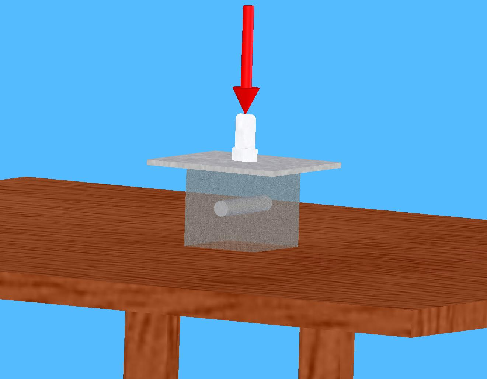
.. highlights::
  
  |cylinder_long|: Illustration of the mechanical model from which the
  displacements and strains in this chapter are studied.  A block with
  homogeneous stiffness has a stiffer cylindrical inclusion embedded within.
  The block is compressed uniaxially with a plate and pre- and post-deformation
  images are made of the transverse plane of the cylinder with a transducer
  placed at the top of the assembly.

A common test case for ultrasound strain imaging is the model of a stiffer
cylindrical inclusion (high elastic modulus) embedded in a soft background (low elastic
modulus).  The inclusion exists in a cubic block, and is subject to uniform
compression from the top while being unconstrained at the side (zero-traction
stress boundary conditions), as shown in |cylinder|.  Displacement is assumed to start from zero at the
top and center of the model as if an ultrasound transducer exists there as a
point of reference.  Details on methods to create the mechanical finite element
and ultrasound scattering parts of a simulation that represents this model are
described in Chapter 3.  In this section, images resulting from a 3% compression along
the axis of deformation in this model will be used to evaluate the behavior of
different methods to calculate the strain tensor from tracked displacement
vectors.

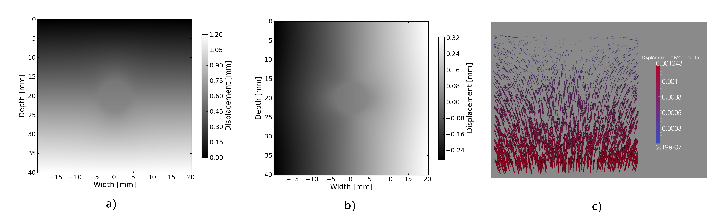
.. highlights::

  |input_known_displacements_long|:  Ideal input displacements resulting from
  the mechanical model.  a) Axial displacements, b) lateral displacements, c)
  displacement vectors represented by arrows scaled and colored by their magnitude.

The ideal, known displacements are shown in |input_known_displacements|.  Axial
displacements start from zero at the transducer surface and increase further
into the phantom.  Lateral displacements are assumed to be zero along the center
axis of the transducer and diverge to the edges of the phantom.

If we apply the central difference methods and the equations in Section 5.1.1.1
to the noiseless known input displacements, |input_known_displacements|, we
obtain the expected strains in |expected_strains|.

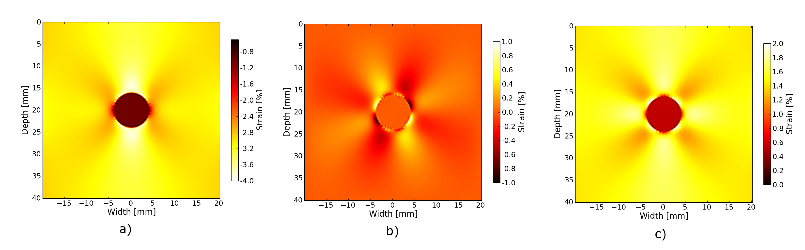
.. highlights::

  |expected_strains_long|: Strains calculated from the noiseless input
  displacements on a hard cylindrical input model undergoing uni-axial
  compression. a) Axial strain, b) shear strain, and c) lateral strain.

The challenge arises when noise in the displacements are present from imperfect
motion tracking.  RF ultrasound simulation images in |rf_inputs| display
image content before and after deformation.  The deformation pattern that takes
place between these images is not readily apparent, but the motion tracking
algorithm is able to determine the movement of regions in the image.  Notice
the anisotropy in resolution-- signal content is much higher in the axial
direction than it is in the lateral direction.  This leads to higher quality
motion estimation in the axial direction, as discussed in Section 5.1.2.

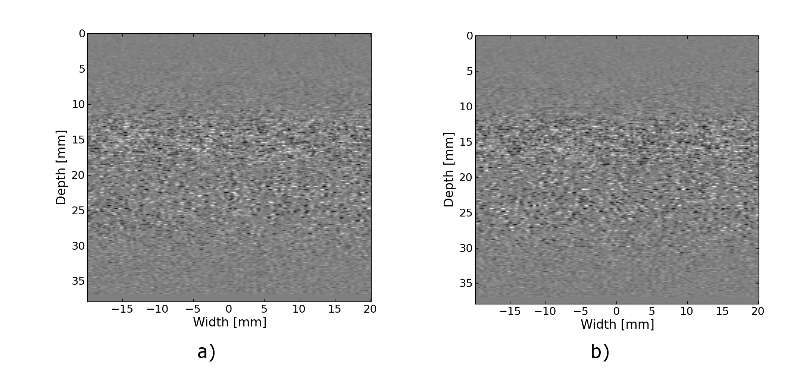
.. highlights::

  |rf_inputs_long|: a) Pre-deformation and b) post-deformation ultrasound RF
  images.  Motion tracking applied to these images generates the displacements
  in |tracked_displacements|.

Displacements that define the motion between |rf_inputs|\ a) and |rf_inputs|\ b)
are shown in |tracked_displacements|.  These images are created with the
motion tracking algorithm described in Chapter 9.  In the next few
subsections, methods for calculating the displacement gradient from
|tracked_displacements| are presented and the strain that results shown.

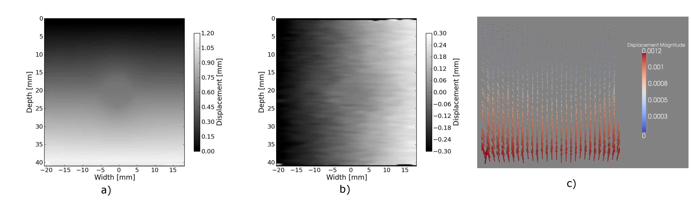
.. highlights::

  |tracked_displacements_long|: Displacements that result from tracking the
  motion in |rf_inputs|.  a) Axial displacements, b) lateral displacements, c)
  displacement vectors represented by arrows scaled and colored by their
  magnitude.

5.2.1 Finite difference based methods
=====================================

A common way to approximate the first derivative of a function *f*\ :sub`k` at sample
offset *k* using finite differences is the central difference method.

.. math::  f^1_0  \approx \frac{f_1 - f_{-1}} { 2 h }

.. epigraph::

  where *h* is the sampling period.

This expression comes from a Taylor series expansion of the component terms

.. math::  f_1 = f_0 + h f^1_0 + \frac{h^2}{2!}f^2_0 + \cdots + \frac{h^n}{n!} + \mathcal{O}(h^{n+1})

.. epigraph::

  where :math:`\mathcal{O}(h^{n+1})` indicates the series has been truncated after *n+1*
  terms.

We also have

.. math:: f_{-1} = f_0 - h f^1_0 + \mathcal{O}(h^{2})

Then we see

.. math::  f^1_0 = \frac{f_1 - f_{-1}} { 2 h } + \mathcal{O}(h^{2})

This approximation is, therefore, *second-order accurate*.  Strain calculated
using the central difference method to compute the displacement gradient is
shown in |central_difference_strain|.

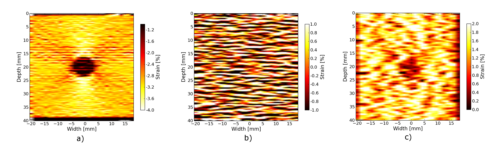
.. highlights::

  |central_difference_strain_long|: Strains calculated using the central
  difference method to compute the displacement gradient.  a) Axial strain, b)
  shear strain, and c) lateral strain.

Other popular simple approaches for approximating the local derivative of sampled
data include the forward difference method and the backward difference method.
In the forward difference method,

.. math::  f^1_0  \approx \frac{f_1 - f_{0}} { h }

After looking at the Taylor series expansion, the forward difference method, like the backward
difference method, is first-order accurate.

.. math::  f^1_0  =  \frac{f_1 - f_{0}} { h } + \mathcal{O}(h)

Higher order accurate [#]_ approximations can be made by using additional
samples.  Various schemes will yield correct results as long as the Taylor
series terms cancel.  When there are equally spaced function samples, which are
the most commonly encountered dataset and are the case for digital images, the
coefficients are usually rational numbers because of the form of the Taylor
series.  For instance, a central difference approximation to the first
derivative that uses a five point kernel is

.. math:: f^1_0 = \frac{f_{-2} - 8 f_{-1} + 8 f_1 - f_2}{ 12 h } + \mathcal{O}(h^4)

.. [#] Here we use the terminology *order of accuracy* to refer to the number of terms used in the Taylor series approximation and *order derivative* to refer to the degree of the derivative.

Khan and Ohba derived closed form expressions for higher order accurate
approximations of an arbitrary *p*\ :sup:`th` order derivative [Khan1999,Khan2003]_.
Two different sets of expressions were developed.  The newer set of
finite difference approximations uses samples from every other sample around the
differentiated point.  This set of approximations has the same computational
complexity, and both approximations have linear phase and are highly accurate
for polynomial type inputs [Khan2003]_.  However, these set of approximations
have
slightly better performance for periodic functions and functions sampled near
the Nyquist frequency [Khan2003]_.  The second set of approximations is central
difference type approximations that have symmetric non-zero coefficients for
every point surrounding the sample of interest.  The coefficients alternate in
sign and decay rapidly from their center.   The tap-coefficients, *d*, for a
first order derivative are:

.. image:: images/nth_order_coefficients.png
  :align:  center
  :width:  8cm
  :height: 1.25cm

The first sets of coefficients are explicitly given in |higher_coefficients|.

======================= =========================================
 Order of accuracy, 2N   Coefficients
----------------------- -----------------------------------------
 2                       -0.5, 0.0, 0.5
 4                       0.08333, -0.6667, 0.0, 0.6667, -0.08333
 6                       -0.016667, 0.15, -0.75, 0.0, 0.75, -0.15, 0.016667
 8                       0.00357143, -0.0380952, 0.2, -0.8, 0.0, 0.8, -0.2, 0.0380952, -0.00357143
 10                      -0.000793651, 0.00992063, -0.0595238, 0.238095, -0.238095, -0.833333, 0.0 0.833333, 0.0595238, -0.00992063, 0.000793651
======================= =========================================

.. highlights::

  |higher_coefficients_long|: Tap-coefficients for higher order accurate center
  difference approximation of the first degree derivative.

Strain images with order of accuracy of 6 are displayed in
|higher_order_accurate|.

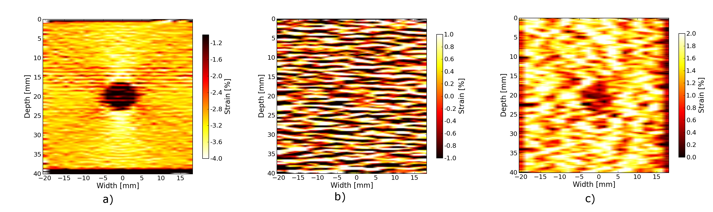
.. highlights::

  |higher_order_accurate_long|: Cylindrical inclusion strain calculated with a 6th order-accurate central
  difference approximation. a) Axial strain, b) shear strain, and c) lateral
  strain.

Inspecting |central_difference_strain| and |higher_order_accurate|, only subtle
differences are observed.  There is noise present in |central_difference_strain|
that remains present in |higher_order_accurate|.  This noise is due not only to
signal decorrelation but also artifacts related to the regularization described in
Chapter 3.  While the higher order-accurate calculation may be a more correct
representation of the displacement gradients, it is sometimes primarily a more
accurate representation of the noise present in the displacement gradients.
In general some notable advantages have been observed.  Specifically,
there are reductions in the strain noise and an increase in the strain dynamic
range.  This behavior contrasts with the rest of the gradient calculation
techniques discussed in this section, which tend to reduce the dynamic range
resolution in the strain component images.  Finite difference based methods are
also among the most computationally efficient methods.  They are implemented
as small, fast convolution kernels.  However, they do little to filter out
noise as the remaining techniques do.

5.2.2 Derivative of Gaussian
============================

Convolution of an image with a Gaussian has a smoothing effect that removes
high frequency content.  In two dimensions, a Gaussian is given by

.. math:: g(x_1, x_2) = \frac{1}{\sqrt{2 \pi}\sigma} e^{\frac{-(x_1^2 + x_2^2)}{2\sigma^2}}

It follows from the derivative theorem and the convolution theorem, that
convolving one function with the derivative of another is equivalent to
taking the derivative of the first and convolving with the other
[Bracewell2000]_.

.. math:: ( f \ast g )' = f' \ast g = f \ast g'

Thus, we can convolve the displacement images with a derivative of a Gaussian to
get smoothed derivatives for the strain calculation.  Since a large proportion
of the high frequency content is often noise, this operation filters out
noise.  According to the derivative theorem, "If *f(x)* has the Fourier transform
*F(s)*, then *f'(x)* has the Fourier transform *i2πsF(s)*.  That is, the normal
derivative operation, such as that achieved with finite difference operations,
suppresses low frequency content and amplifies high frequency content since it
is linear modulation.  The derivative of a Gaussian can suppress the negative
effects of amplification of high frequency content.  Results of convolution with
a 2D Gaussian are found in |gradient_recursive_gaussian_strain|.

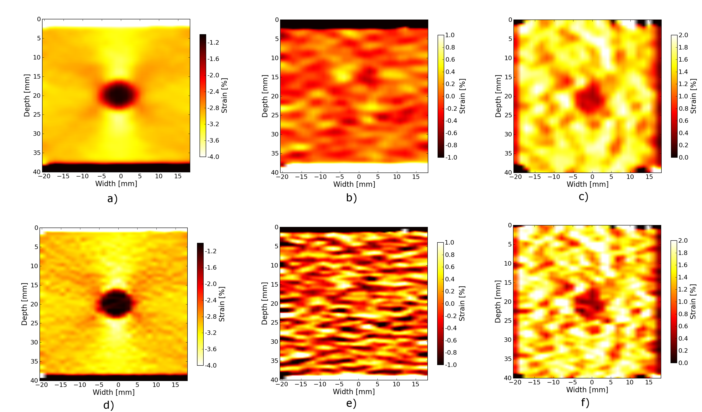
.. highlights::

  |gradient_recursive_gaussian_strain_long|: Strains from gradient calculation
  with the derivative of a 2D Gaussian having a-c) σ = 1.0 mm and d-f) σ = 0.5 mm.

The noise is reduced for both values of the smoothing parameter σ in
|gradient_recursive_gaussian_strain|\ a-c) and
|gradient_recursive_gaussian_strain|\ d-f).  Of course, with too much smoothing,
desired structural information also will be removed.

5.2.3 A modified least-squares strain estimator
===============================================

An alternative approach to direct filtering out of the high frequency content is to fit the
data with an approximating function of known form and use the derivative of the
approximating function.  This approach is taken in the next two subsections.

The least-squares strain estimator is simple, popular strain approximation
method proposed by Kallel et al. [Kallel1997a]_.  A piecewise linear function
is fit to the displacement data, and the slope of this function is used in place
of the derivative.  To obtain the derivative of the displacement along direction
1, *u*\ :sub:`1`, with respect do direction *x*\ :sub:`1`,
:math:`\partial u_1 / \partial x_1` around the datum *x*\ :sub:`1`\ :sup:`(0)`,
first, the linear expression for a single datum is written,

.. math:: u_1^{(0)} = m \, x_1^{(0)} + b

.. epigraph::

  For a five point least-squares kernel in matrix form,

.. math:: \begin{bmatrix} u_1^{(-2)} \\ u_1^{(-1)} \\ u_1^{(0)} \\ u_1^{(1)} \\ u_1^{(2)} \end{bmatrix} = \begin{bmatrix} x_1^{(-2)} & 1 \\ x_1^{(-1)} & 1 \\ x_1^{(0)} & 1 \\ x_1^{(1)} & 1 \\ x_1^{(2)} & 1 \end{bmatrix} \begin{bmatrix} m \\ b \end{bmatrix}

.. epigraph::

  If this is written as,

.. math:: \mathbf{u} = \mathbf{A} \begin{bmatrix} m \\ b \end{bmatrix}

.. epigraph::

  Then the classic least-squares solution is [Kallel1997a,WeissteinEric2011]_

.. math:: \begin{bmatrix} \hat{m} \\ \hat{b} \end{bmatrix} = (\mathbf{A}^T \mathbf{A})^{-1} \mathbf{A}^T \mathbf{u}

.. epigraph::

  This can be written as

.. math:: \begin{bmatrix} \hat{m} \\ \hat{b} \end{bmatrix} = \mathbf{A}^+ \mathbf{u}

.. epigraph::

  where **A**\ :sup:`+` is the Moore-Penrose pseudo-inverse of **A**
  [WeissteinEric2011]_, which is found in practice using singular value
  decomposition.  Note that if the spacing between displacement points is
  uniform along the direction of derivation, which it is for the displacement
  images, **A**\ :sup:`+` will not change apart from handling boundaries, and it
  will only have to be found once for each direction of a displacement image
  that has unique spacing.  The derivative is simply taken to be
  :math:`\hat{m}`.

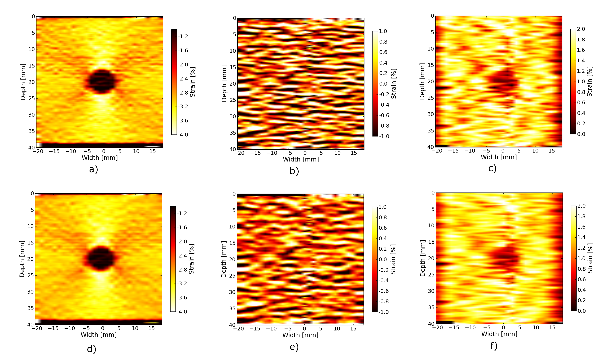
.. highlights::

  |lsq_long|: Strain images using local linear least-squares fit to the
  displacement data.  a-c) 5 point least-squares kernel.  d-f) 7 point least
  squares kernel.

Results from the linear least-squares technique are shown in |lsq|.  Similar to
the derivate of Gaussian results, high frequency noise is removed.  Again, a
longer kernel results in greater noise suppression but lower resolution.

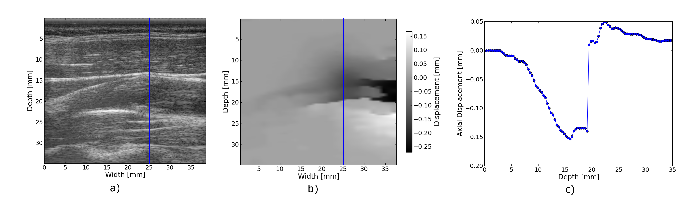
.. highlights::

  |lsq_vessel_long|:  Longitudinal image the left carotid of subject 157.  a)
  B-Mode, b) tracked axial displacements, c) line profile of the displacements
  in b) over the line overlaid on the images in a) and b).  The motion is
  occurring during systole.  Note the discontinuity of the displacement that
  occurs at the wall-lumen boundary around a depth of 20 mm.

In most tissues, such as breast tissue, the deformation is continuous and
differentiable.  Deformation in the arteries, however, exhibits discontinuities
in its motion.  In a longitudinal view of the artery, |lsq_vessel|, opposing
arterial walls move in opposite directions.  There is a discontinuity at the
artery-lumen boundary.  A motion tracking algorithm may follow the motion of
blood or, more likely, signal in the area of the lumen that is from out-of-plane
arterial tissue picked up by the wide elevational profile of the ultrasound
beam.  Alternatively, the motion tracking algorithm may track the motion of
reverberations in the area of the lumen.  In our experience, the tracked
displacement is mostly continuous apart from the posterior wall-lumen boundary
where divergence is recorded.  This pattern is shown in |lsq_vessel|\ b) and
with greater detail in |lsq_vessel|\ c).  If the support of a derivative kernel
operator passes over this discontinuity, erroneous values will extend
from the discontinuity almost the length of the kernel in both directions from
the discontinuity.

To address this condition, the linear least-squares implementation can be
modified.  If the number of consecutive displacement samples with the same sign
exceeds half the width of the kernel, only these samples can be used in the
linear least-squares fit.  In this way, values from only one side or the other
of the discontinuity are used for the local gradient estimate.  Axial strain
results of this modified least-squares method applied to the carotid artery are
shown in |lsq_vessel_axial_strain|.  The effects of the discontinuity are
greatly reduced without affecting other parts of the image.  Correctly
estimating the strain in this area is important since we are most interested in
the strain in the vessel wall.  Note that is still a small positive streak at
the vessel-wall border.  Close inspection reveals that this streak is primarily
within the lumen.  Its source can be observed in |lsq_vessel|\ c) in the segment
following the sharp discontinuity.  It is possibly explained by the finite match-block
kernel length or possibility the way the regularization algorithm (Chapter 3)
encourages continuity.

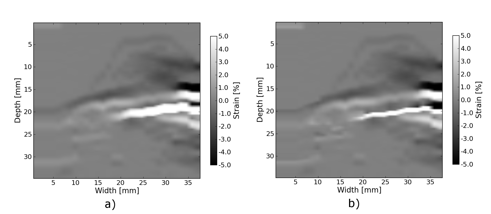
.. highlights::

  |lsq_vessel_axial_strain_long|:  Axial strain in the vessel show in
  |lsq_vessel|.  a) Strain calculated with the standard linear least-squares
  method. b) Strain calculated with the modified linear least-squares method
  described in the text.

5.2.4 B-spline fitting
======================

Instead of approximating the displacement field with a piecewise linear
function, the displacement field can be approximated with piecewise continuous
spline fitting.  This function is more appealing than a piecewise linear fit for several
reasons.  First, the splines are constructed to be piecewise continuous
[Boehm2002,Schwarz2007]_.  Second, if a B-spline is used, the first derivative will be
continuous if the order of the spline is two or higher [Boehm2002,Schwarz2007]_.  Third,
the greater flexibility of higher order polynomials should decrease the loss in
resolution observed with the linear least-squares strain estimator [Khadem2007]_.  Khadem
and Setarehdan applied this method in 1D to determine axial strains
[Khadem2007]_.  A piecewise continuous polynomial spline was fit to the discrete
noisy displacement data, and the derivative of the resulting polynomial was used
as the derivative of the underlying displacement [Khadem2007]_.  D'hooge et al.
performed a similar procedure with a cubic B-spline approximation to track
M-Mode data to obtain strain rates in a gelatin phantom [Dhooge2002]_.  In both
articles, the spline did not interpolate the underlying displacement data, but
it was fit by minimizing a term involving the squared difference with the
sampled data and another regularization term involving the square of the second
derivative of the underlying function.  Applying a higher weight to the later
term will increase the smoothness of the result.

In what follows, a least-squares 2D cubic B-spline approximation based on the
work of Tustison et al. is applied the displacement data [Tustison2005]_.  Once
the fit is performed, the gradient of the resulting function can be found
analytically anywhere in the image domain.  The method is parameterized by the
number of B-spline control points.  In the results presented in |bspline_strain|,
control point density is expressed as the ratio of control point spacing to the
displacement sample spacing.

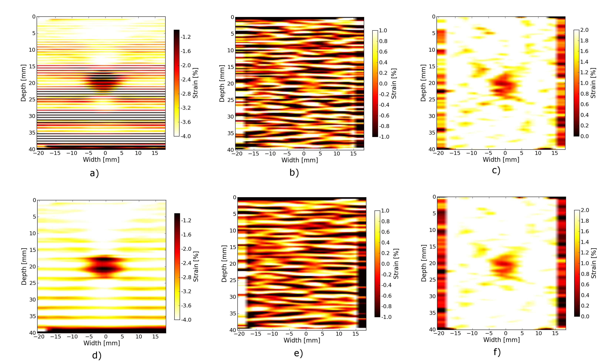
.. highlights::

  |bspline_strain_long|:  Strains resulting from the cylindrical inclusion model
  using a cubic B-spline least squares fit to calculate the displacement
  gradient.  a-c) control point spacing to displacement sample spacing ratio of
  1.5.  d-f) control point spacing to displacement sample spacing ratio of 1.8.

While smoothing is present in |bspline_strain|, there are also very noticeable
and unacceptable oscillation artifacts.  The artifacts are greatest in the axial
strain images.  When the control point spacing is increased, the frequency of
the artifacts decreases.  The presence of these artifacts can be explained by
two sources.  A numerical insufficiency in the current implementation of the
regularization method described in Chapter 3 causes bias toward integer sample
displacements.  The higher order polynomial function fit exaggerates this bias
and causes extensive oscillations.  Runge's phenomenon [Maes2011]_ states that
higher order polynomial fitting functions may actually result in poorer
performance because of the oscillations that result.  This can be attributed to
the increased extrema (*n*-1 for a polynomial of order *n*) that are required
with increasing polynomial orders.  In order for B-spline fitting to be
successful in this algorithm, a few actions could be taken.  First, the bias
artifacts could be reduced or eliminated with a re-implementation of the
regularization algorithm.  Also, smoothness of the B-spline could by enforced by
adding a regularization term to the fit that penalizes the presence of the *L2*
norm of the second derivative.

~~~~~~~~~~~~~~~~~~~~~~~~~~~~~~~~~~~~~~~~~~~~~~~~~~~~
5.3 Useful quantities derived from the strain tensor
~~~~~~~~~~~~~~~~~~~~~~~~~~~~~~~~~~~~~~~~~~~~~~~~~~~~

5.3.1 Principal strains
=======================

Since strain is a tensor instead of a scalar, it is not rotation invariant.
Consequently, for the same tissue deformation, the axial strain in a certain
volume of tissue will change depending on the orientation of the beam axis
relative to the tissue.  When a tensor is subject to a linear transformation,
such as a rotation, the transformed tensor is given by [Lai1993]_,

.. math:: [ \mathbf{Q} ]^T [ \mathbf{T} ] [ \mathbf{Q} ]

.. epigraph::

  where **Q** is the transformation on the tensor **T**.  There is a
  particular rotation of the strain tensor **E** that provides a more
  transparent interpretation of the tensor.

Recall that when

.. math:: \mathbf{E} \mathbf{n} = \lambda \mathbf{n}

.. epigraph::

  if **E** is a tensor, **n** is a vector, and λ is a scalar, **n** is called
  an eigenvector of **E**, and λ is an eigenvalues of **E**.  Basic linear algebra states
  that every real, symmetric tensor will have eigenvalues and corresponding
  eigenvectors that are mutually perpendicular [Lai1993]_.  Since the strain
  tensor is a real, symmetric tensor, it has eigenvalues and eigenvectors.  If
  unit length eigenvectors are used as the columns of a transformation matrix
  for the associated tensor, the transformed result will be a diagonal matrix
  whose entries are the eigenvalues.  The eigenvalues of **E** are called the
  *principal strains* of **E**, and the eigenvectors of **E** are called the
  *principal directions* of **E** [Lai1993]_.

Rotating a tensor is equivalent to looking at the tensor in a different
coordinate system orientation.  With this in mind, the principal directions
define the most convenient orientation to view a strain tensor. The principal
strains have the largest possible magnitude of normal strain.  No shear strains
are present.

5.3.2 Representation of the 2D strain tensor as an ellipse
==========================================================

In section 5.1, it was shown that a strain tensor describes the change in
relationship between two small vectors in a body.  Second-rank tensors in
general are characterized by how they modify these two vectors.

Another second-rank tensor of importance in medical imaging is the diffusion
tensor.  This tissue property has proven to be a useful tool for exploring
neural physiology and pathology with MRI.  Diffusion of water molecules
can cause a decay in the received echo amplitude because of their displacement
in the spatially varying magnetic-field gradient, which is given by [Basser1994a]_

.. math:: \ln \left[ \frac{A(TE)}{A(0)} \right]  = -\gamma^2 \left[ \delta^2( \Delta - \frac{\delta}{3}) + \frac{\varepsilon^3}{30} - \frac{\delta}{\varepsilon}^2{6} \right] \mathbf{g}^T \mathbf{D} \mathbf{g}

.. epigraph::

  where *A(TE)* is the amplitude of the magnetization at the time of the echo,
  :math:`\gamma^2 \left[ \delta^2( \Delta - \frac{\delta}{3}) +
  \frac{\varepsilon^3}{30} - \frac{\delta}{\varepsilon}^2{6} \right]` are a set
  of pulse sequence parameters, **g** is the vector of the magnetic-field
  gradients, and **D** is the diffusion tensor.  Like the strain tensor, the
  diffusion tensor is symmetric and real, so it has eigenvalues, λ\ :sub:`i`,
  and eigenvectors [Basser1994]_.  The eigenvectors are the principal
  diffusivity directions and the eigenvalues are the principal diffusivities
  [Basser1994]_.  The largest principal diffusivity can identify neural tissue's
  fiber track direction as the principal direction associated with that
  eigenvalue [Pierpaoli1996,Basser1994]_.

The probability density function that a molecule diffuses from location **x**\
:sub:`0` to position **x** at time *τ* is given by [Basser1994]_,

.. math:: \rho( \mathbf{x} | \mathbf{x}_0, \tau ) = \frac{1}{\sqrt{|\mathbf{D}(\tau)|(4\pi \tau)^3)}} \exp \left[ \frac{-(\mathbf{x} - \mathbf{x}_0)^T \mathbf{D}^{-1}(\tau)(\mathbf{x} - \mathbf{x}_0)}{4 \tau}\right]

The probability of displacement of a molecule is dependent on the inverse of the
diffusion tensor, whose eigenvectors are the same as **D** and whose eigenvalues
are 1/ λ\ :sub:`i`.  If the inverse diffusion tensor is applied in a quadric operation on the vector **x** and
set equal to a constant, the expression represents the relative diffusivity in
direction **x** [Basser1994]_.  If the matrix has been diagonalized, the
expression has the form,

.. math:: \frac{x_1^2}{\lambda_1^2} + \frac{x_2^2}{\lambda_2^2} + \frac{x_3^2}{\lambda_3^2} = 1

.. epigraph::

  This expression describes an ellipsoid with λ\ :sub:`1`, λ\ :sub:`2`, and λ\ :sub:`3`, being the lengths of the principal axes [Roe1993]_.  The ellipsoid represents the diffusivity in any given direction, **x**.

As discussed in the derivation of the strain tensor in Section 5.1.1,
the quadric operation of the strain tensor on a differential line segment in a
body effectively relates the stretching or compression of that segment.  As with
the diffusion tensor, the strain tensor can be visualized as an ellipse in 2D or
an ellipsoid in 3D [Sosa2009,Roe1993]_.  This representation is called a *Lamé ellipsoid* [Sosa2009]_.

Note that this geometrical representation does not always strictly follow from
the strain tensor.  The diffusion tensor is positive definite [Basser1994]_,
i.e. its determinant is always positive and its eigenvalues are always
positive.  This is not true for the strain tensor; the principal strains can be
positive (stretching) or negative (compression).  In fact, due to the Poisson
effect [Srinath2003]_, stretching of a material in one direction often causes
stresses that drive compressions in the orthogonal directions, and the signs of the
principal strains are usually varied.  In 2D, if one of the principal strains
is negative, the expression is no longer represented by an ellipse but by a
hyperbola,

.. math:: \frac{x_1^2}{\lambda_1^2} - \frac{x_2^2}{\lambda_2^2} = 1

In 3D, if one of the principal strains is negative the quadratic expression
specifies a hyperboloid of one sheet, and if two of the principal strains are
negative, then the quadric surface is a hyperboloid of two sheets [Roe1993]_.
Unfortunately, hyperboloids are not closed surfaces, and it is difficult to
visualize it as a glyph.  Therefore, the strain is represented as an ellipse
or ellipsoid where the lengths of the principal axes are the absolute value of
the principal strains, and the orientation of the ellipse is specified by the
principal directions.  An interpretation of the ellipse is therefore the
stretching or compression that occurs in a given direction.  Visualization of
the noiseless strain tensor image for a cylindrical inclusion undergoing
uniaxial compression (examined in Section 5.2) is shown in |strain_ellipses|.

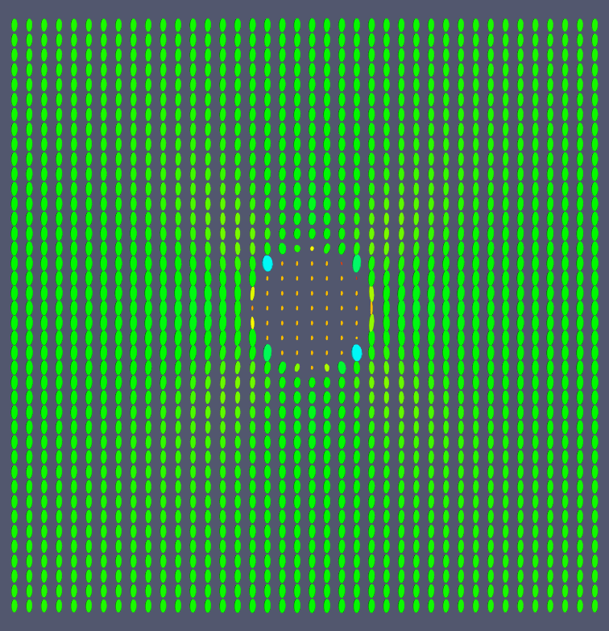
.. highlights::

  |strain_ellipses_long|:  Visualization of the strain tensor field for a
  cylindrical inclusion undergoing uniaxial compression.

5.3.3 Combination of normal strains and shear strain into a single strain index
===============================================================================

It is easier to perform statistical hypothesis testing with a single, scalar
strain statistic than with the full second-order tensor.  With the appropriate
scalar quantity derived from the tensor, comparisons can be made to other
metrics that quantify plaque vulnerability, and a number that indexes likeliness
of plaque rupture will hopefully be obtained.  The three strain tensor
components estimated from a 2D image can be combined into a single strain index
using metrics developed in the field of material plasticity theory.  In material
plasticity theory, a yield criteria prescribes the point a deformed material
will no longer return to its original state after the load is removed
[Srinath2003]_.  Yield criteria that have been studied for engineering materials
include the maximum principal strain, the maximum shear stress (Tresca yield
criteria), the total strain energy, or the distortion energy (von Mises yield
criteria) [Srinath2003]_.  These criteria compare a single index to a material
dependent threshold that determines the transition point from elastic
(recoverable) to plastic (non-recoverable) deformation.  They are most often
given in stress form, but here their 2D strain analogs are used with our 2D
strain tensor imaging algorithm data.  For example, given λ\ :sub:`1` and
λ\ :sub:`2`, the ordered principal strains, strain metrics to examine include
the maximum principal strain,

.. math:: max\left\{ | \lambda_1 | , | \lambda_2 | \right\}

.. epigraph::

  the maximum shear strain,

.. math:: \lambda_1 - \lambda_2

.. epigraph::

  total strain energy,

.. math:: \frac{1}{2} E \left( \lambda_1^2 + \lambda_2^2 \right)

.. epigraph::

  and the distortional energy,

.. math:: \frac{1}{2} E \left( \lambda_1 - \lambda_2 \right)^2

The latter has been used by Maurice et al. for the examination of carotid
plaque [Maurice2004]_.  Note that although the modulus, *E*, is unknown, plaque
materials that have a low *E* generally possess a low ultimate failure strain
[Holzapfel2004]_.  Thus, a plaque region with a high energy metric is likely
near the failure strain if it has a high modulus  and high failure strain or if
it has a low modulus and low failure strain.  In other words, since *E* is
unknown, the 'total strain energy' and 'distortional energy' calculated is only
proportional to these quantities.  However, this may be sufficient because of
the material properties of the plaque constituents.

~~~~~~~~~~~~~~~~~~~~~~~~~~~~~~~~~~~~~~~~~~~~~~~~~~~~
5.4 Generating accumulated strain from a time series
~~~~~~~~~~~~~~~~~~~~~~~~~~~~~~~~~~~~~~~~~~~~~~~~~~~~

5.4.1 Dynamic frame skip
========================

As seen in the elastographic signal-to-noise ratio (*SNRe*) results in Chapter 3, Fig. 3.3, and Chapter 4, Fig. 4.1,
the ability for an algorithm to achieve a good strain image signal-to-noise
ratio depends on the magnitude of the strain.  This was explored theoretically
and experimentally by Varghese et al. [Varghese1997]_.  If the amount of
deformation in the image is too low, electronic and quantization noise prevent
determination of the motion in the image with precision [Varghese1997]_.  If
the deformation is too high, the image pair will decorrelate [Varghese1997]_.

When data is collected *in vivo*, a series of image frames are collected.  To
obtain high quality motion tracking, frame pairs should be chosen that have the
amount of deformation that will yield the highest quality results.  Motion
tracking does not need to occur between consecutive frames.  The most
appropriate frame skip between the pre-deformation image and the
post-deformation image should be chosen.

When the mechanical load on the tissues being imaged comes from cardiac
pulsations, the strain rate in an image sequence is non-constant.  A higher
strain rate occurs during systole, and a lower strain rate occurs at end diastole.
To retain optimal tracking over a sequence of images spanning the cardiac cycle,
a dynamic frame skip is applied that uses a short frame skip when the strain
rate is high, and a long frame skip with strain rate is slow.

To apply an automatic method that ascertains an ideal frame skip, the optimal
deformation must be defined in a quantifiable way.  This is application
specific.  For example, when the objective is to get a strain image of a breast
tissue abnormality, the frame average strain may be a good measure.  When
imaging carotid plaques, we are only interested in the strain inside the plaque.
There is relatively little deformation in the skin and muscle near the transducer,
but the deformation in these areas should not determine the frame skip.  Also,
there may be apparently high strain in the region of the lumen, but tracking
in this area is unreliable.  The criteria that determines the frame skip in this
work is based on the axial strain in a sub-region of the image.  The top
and bottom portions are removed from the region-of-interest (ROI) because the skin and
fat near the transducer are not the target tissue of interest and because
attenuation decreases signal quality at depths beyond the vessel.  The frame
skip is dynamically increased or decreased based an absolute ROI axial strain
threshold.  Peak-hopping errors generally are also undesirable, which will present
as unrealistically high strains.  Peak-hopping is acceptable in the lumen,
however, so and additional frame skip criteria is percent axial strain pixels in
the ROI over a threshold.

When it is time to track the next frame pair in a sequence, the previous frame
skip is initially attempted.  If both criteria are below threshold, the frame
skip is increased until they exceed threshold, and the prior tracking result is
used.  An exception to the prior behavior is a halt to the increase in the frame
skip if the magnitude of the strain decreases, which could occur during the
transition from systole to diastole or at the dichrotic notch.  On the other
hand, if either criteria are above threshold, the frame skip is decreased until
they are below threshold.

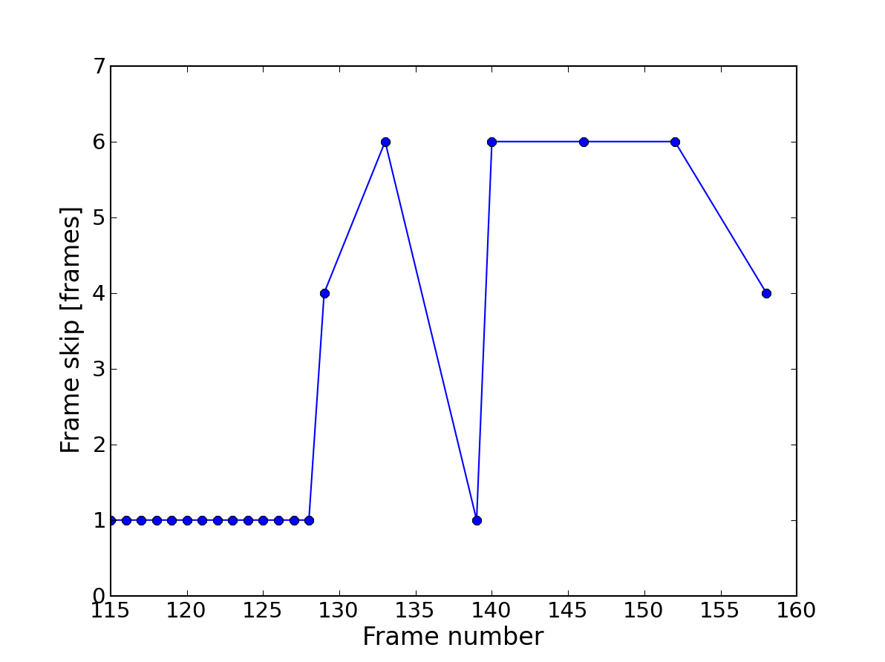
.. highlights::

  |frame_skip_long|:  Frame skip for tracking of subject 157's left carotid over
  the period of a single cardiac cycle.  A small frame skip is used during
  systole when the strain rate is high, and a larger frame skip is used during
  diastole when the strain rate is small.  The maximum frame skip was limited to
  six frames.

For the purposes of creating a video to view the tracked results, it is more
convenient to have the displacement and strain images available at regular time
steps.  Standard video encoding and decoding software assume a constant frame
rate.  If a dynamic frame skip is used, displacement images must be interpolated at the
shortest period between tracked frames.  Incremental displacement images are interpolated
to the original frame rate with the following algorithm:

1.  Set a frame counter *i* to 1.
2.  Calculate the fraction of displacement remaining, *p*, as *(n-i)/(n-i+1)*, where *n*
    is the frame skip.
3.  The output displacement for the current frame is (1-p) multiplied by the
    remaining displacement.
4.  This remaining displacement is multiplied by *p*.
5.  A correction field is calculated the inverse of the prior frame
    displacement.
6.  Warp the remaining displacement by the correction field.
7.  Increment *i* and repeat at step 2. until *i = n*.

This process is non-trivial because the displacement image is defined on a
grid with uniform spacing.  The inverse displacement field is calculated with
the algorithm given by Chen et al. [Chen2008]_.

5.4.2 Eulerian approach to accumulated strain
=============================================

Since strain is a measure of the distortion of an object relative to a reference
strain, the *reference state* must be defined.  Experimentalists whom attempt to
measure the *in vitro* mechanical properties will sometimes try to find a
complete stress-free state of the artery and use this as the reference state.
When removed from the tethering provided by surrounding tissue, arteries will
shrink dramatically in size [Fung1993]_.  A *no-load* [Fung1993]_ condition
occurs when excised vessels are removed and blood pressure and longitudinal
tensile stresses are removed.  A *zero stress* [Fung1993]_ occurs when no
further strain occurs after cutting the tissue.  The residual stress that
defines the difference between the no-load and zero stress can be quantified
with the opening angle, the angle that results from cutting an artery
longitudinally [Fung1993]_.  When working with *in vivo* tissues,
it is difficult to infer the zero stress state, although Masson et al. obtained
reasonable results given a number of modeling assumptions for a healthy common
carotid artery [Masson2008]_.  For this reason, an end diastolic image state is
taken as the reference state.

To get the strain that occurs over a cardiac cycle, the deformations
calculated with the dynamic frame skip tracking must be accumulated.  Since the
strains observed in a cardiac cycle are typically large, > 0.05, accumulating
infinitesimal strain (Section 5.1.1.1) is inappropriate.  Since the
displacements are calculated incrementally, the reference material is always
changing, and Eulerian-Almansi strain tensor should be accumulated because it
consistently specifies strain in terms of the spatial configuration [Haupt2002]_.

Two additional factors make calculation of the accumulated strain non-trivial.
First, the displacement and strain fields are discretely sampled and saved as
digital data.  Secondly, the plaque moves in its location with the image over
the cardiac cycle.  To address these challenges, a particle method is applied to
the purpose of finding the accumulated strain.  First the plaque ROI is
segmented by a radiologist at end-diastole with the medical interaction
toolkit (MITK) [Maleike2009]_.  This creates a binary label image.  All the points in
the binary image labeled as plaque are used to create a quadrilateral mesh.
Accumulated strain and accumulated displacement is then calculated over the
points in the mesh.  For every frame, the mesh is first warped by the
incremental displacement by translating coordinates of the points in the mesh.
This translation is determined via bilinear interpolation of the incremental
displacement vector image.  The incremental strain or incremental displacement
for each point in the mesh is found with bilinear interpolation and added to the
accumulated strain or accumulated displacement for that point (particle).  This
process is repeated for every frame.  Since coordinates of particles in the mesh
are recorded as real numbers, this system handles subpixel displacements well.
Note that the mesh is warped prior to adding the incremental strain for a given
frame because we are using Eulerian-Almansi strain instead of Green-Lagrangian
strain.

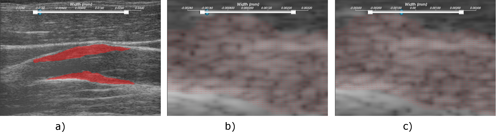
.. highlights::

  |points_long|: Mesh warping for subject 157.  a) Segmented plaque in the
  longitudinal view. b) A mesh of particles is created from the segmented ROI.
  c) The mesh is warped by the incremental tracked displacements.

~~~~~~~~~~~~~~~~~~~~~~~~~~~~~~~~~~~~~~~~~~~~~~~~~~~~
5.5 References
~~~~~~~~~~~~~~~~~~~~~~~~~~~~~~~~~~~~~~~~~~~~~~~~~~~~
