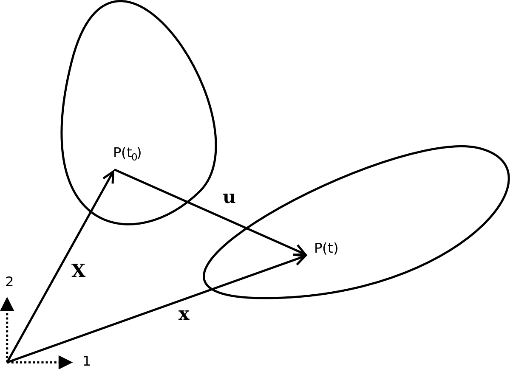

====================================
Calculating Strain from Displacement
====================================

In this chapter, theory and techniques necessary to create strain tensor images
from displacement images are covered with attention paid towards issues relevant
to strain imaging of the carotid artery with external ultrasound.  First, how
the definition of the strain tensor arises in continuum mechanics and the
physical explanation that follows is reviewed.  The nomenclature as it is
applies to diagnostic ultrasound strain imaging is covered.  Next, a number of
methods to estimate the displacement gradient, which is needed to calculate the
strain tensor, are presented.  Once the strain tensor has been estimated,
permutations can be computed that ease interpretation and derived scalar quantities
that be used for statistical analysis of plaque vulnerability.  Finally, methods
to calculate accumulated strain in digital ultrasound strain images over the
cardiac cycle are explained.

.. |points| replace:: Fig. 1

.. |points_long| replace:: **Figure 1**

~~~~~~~~~~~~~~~~~
The strain tensor
~~~~~~~~~~~~~~~~~

An *in situ* plaque prior to failure is a continuous, solid-body at a gross
level, and solid-body continuum mechanics can be applied.  Solid-body continuum
mechanics treats a body as a collection of infinitesimal volumes of material.
We are concerned with the motion of this collection of infinitesimal volumes
over time.  This may be rigid body motion, translation and rotation, or
deformation of the body.

.. highlights::

  |points_long|: 2D solid body at reference time *t*\ :sub:`0`, and after motion
  at time *t*.  The vector **X** defines the position of point P(t\ :sub:`0`\ )
  in the reference configuration, and the vector **x** defines the point's
  position after motion.

Mechanical model
================

Infinitesimal strain
--------------------

Lagrangian strain
-----------------

Eulerian strain
---------------

Application in ultrasound
=========================

