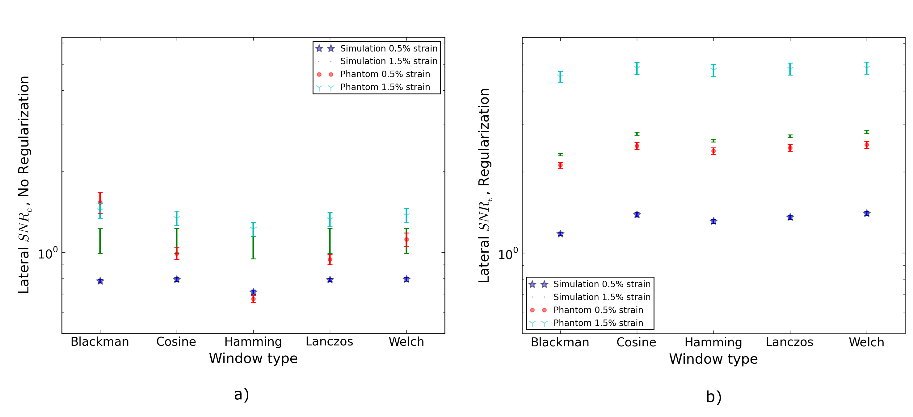

===================================================================
Chapter 4 : Unbiased Subsample Displacement Interpolation
===================================================================

.. sectnum::
  :prefix: 4.

Accurate subsample displacement estimation is a necessity in ultrasound
elastography because of the small deformations that occur and the subsequent
application of a derivative operation on local displacements.  Many of the
commonly used subsample estimation techniques introduce significant bias errors.
In this chapter an unbiased approach to subsample displacement estimations that
consists of two-dimensional windowed-sinc interpolation with numerical
optimization is examined.  It is shown that a Welch or Lanczos window with
Nelder-Mead simplex or regular-step gradient descent optimization is well suited
for this purpose.  First, a literature review of past efforts for subsample time
delay estimation and ultrasound displacement estimation is given.  Next,
implementation of the new algorithm is described.  Finally, the method is
compared to the common parabolic and cosine interpolation methods, tradeoffs
between precision and computational time are quantified, and optimal parameters
are determined.  The usefulness of this approach is also proven to not rely on
special properties of the image or similarity function by demonstrating its
effectiveness after applying the regularization algorithm discussed in Chapter
3.

.. |interp_method_plot| replace:: Fig. 4.1

.. |interp_method_plot_long| replace:: **Figure 4.1**

.. |inclusion_figure| replace:: Fig. 4.2

.. |inclusion_figure_long| replace:: **Figure 4.2**

.. |window_type_plot| replace:: Fig. 4.3

.. |window_type_plot_long| replace:: **Figure 4.3**

.. |window_length_plot| replace:: Fig. 4.4

.. |window_length_plot_long| replace:: **Figure 4.4**

.. |simplex_offset_plot| replace:: Fig. 4.5

.. |simplex_offset_plot_long| replace:: **Figure 4.5**

.. |sinc_windows_table| replace:: Table 4.1

.. |sinc_windows_table_long| replace:: **Table 4.1**

.. |opt_times_table| replace:: Table 4.2

.. |opt_times_table_long| replace:: **Table 4.2**

~~~~~~~~~~~~~~~~~~~~~~~~~~~~~~~~~~~~~~~~~~~~~~~~~~
Previously explored methods for subsample tracking
~~~~~~~~~~~~~~~~~~~~~~~~~~~~~~~~~~~~~~~~~~~~~~~~~~

Accurate and precise sub-sample estimation of local displacements is critical
for ultrasound elastography based applications.  The recent movement towards transducers with
higher center frequencies and broader bandwidths with the sampling frequencies
barely satisfying the Shannon-Nyquist criterion have also demonstrated the need
for accurate sub-sample estimation.
Furthermore, noise is introduced into the post-deformation signal.
These conditions are a concern when trying to perform ultrasound strain imaging
where displacement estimates need precision on the order of micrometers;
sample spacing in the axial direction is only 19 μm for a 40 MHz sampling
rate.  Cespedes et al. [Cespedes1995]_ examined the theoretical limit for time
delay estimation using cross correlation with parameters from a typical
ultrasound system.  He found that the standard deviation due to time quantization was 5.7
ns, which is much larger than the Cramer-Rao Lower Bound (CRLB) for the continuous
case, 0.024 ns.

Methods that use properties of cross-correlation
================================================

This subsample delay estimation problem has been studied extensively in
one-dimension (1D) for
the sonar and radar fields, where use of cross-correlation as a similarity
metric is dominant.  If the signal is approximately narrowband,
quadrature subsample delay techniques can be used [Maskell2002]_.
Maskell and Woods describe a technique where the shift between signals is not
determined by comparing them directly but by comparisons with shifted versions of
a reference signal [Maskell1999]_.  The total delay is then determined to be the difference
between the two delays to the reference signal.

A number of techniques use the fact that phase of the analytic signal's
cross-correlation in the vicinity of the signal shift will have a slope
equivalent to the nominal centroid frequency and zero crossing at the shift
[MarpleJr1999,Pesavento1999]_.  Marple discusses the theory behind this method,
and the scaling that must occur at the DC and Nyquist frequencies
when dealing with discrete signals.
Grennberg and Sandell described a fast subsample delay estimator calculated with
the cross correlation of the delayed signal with the Hilbert transform of the
original signal using an arcsine [Grennberg1994]_.  Other authors use similar
approaches by taking the cross-correlation of base-band analytic signals from both
the original and shifted signals [Pesavento1999,Fromageau2003]_.  The root is
then found with an iterative modified Newton method.  This approach only works
for narrowband signals with small time delays.  For larger time delays,
strategies have to be employed to prevent phase aliasing.  However, if these
approaches can be used, they are advantageous because they are very precise and
have minimal computational complexity can be performed in a single step.
In medical ultrasound, the
backscattered signal is generally beam-formed along the axial direction, so these methods can
only be used to calculate axial displacements.  However, if unconventional
beam forming strategies are used, phase can also be tracked in the lateral
direction [Basarab2009]_.  Alternatively, a synthetic oscillatory signal can be
generated by taking the inverse Fourier transform of half the transformed signal
[Chen2004]_.  Instead of the more prevalent cross-correlation/Fourier methods,
Viola and Walker have worked on a sum-of-squared error/cubic spline method
[Viola2005,Viola2008]_.  After a cubic spline fit, the problem reduces to
finding the roots of a polynomial whose order is proportional to the number
of samples in the fit.  In Viola and Walker's method, a continuous polynomial
signal representation is compared to a discrete signal.  Pinton and Trahey took
a similar approach, but compared two continuous polynomial fits with the sum of
squared differences and normalized cross-correlation [Pinton2006]_.

Parametric and non-parametric methods
=====================================

As studied in [Viola2005]_, a straightforward and computationally intensive
approach to determine a precise
signal shift is to resample the image through interpolation before performing
cross-correlation.  Use of a matched filter during resampling may improve the
result [Lai1999]_.  Instead of resampling and recalculation of the
cross-correlation, curve fitting can be applied.  For example, a parabola
[Boucher1981,Jacovitti1993,Foster1990,Moddemeijer1991,Lai1999]_ or cosine fit
[deJong1990]_ can be used in 1D or an ellipsoid in 2D [Giunta1999]_.  These
methods are computationally efficient and easy to implement, but they suffer
from bias errors because the underlying signal may not conform to the shape chosen
[Zahiri-Azar2008,Geiman2000,Jacovitti1993,Moddemeijer1991,Cespedes1995]_.

Curve fitting bias errors can be avoided by using signal reconstruction with
sinc interpolation, which is the maximum likelihood estimator for interpolation
[Cespedes1995,Boucher1981]_.  Cespedes et al. examined the use of 1D sinc
reconstruction to locate the cross-correlation peak, and found that it
significantly out-performs parabolic or cosine interpolation.  Reconstruction is
computationally expensive, when compared to curve fitting methods, and an optimization
method must be utilized to find the peak location.  Cespedes et al. used a binary
search method to decrease computation times [Cespedes1995]_.

It has also been demonstrated that a simultaneous two-dimensional (2D) displacement vector estimate will generate
better results than two independent 1D displacement estimates
[Konofagou1998,Chen2004,Geiman2000,Zahiri-Azar2008]_.  Sumi described an
iterative 2D phase tracking technique [Sumi1999]_, and Ebbini describes a similar technique
that iteratively searches for the location where the gradient vectors of the 2D
complex cross correlation are orthogonal, which exists along the zero-phase
contour [Ebbini2006]_.

In this chapter, we propose the use of a 2D sinc reconstruction method coupled
with traditional numerical optimization techniques for subsample ultrasound
displacement estimation.  Since parabolic methods remain the most popular method
referenced in the literature and to follow the analysis of Cespedes et al.
[Cespedes1995]_, we
compare the new method with parabolic and cosine curve fitting.  Performance is
evaluated utilizing the variation in the elastographic signal-to-noise ratio
(*SNRe*) in tissue-mimicking (TM) experimental phantoms and numerical simulations.  We
examine the optimal sinc-filtering window radius and type, and the computational
performance of the Nelder-Mead simplex and a regular step gradient descent
optimizer.

~~~~~~~~~~~~~~~~~~~~~~~~~~~~~~~~~~~~~~~~~~~~~~~~~
2D sinc interpolation with numerical optimization
~~~~~~~~~~~~~~~~~~~~~~~~~~~~~~~~~~~~~~~~~~~~~~~~~

In the article by Cespedes et al. [Cespedes1995]_, a binary search algorithm improved the time
required to localize the subsample 1D cross-correlation peak.
We framed this process as a multi-parameter, single-valued cost function numerical
optimization problem.  We applied traditional numerical optimization methods that
have quicker convergence properties than a binary search and can be applied to
multiple parameters.  The cost function to be maximized is the cross-correlation
function.  The parameters to be optimized are the axial and lateral
displacements.

We obtained subsample displacements values with 2D sinc interpolation
[Meijering1999,Yoo2002]_.  The sinc kernel, *K(t)* is given by

.. math:: K(t) =  w(t) sinc(t) = w(t) \frac{\sin(\pi t)}{\pi t}

*Eqn. 4.1*

where *w(t)* denotes the window function.  We examined different window
functions shown in |sinc_windows_table| [Meijering1999,Yoo2002]_,  Here *m* is the window
radius; the window is non-zero from *-m* to *m*.

============= =======================
 Window Name   Expression
------------- -----------------------
 Blackman      :math:`0.42 + 0.50 \cos(\frac{\pi x}{m}) + 0.08 \cos(\frac{2 \pi x}{m})`
 Cosine        :math:`\cos(\frac{\pi x}{2 m})`
 Hamming       :math:`0.54 + 0.46 \cos(\frac{\pi x}{m})`
 Lanczos       :math:`sinc( \frac{\pi x}{m})`
 Welch         :math:`1 - \frac{x^2}{m^2}`
============= =======================

.. highlights::

  |sinc_windows_table_long|: Sinc window functions.

An interpolated normalized cross-correlation value, *XCORR(x,y)* was calculated with
the sampled correlation values across the radius, and the window,

.. math:: XCORR(x,y) = \sum_{i=\lfloor x \rfloor + 1 - m}^{\lfloor x \rfloor + m} \sum_{j=\lfloor y \rfloor + 1 - m}^{\lfloor y \rfloor + m} XCORR_{i,j} K(x-i) K(y-j)

*Eqn. 4.2*

In this chapter, two simple optimization methods were examined: a regular-step
gradient descent and Nelder-Mead simplex (amoeba) optimization.  In the
regular-step gradient descent method, parameters are advanced along the
direction of the negative of the gradient, which is calculated with the finite
difference method.  The step length is reduced by half
when the sign of the gradient changes [Ibanez2005]_.  The well-known Nelder-Mead
simplex optimization advances a three-point simplex over the optimization space.

We set the initial condition to be the sampled maximum of the normalized
cross-correlation.  The parameter space was the displacement in the axial and
lateral directions defined in fractional samples.  We proceeded with
optimization until reaching convergence, which was defined with a minimum step length during
the regular-step gradient descent method and a parameter tolerance with the
Nelder-Mead simplex method.

~~~~~~~~~~~~~~~~~~~~~~~~~~~~~~~~~~~~~~~~~~~~~
Numerical properties of 2D sinc interpolation
~~~~~~~~~~~~~~~~~~~~~~~~~~~~~~~~~~~~~~~~~~~~~

Motion tracking algorithm used in testing
=========================================

The proposed subsample interpolation algorithm was used within an ultrasound block-matching
motion tracking context, the algorithm described in Chapter 9.  Normalized cross-correlation was used as a similarity
metric when comparing the matching blocks in the pre-deformation image to the
image content in the post-deformation image search region.  A multi-level
tracking approach was used to improve search region initialization at the lowest
level of the multi-level image pyramid.  A three-level pyramid
was utilized where the highest level was decimated by a factor of three in the
axial direction and a factor of two in the lateral direction, and the middle level
was decimated by a factor of 2 in the axial direction only.  Before decimation,
the data was filtered with a discrete Gaussian with variance *(f/2)*\ :sup:`2`, where *f*
is the decimation factor [Lindeberg1994]_.  Matching-block sizes varied linearly
from the top to bottom level with axial length of 1.3 mm and lateral width of
4.0 mm at the top level to an axial length of 0.5 mm and lateral width of 2.2 mm at
the bottom level.  There was no block overlap.

To remove peak-hopping tracking errors, displacements with strains greater than
15% magnitude were replaced with linearly interpolated values from outside the
erroneous region.  To improve correlation, matching-blocks at lower levels were
compressed according to the strain estimated at the previous level
[Chaturvedi1998]_.  The
matching block was scaled by a factor of :math:`1+\varepsilon_d`, where :math:`\varepsilon_d`
is the strain in direction *d*, at its center and resampled using sinc interpolation
with a Lanczos window and radius four.

In order to demonstrate that the proposed method is effective in finding the
subsample peak in situations other than normalized cross-correlation with
ultrasound radiofrequency (RF) data, we also examined interpolation after regularization with the
Bayesian regularization method described in Chapter 3 [McCormick2011]_.  As noted in the results, two iterations of
the regularization method were applied to the normalized cross-correlation.
The strain regularization sigma (SRS) parameter used in the algorithm was 0.15
in the axial direction and 0.075 in the lateral direction.

Effectiveness of the algorithm was tested on both TM phantom
and simulated numerical ultrasound images.

Tissue-mimicking phantom
========================

We collected ultrasound RF data on a TM phantom using a clinical ultrasound
scanner, the Siemens S2000 (Siemens Ultrasound, Mountain View, CA, USA).  The
Siemens VFX9-4 linear array transducer acquired RF data at 40MHz with an
excitation frequency of 8.9 MHz and at a depth of 5.5 cm.

A 95×95×95 mm, uniformly elastic oil-gelatin phantom was placed in a rigid, low-friction
container
and imaged from the top surface.  Uni-axial, uniform, unconstrained compressions were
applied by placing the surface of the transducer in an acrylic plate.  Slip
boundary conditions were maintained at the interface of the phantom and plate by
ensuring adequate oil was present for lubrication.  Precise deformations in the
directions intended were achieved by a motion table with three linear degrees of
freedom and two rotational degrees of freedom.  A reference RF frame was
collection along with post-deformation frames at 0.5%, 1.0%, 3.0%, 5.0%, and
7.0% axial strain magnitude.  The position of the transducer was rotated and translated to
obtain an uncorrelated scattering field, and the set of deformed frames
re-collected.  This process was repeated to obtain 30 independent trials at each
applied deformation.

A TM phantom with a spherical inclusion, a common test object for ultrasound
elastography, was also imaged.  The inclusion was stiffer than the background and
the phantom was subjected to a compression of 1.0% axial strain.

Ultrasound and mechanics simulation
===================================

Computer simulations were also performed intended to model the ultrasound and
mechanical behavior of the clinical system and TM phantom.  A numerical phantom was
generated by simulating randomly positioned acoustic scatterers over a
40×40×10 mm volume.  A transducer was modeled with a Gaussian spectrum having a
center frequency of 8.0 MHz and a 40% fractional bandwidth, 128 element linear
array with 0.15 mm lateral by 10 mm elevational element dimensions, and 0.2 mm
element pitch [Li1999]_.  Focusing was fixed at a 20 mm depth.

Displacements were applied to the scatterers assuming uni-axial compression of
an incompressible material, i.e. local orthogonal strains were opposite in sign and half the
magnitude along the axial directions.  The same deformations applied to the TM
phantom were simulated.  Axial displacements started from zero at the
transducer surface to a negative value at the bottom of the simulated phantom
and lateral displacements transitioned from negative to positive values across
the phantom with zero lateral displacement at the lateral midline.  New sets of
randomly distributed scatterers were used to create 30 independent scattering
fields with the corresponding RF data.

Behavior of optimization methods
================================

Following the analysis by Cespedes et al. [Cespedes1995]_, we evaluated the effectiveness of the
subsample interpolation method using the *SNRe* feature.

.. math:: SNR_e = \frac {m_\varepsilon} {s_\varepsilon}

*Eqn. 4.3*

The *SNRe* estimate was evaluated over the applied deformations examined for
both the TM phantom and numerical simulation, along the axial and lateral
directions, and with and without regularization.  The normal strain,
:math:`\varepsilon`, in direction *x* is the derivative of the displacement
along direction *x*, and if multiplied by 100 represents the percent elongation
of a material [Lai1993]_.  Twice the standard error calculated for the 30 trials
examined in each experiment was displayed in resulting plots.  Unless otherwise
noted, a radius of four RF data samples was used with the Welch window and
Nelder-Mead optimization.

Variations in the *SNRe* are used to compare sinc interpolation with numerical optimization via
Nelder-Mead simplex or regular step gradient descent with parabolic
interpolation, cosine interpolation, and no interpolation.

The *SNRe* was also used to evaluate the parameters of the algorithm.  With a
window radius of four samples, we compare the Blackman, Cosine, Hamming,
Lanczos, and Welch windows types.  The effect of window radius was examined along
with the convergence tolerance.

Given a convergence tolerance of 1e-5 samples, we inserted time probes in our
code to measure the average time required for convergence in an image on an
Intel Core i5 CPU clocked at 3.2 GHz.  We also measured the effect of the initial
simplex offset on the number of iterations required for convergence when using the
Nelder-Mead optimization method.

.. highlights::

  |interp_method_plot_long|: Performance of interpolation methods as compared using variations in the *SNRe* for 2D sinc
  interpolation using either Nelder-Mead simplex or regular-step gradient
  descent, parabolic interpolation, cosine interpolation, or no interpolation.
  a) TM phantom axial *SNRe* with no regularization, b) TM phantom lateral *SNRe* with no regularization,
  c) TM phantom axial *SNRe* with Bayesian regularization, d) TM phantom lateral *SNRe* with Bayesian
  regularization,
  e) simulation axial *SNRe* with no regularization, f) simulation lateral *SNRe* with no regularization,
  g) axial *SNRe* with Bayesian regularization, and h) lateral *SNRe* with Bayesian
  regularization.

The effectiveness of 2D windowed-sinc interpolation when compared to parabolic,
cosine, or no interpolation is shown in |interp_method_plot|.  The *SNRe* is
shown across the range of strains in both the lateral and axial directions.   As
shown in |interp_method_plot|\ a), no interpolation provides the worst performance,
followed by cosine interpolation, parabolic interpolation, and windowed-sinc
interpolation.  Lower *SNRe* arises for low strains from electronic and quantization noise artifacts
and increased signal decorrelation due to larger applied deformation.  For example, once we reach 7% applied deformation, motion tracking was no longer effective
due to signal decorrelation [Varghese1997]_. For all the subplots shown in |interp_method_plot|, sinc
interpolation perform equally well regardless of the optimization method
utilized.  In the axial direction with no regularization, sinc interpolation is
better than parabolic interpolation, but only significantly at lower applied
deformation, e.g. 0.5% and 1.0%.  Due to ultrasound's anisotropic resolution, lateral *SNRe* in
|interp_method_plot|\ b) is generally much lower than the axial *SNRe* as
observed from |interp_method_plot|\ a).
However, the same trend in effectiveness observed in |interp_method_plot|\ a)
can be seen in |interp_method_plot|\ b).  In the lateral case, the benefits of
sinc interpolation over parabolic interpolation are more dramatic.  When
regularization is applied in |interp_method_plot|\ c) and d), the curves shift up as
expected with improved *SNRe*.  The same ranking that resulted in the no regularization case also
occurs with regularization, although the difference between sinc and parabolic
interpolation is reduced.

.. highlights::

  |inclusion_figure_long|: Axial strain distribution of an inclusion phantom subjected to 1.0% axial strain magnitude, with  a) no
  interpolation, b) cosine interpolation, c), parabolic interpolation, and d)
  optimized sinc interpolation.  Regularization was not applied in these images.

Images of the inclusion phantom's axial strain, |inclusion_figure|,  after compression to 1.0% strain
reflect the outcomes on the uniform phantom.  Image quality with no
interpolation and cosine interpolation was significantly poorer than parabolic or
sinc interpolation.  The improvement of sinc interpolation over parabolic
interpolation is less pronounced, but still significant.  No regularization was
applied, so some noise artifacts remain after sub-sample interpolation.

The dependence on the displacement convergence tolerance with the Nelder-Mead
simplex optimization method was also studied.  The tolerance is specified in units of
data samples.  Surprisingly, the *SNRe* is relatively stable across a range of
values.  Results in the regularization case and on simulation data were similar
and are omitted for brevity.  A tolerance of 1e-5 samples appears to be
sufficient to generate consistent results.

.. highlights::

  |window_type_plot_long|: Impact of the sinc window type on lateral *SNRe*.  Statistically significant
  differences were not observed along the axial direction. a) lateral
  *SNRe* with no regularization.  b) lateral *SNRe* with
  regularization.

The significance of the window type on the lateral *SNRe* is displayed in
|window_type_plot|.  No significant impact was observed in the axial direction,
and the lateral impact appears to be small but significant even though a
generous radius of four samples was used.  The Hamming window provides the worst
performance, which is consistent with the study conducted by Meijering et al. where
it was concluded that Welch, Cosine, and Lanczos windows are some of the best sinc
approximation windows for medical images, while the Hamming is among the worst [Meijering1999]_.

.. highlights::

  |window_length_plot_long|: Impact of the sinc window radius in data samples.  The radius is the same in all
  directions. a) lateral *SNRe* with no regularization for the simulation and
  TM phantom with 0.5% and 1.5% nominal strain magnitude.  b) the same quantity with
  regularization.

Content in the sinc interpolation calculation is determined by both the window
type and the window radius.  Figure 4 shows the effect of window
radius in data samples on the lateral *SNRe*.  Axial *SNRe* results are similar.
For both the cases of regularization and no regularization, a radius of one or two samples is
insufficient.  In the case of no regularization, improvements appear up to a
radius of five samples.  In contrast, with regularization, little gain is
accrued after three samples.  This type of regularization localizes the
content of the similarity function, which decreases the need for an expansive interpolation window.

Since the two optimization methods generate similar results, the preferred
optimization method would be the one with improved computational efficiency.  Table 3.0 shows mean optimization
for a subsample displacement calculation.  While sinc interpolation is much more
computationally expensive than the parametric methods, the times required are
still feasible for real-time imaging.  Nelder-Mead simplex optimization is
slightly faster than gradient descent optimization, but they are very close.
Figure 5 shows that the best initial simplex offset is approximately 0.2-0.3 samples.
However, a poor choice for an initial simplex offset only generates about a 5%
increase in optimization time.

======================= ===========================================
Interpolation method     Mean optimization time [μs] ± 2*std. err.
----------------------- -------------------------------------------
Parabolic                  0.21 ± 0.022
Cosine                     1.07 ± 0.021
Sinc-Nelder-Mead           261  ± 5
Sinc-gradient-descent      277  ± 6
======================= ===========================================

.. highlights::

  |opt_times_table_long|: Optimization times.

.. highlights::

  |simplex_offset_plot_long|: Number of iterations until convergence is reached given the initial simplex
  offset for both directions in samples.

~~~~~~~~~~~~~~~~~~~~~~~~~~~~
Application of this method
~~~~~~~~~~~~~~~~~~~~~~~~~~~~

Bias errors that occur with parametric interpolation methods can be attributed
to a mismatch between the underlying function being interpolated and the
parametric model.  While prior articles reported fewer bias errors with cosine
interpolation relative to parabolic interpolation
[Cespedes1995,Zahiri-Azar2008]_, differences in the signal or sampling rate may
explain the better performance attributed to parabolic interpolation.  An
advantage of sinc interpolation is that it is theoretically unbiased
[Cespedes1995]_, and therefore will perform optimally despite the underlying signal.
Unlike some of methods discussed in the Introduction, this method is not
dependent on the similarity metric being normalized cross-correlation
or the signal being narrowband.  The approach was shown to be still applicable when
regularization is applied.  In addition, we perform 2D interpolation instead of
separable 1D interpolations, which may help explain some improvement seen
in the relatively noisy lateral direction.

Of course, real-world sinc interpolation has limitations due to quantization and
finite window lengths.  A similar approach that may have better performance is
one that is incorporated into the motion-tracking algorithm by Brusseau et al.
[Brusseau2008]_.  Determination of a subsample normalized
cross-correlation peak is part of an optimization approach earlier in the process; with
each subsample-shift calculation of the normalized cross-correlation involving  resampling of the
post-deformation image over the area of the matching-block.  However, this has a
significantly higher computational cost.

As shown in |interp_method_plot|, as long the optimization method can robustly
converge to the solution, the choice of optimization method does not affect the
accuracy of the result.  This particular problem is well-behaved and does not
require complex optimization methods, with only two parameters, the axial
and lateral displacements.  If the problem is initialized close to the solution, and
the similarity metric is smooth and without local maxima in the subsample
location of the peak, the peak location is estimated accurately.

While 2D sinc-interpolation based subsample displacement estimation was
not feasible in the past, acceleration of computation speeds and application of an
optimization method make the method applicable to real-time imaging.  Future
advances in computing speed will occur with multi-core CPUs and general purpose
GPUs (GPGPUs), so parallelization is an important property of an algorithm.  The
proposed algorithm is parallizable across each displacement pixel.  In our
tests, the Nelder-Mead simplex achieved convergence close to the gradient
descent method.  While gradient descent methods often converge with fewer
iterations than gradient-free methods like the Nelder-Mead simplex, they also
require calculation of the gradient at each iteration, which is computationally
expensive in this case.

There is a tradeoff between accuracy and computational burden for the window
length (radius) and convergence tolerance.  A convergence tolerance of 1e-5
samples in each direction appears to be sufficient; no gains are observed with
increasing tolerance.  Diminishing returns will be obtained with a window radius
higher than four samples.  The Welch, Lanczos, or Cosine windows should be used
to take the greatest advantage of the given radius, and the Hamming window
should be avoided.

~~~~~~~~~~
References
~~~~~~~~~~

