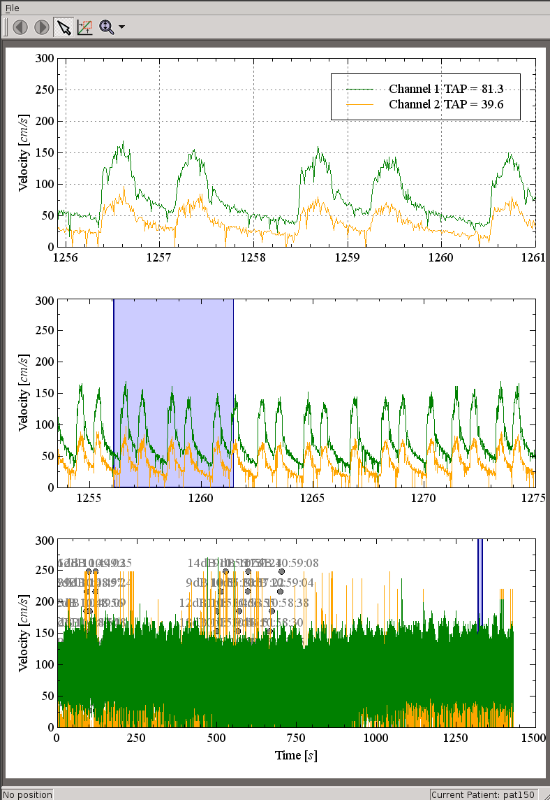

=========================================================================
Chapter 8 : Transcranial Doppler Monitoring of the Middle Cerebral Artery
=========================================================================

.. sectnum::
  :prefix: 8.

In this chapter, we discuss transcranial Doppler ultrasound (TCD), and how it
provides additional insight into the neurophysiology of patients prior to
carotid endarterectomy.  First, a review is provied of the application of TCD in a
clinical monitoring and research setting.  Next, techniques to increase the
reliability of data collected are covered.  Finally, microemboli and
peak velocity data collected as part of this study are presented.

.. |tcd_ui| replace:: Fig. 8.1

.. |tcd_ui_long| replace:: **Figure 8.1**

.. |tx_content| replace:: Fig 8.2

.. |tx_content_start| replace:: Figure 8.2

.. |tx_content_long| replace:: **Figure 8.2**

.. |hits_table| replace:: Table 8.1

.. |hits_table_long| replace:: **Table 8.1**

.. |velocity_table| replace:: Table 8.2

.. |velocity_table_long| replace:: **Table 8.2**

~~~~~~~~~~~~~~~~~~~~~~~~~~~~~~~~~~~~~~~~~~~~~~~~~~~~
Physiological insights from transcranial Doppler
~~~~~~~~~~~~~~~~~~~~~~~~~~~~~~~~~~~~~~~~~~~~~~~~~~~~

TCD is a useful tool in research and clinical situations where monitoring of
intracranial blood flow is desired.  For example, TCD is used in psychology
experiments [Sorond2008]_, for evaluating the potential for sickle cell stroke
[Melo2008]_, estimation of intracranial pressure [Rasulo2008]_, and inpatient
monitoring [McDermid2008,Rasulo2008]_.  TCD is amenable to bedside monitoring or
in surgery, is cost-effective, has very good temporal resolution, can collect
data for extended time periods, and is non-invasive.  However, there are
limitations associated with its use.  For 10% to 30% of patients, the acoustic
window in the skull is too thick to obtain adequate signals, it is sensitive to
motion, and it can be difficult to locate vessels with the single element
transducer.  Collection and analysis of TCD data is also labor intensive and
time consuming [Kwee2008,Rasulo2008]_.

The purpose of TCD in this study is to detect microemboli originating from
vulnerable carotid plaque.  A microemboli passing through the middle cerebral
artery (MCA) will result in
what is termed a microembolic ultrasonic signals (MES) or high intensity
transient signals (HITS).  TCD provides a non-invasive *in vivo*
validation of the vulnerability assessment of plaque tissue obtained with strain
imaging.  Microemboli detected with TCD have been connected to peri-operative
symptoms of ipsilateral cerebral ischemia [Levi1997,Spencer1997]_.

Furthermore, MES predict future ischemic events such as episodic stroke,
transient ischemic attack (TIA) or
migraines [Ritter2008,Jesurum2008,Zuromskis2008,Siebler1995]_. In a typical
single one hour session, 43% of symptomatic cases and 10% of asymptomatic
cases will show one or more MES [Ritter2008]_.  If a MES is seen with an
asymptomatic case, the risk of stroke or TIA in the future increases
significantly [Markus2005,Ritter2008]_. In addition, recent evidence
reinforces the supposition that microemboli cause Alzheimer's disease and
vascular cognitive dementias or
impairment [Purandare2006a,Purandare2006,Purandare2007]_.

Microemboli may originate from locations other than the carotid, such as a
patent foramen ovale (PFO),
other types of right to left shunts other than a PFO, mechanical heart valves,
atrial fibrillation, or congestive heart disease.  However, for elderly
patients, the most common source is thought to be carotid plaques.  Unlike emboli of
cardiac origin, microemboli from the carotid should be unilateral and
ipsilateral to the vulnerable carotid.

TCD requires ultrasonic transmission through the cranium.  This can be achieved
via four acoustic windows, the transorbital, suboccipital,  transtemporal, or
retromandibular [Rasulo2008]_.  Interrogation of the middle cerebral artery
is achieved through the transtemporal window directly above the ear where there
is thinning of the cranial plate.  The MCA is by far the most common vessel
examined when searching for microemboli.  It is one of the main branches
extending from the Circle of Willis, and flow from the internal carotid artery
is directed at the MCA.  It is necessary to monitor for microemboli at the MCA,
a location distal to the plaque, because it would be difficult to monitor all of
the plaque and detect dislodging of the microemboli.  Clinical ultrasound
currently generates 2D planar images and the resolution is insufficient to
detect a microemboli *in vivo*.

Patients are typically monitored for an hour, with one or more microembolic
events considered significant [Ritter2008]_.  The identification criteria
for MES are transient signals, lasting less than 300 milliseconds, at least 3dB
higher than the background blood flow signal, unidirectional in velocity, and
accompanied by an audible 'snap', 'chirp', or 'moan' [CCNICHS1995]_.

A similar study was performed by Zuromskis et al. [Zuromskis2008]_ where the
relationship between MES and traditional ultrasonic vulnerability metrics,
echogenicity and blood flow velocities, was examined.  The conclusion of that
study was as follows: Despite optimum standard anti-platelet therapy, cerebral
micro-embolization occurs in 30% of patients with symptomatic carotid artery
disease, which might therefore be a possible risk factor for recurrent
neurological symptoms. However, the presence of MES is independent of
intrastenotic blood flow disturbances and grey scale ultrasound plaque
characteristics. The conclusion of that study is that the presence of MES as an
indicator of unstable plaque and thereby a possible risk factor for stroke
should be evaluated prospectively using various algorithms for plaque
classifications [Zuromskis2008]_.

~~~~~~~~~~~~~~~~~~~~~~~~~~~~~~~~~~~~~~~~~~~~~~~~~~~~~~~
Methods to increase the robustness of unstable data
~~~~~~~~~~~~~~~~~~~~~~~~~~~~~~~~~~~~~~~~~~~~~~~~~~~~~~~

Examination room protocol
===============================

TCD was performed thus far on a 19 patients using a Multidop-L2
2.54g system made by DWL (Germany).  One hour of data is collected immediately
following acquisition of the carotid ultrasound data for strain imaging.  A pair
of 2 MHz transducers are focused on the right and left
MCA at the transtemporal acoustic windows and secured with the
Marc600 Transcranial Fixation System head unit.  The Doppler gate is placed at a
depth of 30 to 67 mm depending on the size of the patient.

TCD is notorious for difficulties when attempting to obtain useable, reliable
data.  While valuable physiological data can certainly be acquired, consistent
collection of this data is a challenge.  McMahon et al. examined the
reproducibility of TCD acquisition of MCA velocities [McMahon2007]_.
Intraobserver variability was high, and interobserver variability was even
higher.  On the whole, and Bland-Altman analysis resulted in a 95% limit of
agreement of ±36.7 cm/s [McMahon2007]_.  The experience of ultrasonographer can
be critically important, and in that study inter-observer variance between
experienced practitioners was ±22.1 cm/s.  Other factors that can compromise
success include environmental factors and patient compliance [McMahon2007]_. 

During acquisition there are multiple false-positive HITS detected due to motion
or other sources.  To address false positives, marks are added to the data
indicating a possible true micro-embolic signal or a known motion artifact.
This adds important contextual information for retrospective analysis that is
otherwise lost.  Artifacts can result from the operator making adjustments to the
transducer position, which is the most common source of movement artifacts.
There are also many types of motion artifacts that come from the patient:
head movement, teeth clenching, or snoring, for example.  Secure, stable positioning
of the head unit is one of the most critical factors for consistent velocity
waveform acquisition, and failure of the head unit will cause artifacts or loss
of signal.  For this device, a velocity spike occurs when changing the gate
depth.  When surveying an hour's course of velocity data, knowledge of these
conditions are important to correctly interpret the data, and a marking system
archives these environmental events.

An important practical component of successful data acquisition is patient
compliance.  Voluntary patient participation is more difficult to attain in the
context of anxiety over recent ischemic events or upcoming surgery.  The battery
of other tests clinically required to diagnose their condition can lead to test
fatigue.  Subjects generally find motivation when they become informed of the
research purpose of the study during the informed consent process.  Retaining
subject participation and compliance requires attention to the subject's needs.
While pressure the skull from the head unit is unavoidable, patient comfort to
the rest of their body helps during the hour long acquisition.  A reclined,
padded bed with a pillow allows ideal positioning for both the patient and
ultrasonographer.  While reclined in a flat position for an extended period, a
cushion beneath the patient's knees improves back discomfort.  Real and
perceived burden to the subject are reduced by attention to the environment and
time.  Professional candor and dress impart patient confidence.  Comfort is also
assured by scanning in a private room in the clinic or at a facility adjacent
to it.  Presentation of the scanning room also makes an impression, so efforts
are made to ensure cleanliness and removal or concealment of coarse research
apparatus that may appear threatening or unsafe.  Efforts are made to reduce
the time spent for the entire examination; non-critical aspects of the
examination are removed, and the entire procedure protocol is defined
beforehand.  Boredom is a problem as the only task at hand is absence of
movement.  Reduced lighting in the room helps many subjects to fall asleep,
although snoring adds artifacts to the TCD signal.

Retrospective inspection
==============================

The Multidop-L2 system displays the power spectrum calculated with a 128 FFT with 67%
overlap and a sampling frequency of 1 kHz.  The pulse repetition frequency
(PRF) is 3 kHz.  Additionally, the envelope of the peak velocity for both
channels is displayed along with a histogram of High Intensity Transient Signal
(HITS).  A HITS is recorded whenever the signal exceeds 3 dB over the background
signal.

.. highlights::

  |tcd_ui_long|: TCD post-processing software viewing subject 150.  A
  hierarchical view of the peak velocity data is shown with the shortest time
  scale on the top plot.  Contextual marks made during acquisition, some of
  which can be seen in the lower plot, are displayed as a dot with the
  machine recorded time.  In this dataset, unilateral elevated peak velocities
  as well as arrhythmia can be observed.

Post-processing is performed to provide further scrutiny to the collected data.
A custom application was developed to visualize and analyze the available data
show in |tcd_ui|.  Interrogating the file system with the native DOS operating
system or the BG-Rescue Linux [Giannone2010]_ floppy disk distribution, the
files were found to be saved at the *D:\\DATA* location.  For every session, sets
of files are saved with the *NLA* prefix followed by unique integer incremented
for every session.  The filename extension has the pattern *T*, followed by a
letter indicating the file type, followed by a number starting from zero.  This
number is incremented every time recording is stopped or started during a
session.  Two filetypes were found to be of interest: *TX?* and *TW?* where *?*
is the acquisition number per session.  The *TX?* files are plain text files
that contain system setting information and events.  |tx_content_start| presents some
example content from a *TX?* file.  This file first starts with some parameters
related to the acquisition such as the patient name and machine settings such as
the PRF in Hz, velocity curve sampling frequency in
Hz, and the Doppler frequency.  Also contained in the *TW?* are HITS are
operator mark events, one per line.  A HITS event consists of the time the
event occurred, in hundredths of seconds after the start of acquisition, the
string 'HIT', the amplitude of the HITS in dB, the system clock time, and other
numbers.  These are algorithmically detected HITS, many of which may be
artifacts.  A mark event consists of the time the event occurred, in hundredths
of seconds after the start of acquisition, the mark number, and the system clock
time.  Velocity envelope data was found in the *TW?* binary file.  This file
alternates between left and right channels in 64 sample segments.  Each velocity
sample is a two byte signed integer.  With a sampling rate of 100 Hz, and two
bytes per sample, a one hour sessions contains *1,440,000*.  This allows the
data to be exported on a single 3.5" floppy disk, which has a capacity of
1,474,560 bytes per disk, for further examination.  If the file size exceeds
disk capacity, the Unix *split* and *cat* programs can be used to transfer the
dataset in pieces.

:: 

  "
       0 TEXT FILE VERSION 8.27L
       0 PATIENT  NAME: pat160
       0 PATIENT  EXAM: 08-05-02
       0 SYS PRF 5000
       0 SYS SAMPLE_F 1000
       0 SYS DOPCHAN 136
       0 SYS EXTCHAN 0
       0 SYS FDOP1 2000
       0 SYS FDOP2 2000
       0 SYS NSAMPLE 2
       0 START  1:41:05
    2728 MRK1  1:41:32   2 MARK1
    5497 TIME  1:42:00
    9213 MRK1  1:42:40   2 MARK1
   21500 HIT 11dB  1:44:43  4000T1D050 dS05 X236 dX039 V008    288
   21740 MRK1  1:44:45   2 MARK1
   22979 MRK1  1:44:58   2 MARK1
   23223 TIME  1:45:00
   44972 HIT  9dB  1:48:38  4000T1D050 dS05 X184 dX011 V014   1390
   ...
   85464 STOP  1:55:30

.. highlights::

  |tx_content_long|: Example content of Multidop-L2 *TX?* file.

A graphical user interface (GUI) was built to retrospectively inspect the recorded data using PyQt4
[Various2011]_ and Veusz [Sanders2010]_.  To expedite analysis of the data
collected over an hour time period, three plots of the peak velocity waveform
are displayed at three time scales, i.e. the entire acquisition, a 100 second
window, and a 5 second window.  Clicking on a time segment in the entire
acquisition will display the indicated segment in the 100 second window, and
clicking on a time segment in the 100 second will display the shaded region in
the five second window.  Time points where the Multidop-L2 detected a HITS
signal are displayed as a non-overlapping dot along with text indicating the
magnitude in dB.  False and True marks are also displayed as non-overlapping
dots, but in distinguishing colors.

~~~~~~~~~~~~~~~~~~~~~~~~~~~~~~~~~~~~~~~~~
Microemboli and peak velocity results
~~~~~~~~~~~~~~~~~~~~~~~~~~~~~~~~~~~~~~~~~

Microemboli HITS results for subjects where there is reasonable confidence in the
reliability of the counts are enumerated in |hits_table|.  These results are
for up to one hour monitoring prior to surgery.  Subject 142 and 143 were
monitored both before and after carotid endarterectomy (CEA).  Four HITS were noted for Subject 142 prior
to surgery and no HITS were detected after surgery.  Subject 143 had no HITS
detected before or after CEA.  Only guarded confidence is placed in a subset of
the data collected because of factors that prevented the collection of
consitent, reliable signal.  Secure positioning of the transducers by the head
unit proved to be of critical importance.  Alignment of the acoustic beam with
MCA flow is very sensitive to both the position along the acoustic window and
orientation of the transducer.  If the head unit cannot securely anchor the
transducer with the skull, constant transducer re-adjustment is required, which
results in poor signal and motion artifacts.  The age of the machine also bring
into question reliability of the electronics.

.. epigraph::

  ============== ======
  Subject Number  HITS
  -------------- ------
  142             4
  143             0
  146             1
  147             8
  148             0
  149             1
  150             0
  151             0
  161             0
  162             1
  ============== ======

.. highlights::

  |hits_table_long|: TCD detected microemboli HITS per subject.  Only subjects
  with reasonable confidence in the results are enumerated.

.. epigraph:: 

  =============== ========== ========= ================= ================= ================
  Subject Number    Side      TAP       Peak Systolic     Peak Diastolic    Signal Quality
                              [cm/s]    Velocity [cm/s]   Velocity [cm/s]
  --------------- ---------- --------- ----------------- ----------------- ----------------
  140               Left     11.3       22.6             6.7               Fair
  140               Right    1.8        NS               NS                Poor
  142               Left     42.3       71.0             30.3              Good
  142               Right    56.7       101.0            37.2              Good
  142(post-CEA)     Left     27.0       55.3             19.5              Good
  142(post-CEA)     Right    23.9       43.4             17.2              Good
  143               Left     11.6       17.7             9.6               Fair
  143               Right    NS         NS               NS                Poor
  143(post-CEA)     Left     11.2       30.9             5.3               Fair
  143(post-CEA)     Right    19         42.8             8.2               Fair
  145               Left     8.0        16.1             3.4               Fair
  145               Right    8.8        36.7             8.9               Fair
  146               Left     3.7        21.4             3.2               Fair
  146               Right    7.4        25.5             3.5               Fair
  147               Left     8.9        17.9             3.2               Good
  147               Right    31.9       61.4             18.7              Good
  148               Left     11.1       18.7             8.3               Good
  148               Right    3.7        16.0             NS                Fair
  149               Left     NS         NS               NS                Poor
  149               Right    21.3       29.9             15.1              Good
  150               Left     87.5       153.8            60.6              Good
  150               Right    40.5       74.3             27.7              Good
  151               Left     16.4       32.6             9.9               Fair
  151               Right    13.7       NS               NS                Poor
  153               Left     48.7       77.7             33.4              Good
  153               Right    19.9       37.9             9.6               Fair
  154               Left     46.4       84.3             33.6              Good
  154               Right    31.4       47.2             23.8              Good
  156               Left     12.7       21.6             8.31              Good
  156               Right    15.5       26.1             11.0              Good
  157               Left     39.0       67.2             29.2              Good
  157               Right    47.1       62.7             36.5              Good
  158               Left     17.3       26.4             12.0              Good
  158               Right    24.4       38.3             19.2              Good
  159               Left     36.7       56.6             25.4              Good
  159               Right    51.3       81.7             34.5              Good
  160               Left     19.5       45.63            10.1              Good
  160               Right    21.9       47.04            8.2               Good
  161               Left     97.5       182.5            48.1              Good
  161               Right    115.1      212.8            55.7              Good
  162               Left     22.0       47.52            13.4              Good
  162               Right    23.0       48.46            9.6               Good
  =============== ========== ========= ================= ================= ================

.. highlights::

  |velocity_table_long|: Peak velocities as assessed with the analysis software,
  |tcd_ui|.  Measurements are given bilaterally for each side of the subject.  The
  peak velocities in cm/s are shown along with the quality of the signal.  No
  usable signal is indicated with *NS*.

Velocity envelope results are recorded in |velocity_table|. Peak systolic
velocity (PSV), peak diastolic velocity (PDV), and the time-average-peak (TAP)
are shown.  There is a large amount of variation across subjects.  Some this
variation can be attributed to natural variations due to demographics.
Velocities in females are relatively higher than males, and velocity on the left
side is slightly higher than the right side [Farhoudi2010]_.  Variation may also
be due to atherosclerotic effects on hemodynamics.  Changes in the TCD measured
MCA PSV were correlated with MCA stenosis in a study that validated its findings
with magnetic resonance angiography [Tang2005b]_.  In cases of focal MCA
stenosis, PSV of 140 m/s or higher correlate with a 50% or higher level of
stenosis [Tang2005b]_.  When there is diffuse stenosis of 50% or higher, PSV
exceeded 140 m/s in roughly a quarter of the subjects, but in 54% of the
subjects the peak systolic velocity was less than 50 cm/s [Tang2005b]_.  Note
that two subjects, 150 and 161, exhibited very high unilateral velocities.
Right MCA pulsatility index, (PSV - EDV)/MV, where MV is the mean velocity, has
been found to have a positive correlation with a global cognitive function test
in patients with congestive heart failure [Jesus2006]_.  Finally, some
velocities may be artificially low because of errors in assumptions about the
Doppler angle.  The Doppler frequency shift, *f*\ :sub:`d` is given by [Zagzebski1996]_,

.. math:: f_d = \frac{ 2 f_t V \cos \theta}{c}

.. epigraph::

  It is a function of the transmit frequency, *f*\ :sub:`t`, the blood velocity,
  *V*, the speed of sound in tissue, *c*, and the angle between the axis of the
  beam and the direction of flow, θ.  During TCD, this Doppler angle is assumed to be
  zero, i.e. the transducer axis is assumed to be parallel to the MCA at the
  pulse gate.  This contrasts to imaging with an array transducer where the
  B-Mode image can be used to estimate this angle.  Although the MCA may be
  close to being parallel, it is not necessarily the case.  The MCA can be
  tortuous, and its orientation relative acoustic window varies over its course
  along the lateral sulcus.  Position and orientation of the transducer is not
  dictated solely by the maximum velocity obtained.   Good signal can only be
  attained by positioning the transducer where there is adequate acoustic window,
  and orientating it so the beam intersects a sufficient blood volume.

~~~~~~~~~~~~~~
References
~~~~~~~~~~~~~~
