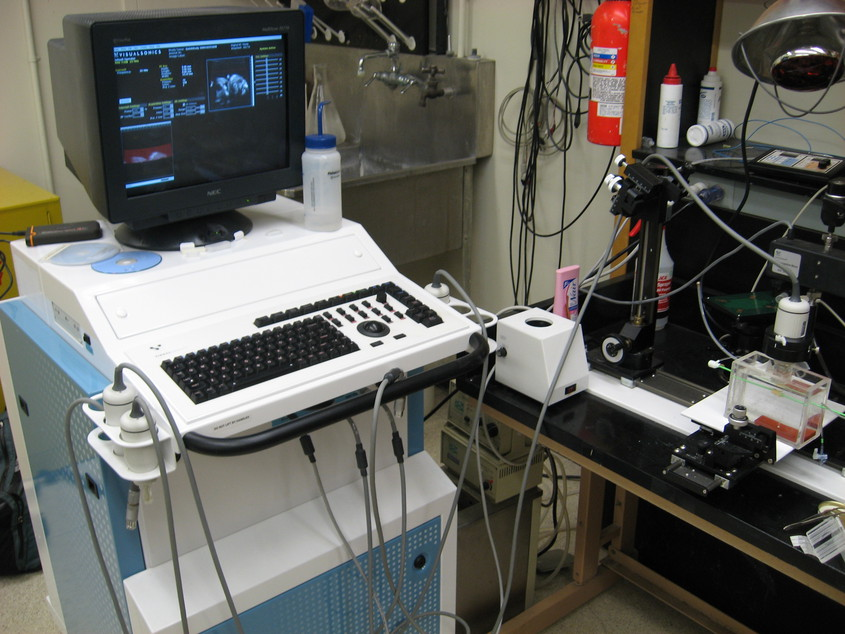
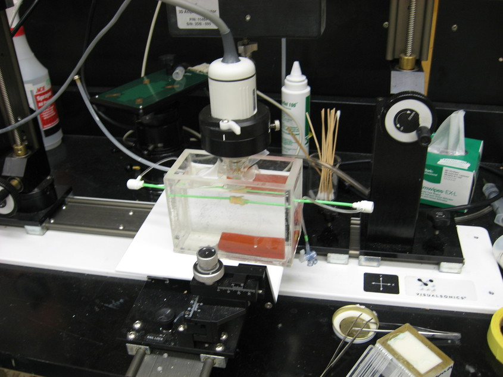
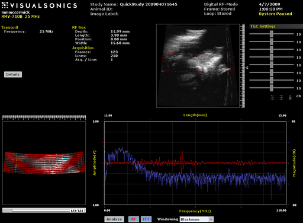
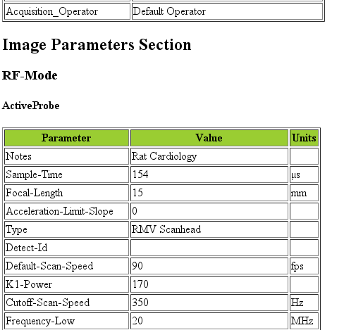
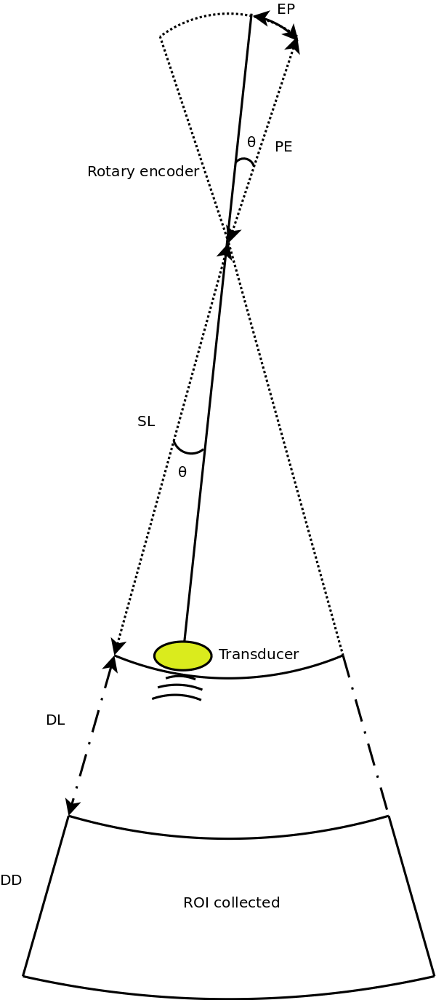
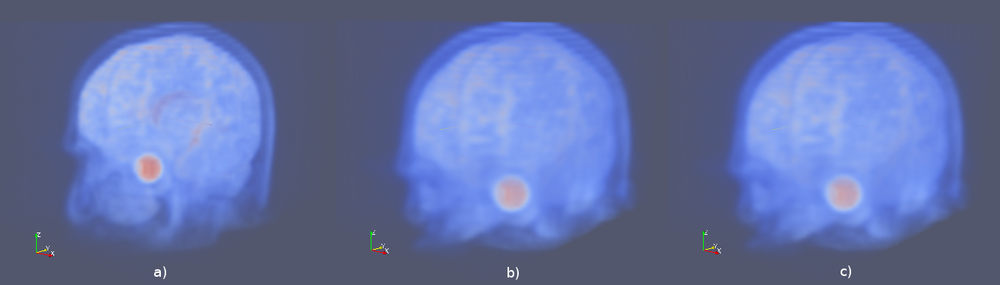
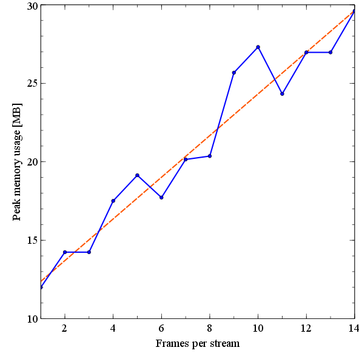

=============================================
Appendix A : High-frequency 3D Data Analysis
=============================================

This section describes methods to adapt a commercial
high-frequency scanner system to perform 3D imaging research.

.. |vs_plaque_system| replace:: Fig. 1

.. |vs_plaque_system_long| replace:: **Figure 1**

.. |vs_plaque_transducer| replace:: Fig. 2

.. |vs_plaque_transducer_long| replace:: **Figure 2**

.. |vs_digital_rf| replace:: Fig. 3

.. |vs_digital_rf_long| replace:: **Figure 3**

.. |rdi_content| replace:: Fig. 4

.. |rdi_content_long| replace:: **Figure 4**

.. |rdixml| replace:: Fig. 5

.. |rdixml_long| replace:: **Figure 5**

.. |rdihtml| replace:: Fig. 6

.. |rdihtml_long| replace:: **Figure 6**

.. |vs_field_of_view| replace:: Fig. 7

.. |vs_field_of_view_long| replace:: **Figure 7**

.. |head_streaming| replace:: Fig. 8

.. |head_streaming_long| replace:: **Figure 8**

.. |peak_memory| replace:: Fig. 9

.. |peak_memory_long| replace:: **Figure 9**

~~~~~~~~~~~~~~~~~~~~~~~~~~~~~~~~~~~~~~~~~~~~~~~~~
Collection and analysis of 3D RF data
~~~~~~~~~~~~~~~~~~~~~~~~~~~~~~~~~~~~~~~~~~~~~~~~~

VisualSonics Vevo 770 system
============================

.. highlights::

  |vs_plaque_system_long|: VisualSonics Vevo 770 imaging system.  The Vevo 770
  supports multiple transducers and has a standard console for interaction
  common to commercial imaging systems.  The system also comes with a motion
  table designed to secure and position the transducer (right).  Typically,
  animals are imaged on a platform equipped with physiological monitoring and
  anesthesia systems, but this has been replaced with a water bath to image the
  excised tissues.

VisualSonics (Toronto, Canada) manufactures high-frequency
ultrasound imaging systems designed for pre-clinical research on small animal
models.  Anatomical and real-time physiological imaging of mice and rats is
possible with resolutions up to 30 μm and frame rates up to 240 frames per second
(fps).  Primary features of the system are intended to allow longitudinal,
non-invasive monitoring of anatomical and hemodynamic features as well as for
therapeutic intervention.  Some of these features include 2D B-Mode, 3D B-Mode
with a stepper motor system, M-Mode, pulse-wave Doppler, power Doppler, tissue
Doppler, and contrast agent imaging.  An ancillary feature of the system is the
output of radio-frequency (RF) data for analysis.  In this section we
describe methods to harness the RF output to perform advanced imaging research.

The Vevo 770 system is the last generation of Vevo line systems that are
designed around rotated single-element transducers; beginning with the Vevo 2100
and later systems, the transducers are a high frequency linear array design.
The newer linear array transducer systems have better capabilities for
pre-clinical imaging: a programmable transmit focus and dynamic receive focusing
allow for a greater depth of field and better lateral resolution [Madsen2010]_.
However, the single-element, high-frequency, wide bandwidth transducers of the
Vevo 770 are desirable for the purpose of creating parametric ultrasound images.
As discussed in Chapter 6 and 7, the simpler transducer geometry allows the system to be
modeled during quantification of tissue-mimicking (TM) phantom acoustic properties.  The same
transducer can then be used in the collection of planar reflector, TM phantom,
and echo-signals from tissue.

A photograph of the Vevo 770 imaging system is shown in |vs_plaque_system| with
a close-up of the transducer assembly in |vs_plaque_transducer|.   The single
element transducer rests at the end of a shaft whose pivot point is high within
the body of the case assembly.  The angular position is measured with a rotary
encoder above the pivot point and scan conversion is necessary for proper
display.  In order to achieve high frame rates, the transducer is rotated quickly
about the pivot point by a motor in the transducer housing.  To facilitate good
coupling between the transducer and *in vivo* animal models outside a water bath,
the transducer element is encapsulated by a plastic basin and a replaceable thin
film over the active element.  The thin film must be placed on the transducer
and the scanhead filled with water prior to each application.

.. highlights::

  |vs_plaque_transducer_long|: The Vevo 770 transducer (white) is held by a
  clamp connected to a precise linear stepper motor (top).  The transducer
  element is suspended in a water filled capsule by a rod whose pivot point is
  high in the assembly housing above the clamp.

Two options exist on the system to collect RF data: a BNC output for
triggered signal acquisition with an external oscilloscope or other
analog-to-digital (A/D) device, or RF data can be collected with an on-board A/D
board integrated with the *Digital-RF* software module if available.  An advantage to
the latter system is an integrated preview of the acquired data at the time of
acquisition along with coordinated 3D acquisition via system software
control of the stepper-motor.

A variety of transducers are available that differ in their focal length,
aperture, center frequency, and bandwidth.  The transducer selected was a
RMV710B that has a center frequency of 25 MHz,
on the lower end the center frequency for available transducers.  This
transducer outputs frequencies up to 37.5 MHz, with an axial resolution of 70 μm,
lateral resolution of 140 μm, focal length 15 mm, and a maximum field of view of
20.0 mm.  The RMV710B was selected because the frequency was low enough to
penetrate plaque tissue and the field of view was large enough to encompass the
entire sample.

File storage and metadata extraction
=============================================

RF acquisition is performed in M-mode and is considerably slower than B-mode
frame rates.  The collection of a single 3D data set covering an entire plaque takes
approximately two hours.  RF acquisition was previously limited to single 2D
frames, but we worked with VisualSonics engineers such that RF acquisitions can
be collected in 3D with the optional high-precision stepper motor.  Data is
stored in a pair of non-standard plain text and binary files that contain system
settings and raw data respectively with B-mode and saturation image of the
region-of-interest (ROI) window for the first frame along with the RF data.  A/D
conversion is 12 bit with 71 dB dynamic range, 410 MS/s sampling rate, and 73 dB
gain.

.. highlights::

  |vs_digital_rf_long|:  The *Digital-RF* user interface on the VisualSonics
  Vevo 770.  System B-Mode is shown in the upper right with a red overlay of the
  RF collection ROI.  The lower right shows the ROI window B-Mode and
  saturation content, which is saved in the acquired file along with the RF
  data.  The time and frequency content a selected A-line in the ROI window is
  shown in the lower right.

Data collection is well integrated into the user interface of the machine, but
buffer limits on the A/D card limit the length of acquisition to a subset of the
field of view, as illustrated in |vs_digital_rf|.  When data files are exported
in *RAW* format, two files are saved for each acquisition.  A file with the
*.rdb* extension denotes a binary format file.  This *.rdb* contains three
images in sequence: two image of the ROI selected in the scout window followed
by the RF data.  Regardless of whether the 3D acquisition occurs, the ROI images
are always 2D images.  These images contain the content found in the system
preview of the scan ROI before scan conversion.  The first image is a B-Mode
images in two byte unsigned integer format written sequentially in an A-line
format.  All binary data is in *Little Endian* format, i.e. the least
significant byte (LSB) precedes the most significant byte (MSB).  A saturation
image with the same size as the B-Mode image follows.  The saturation image is
again in two-byte unsigned integer format, but the content is Boolean; a
non-zero sample indicates that the digitizer was saturated at that datum.  The
ROI data is followed by RF data in the acquired volume of interest.  Unlike the
ROI images, the RF data is in a two-byte signed integer format.  The RF data is
written sequentially by samples within an A-line, followed by A-lines within a
frame, followed by the frame in the volume.  There is more than one pulse-echo
data segment saved for each A-line.  To allow signal averaging with the
transducer fixed in a given position, an average A-line signal is saved followed
by the individual pulse-echo signals.  For the beta 3D Digital-RF acquisition
software, only a single pulse-echo acquisition is possible per A-line when in 3D
mode.  Information on the number of A-lines, averaged number of signals, etc. that are
required to read, analyze, and scan convert the binary data must be extracted from the
metadata header file.

Each *.rdb* binary file has a *.rdi* metadata header file associated with it.
This file has three sections, Image Info, Image Data, and Image Parameters.  The
Image Info section contains information related to the current acquisition such
as an operator defined labels, the number of frames, or the acquisition time.
The Image Data section contains information on byte offsets to A-line locations
in the binary file for the ROI B-mode, ROI saturation, and the RF data.
Finally, the Image Parameters section contains system settings such as the
transmit pulse settings, time-gain compensation (TGC) settings, characteristics
of the current transducer, ECG settings, or the stepper motor position.  Example
content from an *.rdi* is shown in |rdi_content|.

::

  "=== IMAGE INFO ==="
  "Study Name","QuickStudy 201001201737"
  "Image Id","54HTKMSSMJCKL2JSKMMF1TPCDW"
  "Image Label",""
  "Image Frames","136"
  "Image Lines","250"
  "Image Acquisition Per Line","1"
  "Image Acquisition Size","4256","bytes"
  ...
  "=== IMAGE DATA ==="
  "ROI Data Offset - B-Mode","0","bytes"
  "ROI Data Size - B-Mode","73472","bytes"
  "ROI Data Offset - Saturation","73472","bytes"
  "ROI Data Size - Saturation","73472","bytes"
  "Image Data Offset - Frame 0 - Line 0 - Acq 0","146944","bytes"
  "Image Data Offset - Frame 0 - Line 1 - Acq 0","151200","bytes"
  ....
  "=== IMAGE PARAMETERS ==="
  "RF-Mode/ActiveProbe/Notes","Rat Cardiology"
  "RF-Mode/ActiveProbe/Sample-Time","154","µs"
  "RF-Mode/BModeSoft/V-Relative-Frame-Rate","4"
  "RF-Mode/ActiveProbe/Focal-Length","15","mm"

.. highlights::

  |rdi_content_long|:  Example data from a Vevo 770 *.rdi* file.  Example
  content from the three sections of the ASCII plain text content, Image Info,
  Image Data, and Image Parameters, are given.

Each parameter is described on a line with two to three fields delimited by
quotations and commas.  The first field is generally a key name.  In the Image
Parameters section, this can take a hierarchical form delimited by a forward
slash.  The second field is the value for the given key, which will contain an
array of comma delimited numbers for an array of values.  An optional third
field contains the units for the value.  The voluminous amount of Image
Parameters results in a large file; typical size is 35,000 lines.

Parameters for parsing the binary file can be found or derived from the Image
Info section, which makes the Image Data section largely redundant.  Parametric
image formation and scan conversion relies on content dispersed throughout the
Image Parameters section.  To facilitate the extraction of values of a given key
and conversion from plain text to the appropriate data type, a library was developed
to parse the header content into an intermediate eXtensible Markup Language
(XML) form [Bray2008]_.  The advantages of XML for this data set includes its broad
support under diverse tools and programming languages as an open standard, a
native text-based and hierarchical form, and some explicit specification of data
types.  The structure of the *.rdi* is transformed into an XML hierarchy by
considering the main three sections as top level elements and division and
sorting of the keys in the Image Parameters section into a hierarchy of child
elements.  This structure was determined by parsing an example header file instance
with a Python [Rossum2011]_ script and defined using XMLSchema [Fallside2004]_

::

  <?xml version="1.0" encoding="UTF-8" standalone="no" ?>
  <rdi xmlns:xsi="http://www.w3.org/2001/XMLSchema-instance" xsi:noNamespaceSchemaLocation="rdi.xsd">

  <image_info>
    <Study_Name>QuickStudy 201001201737</Study_Name>
    <Image_Id>54HTKMSSMJCKL2JSKMMF1TPCDW</Image_Id>
    <Image_Label/>
    <Image_Frames>136</Image_Frames>
    <Image_Lines>250</Image_Lines>
    <Image_Acquisition_Per_Line>1</Image_Acquisition_Per_Line>
    <Image_Acquisition_Size>4256</Image_Acquisition_Size>
    <Animal_ID/>
    <Acquisition_Mode>Digital RF-Mode</Acquisition_Mode>
    <Acquisition_Date>1/20/2010</Acquisition_Date>
    <Acquisition_Time>5:42:14 PM</Acquisition_Time>
    <Acquisition_Operator>Default Operator</Acquisition_Operator>
  </image_info>

  <image_data/>

  <image_parameters>
    <RF-Mode>
      <ActiveProbe>
        <Notes>Rat Cardiology</Notes>
        <Sample-Time units="µs">154</Sample-Time>
        <Focal-Length units="mm">15</Focal-Length>
        <Acceleration-Limit-Slope>0</Acceleration-Limit-Slope>

.. highlights::

  |rdixml_long|:  Content of the header file in |rdi_content| after
  transformation into XML format.

The content is imported in C++ into a Xerces-C++ [XercesC]_ object, from which
it can be serialized into an XML file, as shown in |rdixml| to be easily processed by other
programs.  Alternatively, it can be transformed into a Hyper-Text Markup
Language (HTML) to be easily examined in web browsers, |rdihtml|.  Transformation
is specified through an EXtensible Stylesheet Language (XSLT) document and applied in
memory with Xalan-C++ [XalanC]_.  Most importantly, the parameters can be accessed
in C++ as native data objects through the use of XML data binding with
CodeSynthesis XSD [XSD]_ since an XMLSchema has been generated.

.. highlights::

  |rdihtml_long|:  Rendering of the header file contents after transformation
  from XML to HTML.

An Insight Toolkit (ITK) [Yoo2002]_ ImageIO class was written for processing the
data with ITK.  The data is imported as an "image", i.e. geometry of uniform,
anisotropic spacing in Cartesian format, with angle and radius information stored in the
metadata dictionary for scan conversion after B-Mode or parametric image
formation from the A-lines at their original sample locations.

Scan conversion and volume concatenation
=========================================

The raw data collected on the Vevo 770 is structured grid data.  Structured grid
data has implicit connectivity, i.e. the topology is determined by a dimensional
index [Schroeder2006]_.  However, the geometric locations of the points do not
necessary fall on a uniform grid.  An image, on the other hand, has both regular
topology and geometry [Schroeder2006]_.  While there is some support in computer
graphics hardware and software for rendering datasets in a structured grid from,
the most widespread support exist for images with isotropic spacing.  Medical
imaging or scientific rendering programs may have support for rendering of
images with anisotropic spacing.  Volume rendering support for structured grid
data is less common and less efficient than volume rendering algorithms for
image data.  Also, most analysis algorithms are designed for image data.  For
these reasons, we must scan convert the Vevo 770 data; we must resample the
structured grid data onto a orthogonal grid with regular spacing.

Locations of the RF is determined by the transducer geometry, which is
diagrammed in |vs_field_of_view|.  Header file keys that define the geometry
include: *PE*, the pivot-to-encoder distance,
*RF-Mode/ActiveProbe/Pivot-Encoder-Dist*, *SL*, the shaft-length,
*RF-Mode/ActiveProbe/Pivot-Transducer-Fact-Dist*, *DL*, the delay length in the
water path from the transducer to start of acquisition,
*RF-Mode/RX/V-Delay-Length*, *DD*, the digitizer depth,
*RF-Mode/RX/V-Digi-Depth-Imaging*, and *EP*, the encoder position,
*RF-Mode/RfModeSoft/V-Lines-Pos*.  Note that the last value is an array since it
changes with every A-line.

.. highlights::

  |vs_field_of_view_long|:  Diagram of the Vevo 770 geometric parameters used in
  field of view calculations.  The transducer sits at the end of a shaft, and
  the angle of rotation is recorded by a rotary encoder attached to an extension
  of the shaft across the pivot point.  Parameters stored in the metadata file
  include *PE*, the pivot-to-encoder distance, *SL*, the shaft length, *DL*, the
  delay length in the water path from the transducer to start of acquisition, *DD*,
  the digitizer depth, and *EP*, the encoder position.

This polar coordinate configuration is common in ultrasound imaging; it also
occurs with a curvilinear array or phased array transducer, for example.   The
radius is given by :math:`r = SL + DL + \frac{s \, c}{2 f_s}` where *s* is the
sample number along the A-line, *c* is the assumed speed of sound (usually 1540
m/s), and :math:`f_s` is the sampling frequency
(*RF-Mode/RfModeSoft/SamplesPerSec*).  The angle in radians is simply
:math:`\theta = EP / PE`.  The Cartesian coordinates are then :math:`x_1 = r \cos(
\theta )` and :math:`x_2 = r \sin( \theta )`.  For 3D imaging, the only other
geometric parameter of importance is the frame spacing, which is found at
*RF-Mode/3D/StepSize*.

Data streaming
==============

Due to memory capacity limitations of modern computers, it is necessary to process
a large image file in independent chunks, also known as streamed data processing.  A
single Vevo 770 plaque volume prior to scan conversion with 2128 samples per
A-line, 250 lines per frame, 250 frames per subvolume, and four subvolumes per
plaque has 532 million samples.  If the data samples are stored as single-byte
*char* datatypes or two-byte *unsigned short* samples, as may be the case for
clinical scanner's volume rendering software, a high-end modern computer is
capable of storing a copy of the image in system RAM or graphics card global
memory.  When processing the data to create parametric ultrasound images or
to perform scan conversion, we use the eight-byte floating point *double* data type,
and multiple copies of the data are required as it passes through our
processing pipeline.  This size exceeds the capacity of most computers, and
streaming is required.

The process of resampling during scan conversion involves defining a
transformation from the output space to the input space [Ibanez2005]_. In
general, at the time of transformation all of the input data must be available
because the transformation of point from output space may result in a point at any
location in the input space.  This prevents streaming of the resampling process
because the entire input dataset must be made available.

At least for special cases, streaming during resampling may be possible, though,
if we can restrict the region required for a transformation.  With a general
affine transform [Ibanez2005]_,

.. math:: \mathbf{y} = \mathbf{Ax} = \mathbf{b}

.. epigraph::

  where **x** is a vector of the output point position, **y** is the input point
  position, **A** is a matrix of coefficients that apply rotation, shearing or
  scaling to the output space, and **b** is a vector defining the rigid translation,
  lines remain lines after transformation.  Recognizing this fact, we see that the
  region required by a linear transformation of an image is the bounding box
  defined by the transformation of image's corners.  The result of a resampling
  implementation that takes advantage of this property to perform streaming is
  shown in |head_streaming|.  An affine transform is applied with scaling by a
  factor of 1.25 in all directions, rotation of 1 radian about the y-axis and 0.2
  radians about the z-axis, and translation of three pixel spacings in the
  y-direction and seven pixel spacings in the z-direction.  The resampling process
  is applied without streaming and streaming with eight stream divisions.  The
  results are the same for both cases.

.. highlights::

  |head_streaming_long|:  Magnetic resonance head image a) before
  transformation, b) after an affine transformation without streaming,
  and c) after the same transformation with streaming.  Pixel-wise difference
  calculation on the transformed images show that they are identical.

This same implementation can be applied to perform streaming when performing
scan conversion for the Vevo 770.  Even though the inplane transformation is
non-linear and applying this algorithm would be insufficient at the bottom of
the scan plane, the transformation is linear in the stepper-motor direction (an
identity transform).  Measurements of peak heap memory usage made with Valgrind
[Valgrind]_ versus the number of frames per stream are plotted in |peak_memory|.
A linear trend is clearly observed.  Decreased memory usage comes with a slight
performance trade-off as the number of image processing pipeline updates
required is directly proportional to the number of stream divisions.

.. highlights::

  |peak_memory_long|: Peak heap memory usage during B-Mode image creation and scan
  conversion of a Vevo 770 file.  The slope of a linear fit to the data is 1.33
  MB/frame and the intercept is 11.0 MB.

~~~~~~~~~~
References
~~~~~~~~~~

